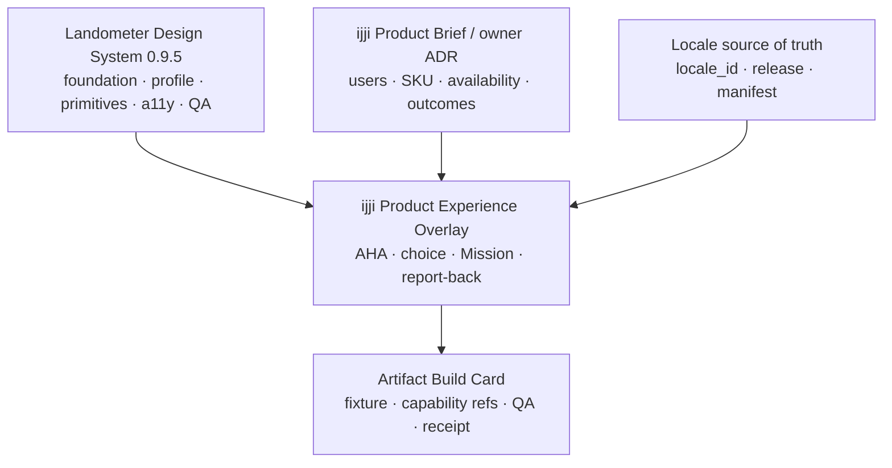
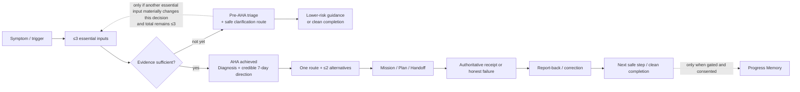

# ijji Add-on v0.5.5 for LDS v0.9.5

**Product Add-on · Human + Machine**

ใช้คู่กับ **Landometer-Design-System-v0.9.5.md** ฉบับเต็ม รวมเป็นสองไฟล์สำหรับงาน ijji ไม่ต้องใช้ master 0.9.4 หรือ overlay รุ่นก่อน Add-on นี้มีเฉพาะข้อกำหนดผลิตภัณฑ์และ structured product records; กฎกลาง สี ฟอนต์ scales และ schemas ใช้จาก LDS 0.9.5 ฉบับเต็มตาม exact base binding ใน machine JSON ของไฟล์นี้

Add-on ใช้ได้เฉพาะ ijji และเฉพาะขอบเขตที่ระบุ ไม่แก้กฎกลางหรือสร้าง product fact / capability ใหม่ ข้อกำหนด shared rule IDs ทุกตัว resolve จาก ruleCatalog ของ base ที่ล็อกไว้ หากขัดกันนอกขอบเขต product override ให้รายงานความต่างก่อนใช้

**เอกสารปัจจุบัน / Current document revision:** `standalone-0.9.5-r3`

**Document ID:** `ijji-addon-0.5.5-lds-0.9.5-r3`

**Distribution:** `standalone-0.9.5-r3-docs1` · **Complete LDS base:** `standalone-0.9.5-r3`

ข้อความ consolidation r2 ในส่วน product profile ด้านล่างเป็นประวัติการรวบรวมกฎผลิตภัณฑ์ ไม่ใช่รุ่นเอกสารหรือ LDS base ที่ต้องใช้ปัจจุบัน ให้ใช้ current revision และ exact base binding ในเอกสารนี้

The r2 consolidation label in the retained product profile below records its original consolidation history only. It does not request an older Add-on or LDS base. Use the current revision and exact base binding in this document. Product rules are unchanged.

# ijji Add-on 0.5.5 — for LDS 0.9.5

**Required foundation:** [Landometer Design System 0.9.5 — complete base normative](https://montri-th.github.io/Landometer/v0.9.5/normative/Landometer-Design-System-v0.9.5.md). For a product Project Source, upload the base Markdown and this Add-on Markdown: two design files. Do not upload a duplicated combined product/base file.

**Current product identities:** ijji Design System `0.5.2`; ijji DS Add-on `0.5.5`. **Consolidation:** `standalone-0.9.5-r2`, 30 September 2026. This Add-on contains the current ijji-specific design rules and product machine values. Use it alongside the separate complete LDS 0.9.5 base normative. It does not embed or replace the shared LDS foundation. No previous LDS master or predecessor ijji design document is required. This consolidation changes delivery, not product version, capability, asset rights or claim strength.

Use the separate complete LDS 0.9.5 base normative for foundation, visual tokens, accessibility, evidence and common controls. This chapter narrows it for ijji. Product capability, SKU, permissions, Locale and actual evidence still come from their owning records; design documentation never supplies those facts. Historical design documents and prior multi-file installation instructions are cancelled as active authoring instructions for new work; provenance is retained only for audit. Explicitly pinned historical artifacts keep their original records.

**North-star experience:** เห็นเรื่องที่ควรทำก่อน → เข้าใจเหตุผลและข้อจำกัด → เลือกคำตอบที่พอดี → ลงมือแบบทำไหว → บอกผลได้ง่าย → เห็นทางถัดไปโดยไม่ถูกกดดัน

**Claim ceiling:** `authoring_aligned` at package level. A stronger artifact-specific claim needs its own test, approval and deployment receipt. An uploaded file does not prove activation across accounts or products.

## A. Current product, identity and evidence rules

### Product truth, voice, and page composition

Start with the shop owner's job. Each owner-facing scene has one main question, one truthful answer or pre-answer, nearby evidence and limitation, one primary action with a real outcome, and a clear completion/next step. Aim for one dominant reading path. Technical release identifiers, approval workflow, TODOs, placeholder values, and validator residue belong in internal records or an explicitly technical reference, not the owner's primary view. Keep ijji's calm, empathetic Thai/English tone without inflating confidence or claiming outcomes that were not observed.

Evidence is **label-first**: show whether a value is recorded, owner-stated, inferred, or missing in words before any color. Missing data is not zero. A verified provenance marker is allowed only when a governed record actually verifies that source; it needs visible and programmatic text and must never turn a claim into stronger evidence. Use heading order, spacing, alignment, neutral surfaces, and uniform hairline borders to establish hierarchy. Do not use colored card-edge rails, decorative bracket-shaped selections, or colored left-edge highlights on navigation, tabs, cards, or callouts. Keep meaningful chart/table boundaries and a clearly visible keyboard focus outline.

Locale Insight is a contextual prior for service planning, field validation, engagement, and prioritization. It is not official population, eligibility, statutory boundary, risk determination, or proof of observed behavior. Aggregate it to municipality, community, or service area only after an explicit `locale_id` crosswalk. Official administrative, verified municipal, hazard/risk, and live operational sources retain their authority within their stated scopes. Show source, unit, date, denominator, uncertainty, and decision limit where relevant.

### Identity, motif, and motion

Use only exact, registered ijji identity assets in their separately approved roles, host surfaces, locales, and channels. The owner-supplied full-square logo reference was approved only for its specified large identity-panel context on exact `brand.blue`; it is not a free-standing production export or permission to crop, recolor, trace, split, mask, animate, or repurpose it as a favicon, app mark, header lockup, social preview, or LINE asset. For another role, obtain the role-specific variant and approval. A text navigation label does not become a substitute official logo.

The approved ijji-only decorative motif family is `ijji.four-beat.selected-3`: `graph-b`, `rings-c`, and `rotate-b`, using the exact asset IDs and hashes included in this document’s product machine metadata. Its 18 exact SVGs, static approval, verification records, and owner-supplied source archive are retained with that record in the repository. The motifs provide secondary orientation, transition, or closure after an approved ijji identity context is already established. They do **not** encode growth, footfall, catchment, completeness, progress, evidence, state, risk, or a business result, and cannot replace any identity mark. Only the registered fixed-surface `*-brand-blue.svg`, `*-dark.svg`, and `*-ground-mist.svg` variants are eligible for live use after placement QA. Canvas and transparent variants are not pre-cleared. Do not recolor, crop, distort, redraw, strip provenance, or make a new logo derivative from a motif.

Because the supplied SVGs carry noncanonical embedded English `aria-label` text, a live placement uses an external `` or a decorative CSS background; any meaning must have a separate visible and accessible label. Inline SVG, object/embed, and supplied motif JavaScript are not approved live transport. At most one treatment belongs in a visible scene; remove it if it adds no genuine orientation benefit. Record exact asset, surface, identity context, single job, fallback, and rendered/deployed evidence.

Four-beat **motif motion remains disabled** (`motionEnabled: false`). Do not add looping attention, shimmer, pulse, decorative reveal, or broad card animation. An independently approved, finite `ijji.logo-sting.r3` can be used only as an artifact-local website identity treatment with its own pause/resume, reduced-motion, no-JavaScript, final-state, and lifecycle checks; it does not approve motif animation or animation of the official logo artwork.

### Color, controls, accessibility, and VES

ijji selects roles from the exact LDS 0.9.5 package; it does not own a new raw palette, type stack, icon set, spacing/radius scale, analytical palette, or motion system. Preserve the approved ijji ground-mist **identity** treatment only for its identity purpose. Never use an identity gradient as a data scale. The `color-srgb-08` analytical family uses its exact theme-specific LUTs, thresholds, units, and denominator labels. Density is warm and distinguishable by denominator: area orange, per-capita rose, household scarlet, built-area gold. Dark categorical colors use the 0.9.5 values. Do not synthesize a scale by interpolating endpoints or use a data color without legend/source.

Use direct semantic controls: labelled text or icon-and-text capsule actions at least 44 CSS px tall; icon-only circles at least 44 × 44 CSS px with names; fields, tabs, selectors, and disclosures with truthful semantics and 44 px direct targets. Do not use a proxy click area. Interface icons use the approved rounded-outline subset with `FILL 0`, `wght 300`, `GRAD 0`, and optical size matched to display size; selected state must not switch to a filled or heavier glyph. Thai and Latin typesetting is script-aware; never compress Thai line-height or spacing to force copy into a card. Where an approved type fixture is absent, 1.25 line-height is a cautious fallback, not proof of full conformance. Review actual text at narrow/desktop widths, zoom and both themes.

Every reusable semantic component needs a stable ID and a contract covering purpose, non-purpose, semantic element, content slots, state, responsive/reflow/print behavior, accessible name/order, token mapping, evidence boundary, and acceptance fixtures. Distinguish `ijji.owner-benefit-answer`, `ijji.evidence-fact`, `ijji.provenance-label`, `ijji.evidence-group`, and `ijji.primary-action` by their jobs; visual similarity does not make them interchangeable.

VES (Visual Experience Specification) is a presentation projection of canonical product objects and fields, not a new source of truth. A state-bearing visual slot maps one-to-one to a canonical field and presentation rule. Decorative slots map to an approved LDS rule or exact ijji identity/motif record. No motif, color, or animation may create evidence or imply an unrecorded product capability.

## B. Product behavior, authoring contracts and governed fixtures

### 0.5 Status dimensions stay separate `[IJJI-STATUS-01]`

| Axis | Allowed values / source | Non-equivalence |
|---|---|---|
| `ijjiOverlay.pattern_maturity` | concept / specified / tested / overlay_approved | overlay-approved pattern ≠ shipped capability |
| `minimum_loop_role` | core / conditional / future_gated | core priority ≠ runtime availability |
| `catalog_status` | source_proposed / candidate / registry_approved / catalog_retired | catalog membership ≠ availability |
| `lifecycle_status` | concept / specified / ready_for_test / pilot / available / paused / retired | specified ≠ available |
| `availability_scope` | none / named_test / named_pilot / eligible_market | named pilot ≠ eligible market |
| `privacy_security_gate_status` | pending / approved_with_scope | owner consent ≠ third-party rights |
| implementation/deployment evidence | exact refs and release receipt; no local replacement enum | implementation ≠ authorization ≠ acceptance |
| analytical/publication evidence | exact owning LDS/Product Brief vocabularies | polished UI ≠ stronger evidence |

Never use `current`, `ready` or `active` as a generic badge across these axes.


### 1. Human and AI Build Routes

#### 1.1 Human quick route `[IJJI-BUILD-HUMAN-01]`

Designers, writers and product owners use this shortest safe path:

```text
1. Confirm product truth and capability state
2. Complete OwnerMomentWorksheet
3. Select exactly one LDS profile
4. Choose the smallest ijji pattern set
5. Build one bounded fixture before a screen family
6. Run AHA, evidence, dignity, privacy and accessibility checks
7. Connect exact runtime evidence and release receipt before live use
```

If a field cannot be resolved, mark it `unresolved` with owner/source and do not invent a value.

#### 1.2 AI build route `[IJJI-BUILD-AI-01]`

An AI implementation agent consumes sources in this order:

```text
approved product truth + capability manifest
→ LDS 0.9.5 base Build Card and selected profile
→ this overlay's rule IDs and pattern IDs
→ SKU/Action Card/Locale/evidence references
→ one labelled fixture
→ typed acceptance results for applicable §11 gates
→ implementation evidence + deployment authorization
→ release receipt
```

AI MUST:

- preserve exact IDs, versions, dates, status axes and limitations
- ask/stop when authority conflicts materially change the result
- omit unauthorized controls rather than simulate them
- keep required semantic data even when progressive rendering hides detail initially
- never convert examples, generated priors or historical behavior into current product truth
- output a decision log listing applied rules, unresolved fields and omitted capabilities

#### 1.3 One foundation, one bounded overlay



Operational ijji uses `ijji.app`. Derivative artifacts use one appropriate LDS profile such as `data.explainer`, `campaign.public`, `social.static` or `presentation`; they do not inherit the `ijji.app` input/time budget automatically.

#### 1.4 Capability default `[IJJI-CAP-01]`

```text
false, unauthorized, unresolved or unsupported capability
→ omit the control
→ do not simulate success
→ explain the limitation only when it matters
→ offer one honest available route or clean completion
```

Presence in a schema, pattern registry or fixture is not implementation evidence.

#### 1.5 ijji Build Card extension `[IJJI-BUILD-01]`

This is an authoring contract, not a runtime schema:

```yaml
ijjiBuildCard:
  schemaDialectVersion: "ijji-authoring-contract/0.1"
  overlayVersion: "0.5.2"
  addonVersion: "0.5.5"
  consolidationRevision: "standalone-0.9.5-r2"
  artifactId: required
  artifactKind: operational_web | line_adapter | data_explainer | campaign | static | presentation | demo_fixture
  interactiveArtifact: true | false
  deliveryRequested: true | false
  liveUsageRequested: true | false
  deployedIjjiAppRequested: true | false
  delivered: true | false
  lds:
    releaseVersion: "0.9.5"
    authoringRevision: "0.9.5-owner.1"
    releaseRef: "v0.9.5-owner.1"
    colorSetId: "color-srgb-08"
    profile: ijji.app | data.explainer | campaign.public | social.static | presentation
    exactPackageRef: required_when_deliveryRequested_is_true
    triggerPacks: [] # items: exact LDS trigger-pack rule IDs
  productTruth:
    briefRef: required
    approvalStatus: required
    capabilityManifestRef: required
    skuRegistryRef: required_when_sku_is_shown
  ownerMomentRef: required
  firstAha:
    contractSource: required_from_selected_lds_profile
    ijjiAppExtension:
      maximumEssentialInputs: 0_to_3
      targetSeconds: 15
      journeyStage: pre_aha_triage | aha_achieved | post_aha_review
      outputClass: triage_orientation | bounded_hypothesis | bounded_diagnosis_with_7_day_direction | recommendation_review
  governedContext:
    shopRef: required_when_shop_specific
    locale_adapter_ref: required_when_locale_insight_is_used
    locale_adapter_authority_status: required_when_locale_insight_is_used # exact value from Locale owner record; no local enum
    locale_adapter_approval_record_ref: required_for_live_locale_use
    locale_lineage_resolution_ref: required_for_live_locale_use
    locale_release_mapping_ref: required_for_live_locale_use
    locale_id: required_when_locale_insight_is_used
    locale_release_id: required_when_locale_insight_is_used
    locale_source_link: required_when_locale_insight_is_used
    source_manifest_ref: required_when_locale_insight_is_used
    source_hash_or_release_checksum: required_when_locale_insight_is_used
    boundary_or_geometry_ref: required_when_locale_insight_is_used
    venue_id: required_when_venue_evidence_is_used
    venue_release_id: required_when_venue_evidence_is_used
    venue_source_link: required_when_venue_evidence_is_used
    venue_source_manifest_ref: required_when_venue_evidence_is_used
    venue_source_hash_or_release_checksum: required_when_venue_evidence_is_used
  evidence:
    analysisRecordRef: required_when_claim_or_recommendation
    ownerFacingEvidenceRoute: required
    generated_prior_refs: [] # items: exact governed prior/analysis refs
    generatedPriorDisclosure: required_when_generated_prior_refs_are_nonempty
  action:
    shownSkuUsageRefs: [] # items: shownSkuUsages.usage_id
    skuRouteSelected: true | false
    selectedSkuRef: required_when_skuRouteSelected_is_true
    actionCardVersion: required_when_mission
    missionRef: required_when_mission_is_instantiated
    nextTriggerOrCleanCompletion: required
  patternUsages: [] # items: PatternUsage; minItems=1 when authoring reaches pattern selection
  shownSkuUsages: [] # items: ShownSkuUsage; minItems=0
  itemSchemas:
    PatternUsage:
      usage_id: required
      pattern_id: required_from_candidate_or_approved_pattern_registry
      registry_entry_ref: required
      ijjiOverlay:
        pattern_maturity: concept | specified | tested | overlay_approved
      minimum_loop_role: core | conditional | future_gated
      applicability_condition: required_when_conditional
      capability_ref: required_when_pattern_depends_on_capability
      lifecycle_status: concept | specified | ready_for_test | pilot | available | paused | retired # required_when_capability_applies; omit otherwise
      availability_scope: none | named_test | named_pilot | eligible_market # required_when_capability_applies; omit otherwise
      privacy_security_gate_status: pending | approved_with_scope # required_when_gate_applies; omit otherwise
      live_render_requested: true | false
      implementation_evidence_ref: required_when_live_render_requested_is_true
      deployment_authorization_ref: required_when_live_render_requested_is_true
      unavailable_reason: required_when_live_render_requested_is_false
    ShownSkuUsage:
      usage_id: required
      route_id: required
      sku_ref: required
      sku_registry_entry_ref: required
      catalog_status: source_proposed | candidate | registry_approved | catalog_retired
      lifecycle_status: concept | specified | ready_for_test | pilot | available | paused | retired
      availability_scope: none | named_test | named_pilot | eligible_market
      price_and_entitlement_ref: required
      live_render_requested: true | false
      implementation_evidence_ref: required_when_live_render_requested_is_true
      deployment_authorization_ref: required_when_live_render_requested_is_true
      unavailable_reason: required_when_live_render_requested_is_false
  release:
    controlInventoryRef: required_when_interactiveArtifact_is_true
    networkReadinessRef: required_when_deployedIjjiAppRequested_is_true
    qaEvidenceRef: required
    releaseReceiptRef: required_when_delivered_is_true
```

Rules:

- `ijjiAppExtension` is required only for `ijji.app`; other profiles inherit their own LDS AHA contract.
- omit inapplicable status fields; never fill them with a placeholder that looks authoritative.
- each pattern and shown SKU has its own keyed usage record; status/evidence never flow from one route to another.
- live rendering requires registry, implementation, authorization, QA and release evidence to agree.

#### 1.6 Authoring-contract notation `[IJJI-SCHEMA-01]`

YAML blocks in this document use `ijji-authoring-contract/0.1`. They are deterministic authoring contracts, not JSON Schema and not runtime payloads.

| Notation | Meaning |
|---|---|
| enum list such as `a`, `b`, `c` | exactly one listed enum value |
| `required` | non-empty value required |
| `required_when_X` / `required_for_X` | required when named condition is true; otherwise omit the field |
| `required_after_X` / `required_before_X` | ordering condition that must be evidenced in the decision log |
| `[] # items: T` | zero or more typed `T` items; preserve order only when order is meaningful |
| `—` / omitted field | not applicable; never an unknown value |

Common conditions resolve from explicit fields, never prose inference:

- `locale_insight_is_used` → any output reads or derives from a Locale Insight release
- `live_locale_use` → `locale_insight_is_used` and the containing record's live flag (`liveUsageRequested`, `liveUsageAllowed`, or `liveRequested`) are both true; a proposed/unapproved adapter never satisfies this condition
- `live_render` / `live_usage` → artifact is rendered outside a labelled non-live fixture
- `mission` → an instantiated Action Card is shown or accepted
- `gate_applies` → the referenced field/capability enters that privacy/security scope
- `aha_achieved` → `journeyStage=aha_achieved` and `[IJJI-AHA-01]` passes

Condition grammar:

- `required_when_<field>_is_<value>` compares the exact sibling/dotted field; enum text is not normalized.
- `required_when_<field>_is_not_<value>` is true only when the exact field exists and differs from that enum value.
- `required_when_<field>_is_<value1>_or_<value2>[_or_<valueN>]` is an explicit enum union of one or more listed values; free-form `or` expressions are invalid.
- `required_when_<field>_are_nonempty` means the typed array contains at least one item.
- `required_when_<field>_exists` is true only when the exact field is present and non-empty.
- `required_unless_<field>_is_present` creates an exclusive fallback pair; exactly one of the paired route/completion fields is non-empty.
- `required_from_<registry/profile>` requires an exact resolvable source record, not author-entered free text.
- lifecycle conditions such as `sku`, `capability`, `published`, `delivered`, `live`, `captured`, `analytical`, `recommendation`, `proof`, `high_risk` and `venue_evidence` evaluate from the owning record or Build Card boolean/usage record. If that record is absent, the condition is unresolved and machine validation stops.
- `pattern_depends_on_capability` is true whenever the pattern could claim, persist, send, calculate, retrieve, authorize or expose a runtime state. A purely editorial/authoring pattern may omit capability fields.
- `selected_sku_defines_countermetric` and `approved_high_risk_destination_exists` resolve only from their exact registries; authors cannot set them by prose.

Until a machine validator is owner-approved, an AI must emit the implementation decision log in section G below and cannot claim schema validation merely because YAML parses.

---

### 2. Experience Contract and First AHA

#### 2.1 Product job and current profile contract `[IJJI-AHA-01]`

The incorporated ijji product contract retains this First AHA for `ijji.app`:

> diagnosis plus a credible 7-day direction

with up to three short essential inputs and a target of `≤15s`.

Therefore:

- `pre_aha_triage` may orient the owner safely but MUST NOT be labelled AHA achieved.
- `aha_achieved` requires a bounded diagnosis plus a credible 7-day direction.
- a meaningful partial result may meet the time budget while full analysis continues, but it does not silently redefine AHA.
- symptom-only context normally permits triage orientation, not locale/shop diagnosis.
- changing triage or “one safe next step” to count as the profile AHA requires a new immutable owner-approved LDS profile amendment.

Honest early value remains a pre-AHA result until both conditions are supported.

Timing measurement for the `≤15s` target:

- **Start:** the first actionable ijji surface for the decision is rendered and announced; if the owner initiates from a trigger, use the accepted trigger time.
- **End:** the bounded diagnosis and credible 7-day direction are both rendered, announced and actionable.
- network, processing, error and recovery time remain in observed wall-clock measurement; do not report only successful fast sessions.
- log pre-AHA partial value separately from AHA completion, and publish measurement method/sample/period before claiming the target is met.

#### 2.2 Candidate Phase-1 ICPs `[IJJI-ICP-01]`

The following IDs come from Product Brief v2.0-draft.2 and remain candidates until that brief or an owner ADR is approved:

| Candidate ICP | Moment | Experience need |
|---|---|---|
| `new_shop_survivor` | ร้านใหม่ยังจับจังหวะไม่ได้ | clarity without long onboarding; first safe test |
| `stable_but_flat` | ร้านอยู่ได้แต่ไม่โต | identify a constraint worth testing; bounded choice |
| `rescue` | ยอด/เงินสด/แรงกดดันกำลังแย่ | reduce panic; low-risk priority and accountable escalation |

`Progress Owner`, `Growth Owner`, lead labels, SKU tiers and operating contexts are not ICPs. Do not promote these candidate IDs to canonical without a new approval/revision record.

#### 2.3 Experience principles `[IJJI-EXP-01]`

1. **Owner moment before dashboard** — start from symptom and decision, not taxonomy or score wall.
2. **Answer before analysis** — show what is seen, what it means and what can happen next before deep detail.
3. **Hidden intelligence, visible basis** — hide jargon, never material source/limitation/assumption.
4. **One recommendation, bounded alternatives** — one primary route and at most two alternatives when supported.
5. **Doable and safe** — respect the shop's data, people, time, money and authority.
6. **Tiny · Useful · Kind · Optional by depth · Correctable** — every ask returns value and has a dignified exit.
7. **No shame, no pressure** — skip, stop and “ยังไม่ได้ลอง” are valid states.
8. **Progress means real state** — persistence, handoff, memory and learning require authoritative evidence.
9. **Identity is not evidence** — gradient, tone or motion cannot encode business truth.
10. **Price never upgrades truth** — entitlement changes access, not claim strength.
11. **Private by default** — sales, cost, staffing, photos, competitor notes and outcomes are not public by default.

#### 2.4 Owner-facing information order `[IJJI-HIER-01]`

```text
ร้านกำลังเจออะไร
→ ตอนนี้ ijji ช่วยได้ถึง triage หรือ diagnosis
→ เรื่องไหนควรทำก่อน
→ ทำไมจึงคิดอย่างนั้น
→ อะไรยังไม่รู้หรืออาจกลับคำตอบ
→ วันนี้/สัปดาห์นี้ทำอะไรได้
→ จะดูผลอย่างไร
→ ถ้าทำไม่ได้ มีทางปรับ หยุด หรือขอความช่วยเหลืออย่างไร
```

Internal bucket names, prompt mechanics, evidence enums and SKU routing stay behind details-on-demand unless they help verify the decision.

#### 2.5 Honest first-session states `[IJJI-SCOPE-01]`

| Input/evidence | Allowed output | AHA state | Forbidden label |
|---|---|---|---|
| symptom only | triage orientation + one safe route to clarify | `pre_aha_triage` | locale/shop diagnosis |
| symptom + essential compatible shop context | bounded shop hypothesis or diagnosis | only `aha_achieved` when paired with credible 7-day direction | proven root cause |
| canonical Locale ref without direct shop evidence | locale-informed generated prior + limitation | normally pre-AHA until shop fit is bounded | demand, sales or WTP fact |
| action + owner report | user-reported outcome | post-AHA state | causal proof |
| compatible observed action/outcome record | evidence-aware learning for that exact scope | post-AHA state | universal Action Card effectiveness |

---

### 3. Authoring Tools Before UI

#### 3.1 Owner Moment Worksheet `[IJJI-AUTHOR-01]`

Complete one worksheet before designing a route, component family or fixture. It is an authoring object, not a hidden user profile.

| Field | Authoring question | Evidence rule |
|---|---|---|
| Candidate ICP / actor | ใครกำลังตัดสินใจ | cite approved/candidate source |
| pressure/operating context | ตอนนี้ร้านกำลังรับมืออะไร | owner-stated/observed; do not infer emotion as fact |
| visible symptom | เขาเห็นอะไรเกิดขึ้น | separate symptom from cause |
| decision and constraint | ต้องตัดสินใจอะไร ภายใต้ข้อจำกัดใด | name time/people/money/authority |
| journey stage | pre-AHA triage, achieved AHA or post-AHA review | must match `[IJJI-AHA-01]` |
| answer scope | triage orientation, bounded hypothesis, bounded diagnosis or review | must match evidence ceiling |
| candidate cause | อะไรน่าจะอธิบายอาการ | may remain unknown; label bounded hypothesis unless supported |
| first useful object | อะไรทำให้เห็นประเด็นเร็วที่สุด | text or governed visual, not dashboard by default |
| owner value / AHA sentence | เจ้าของควรพูดได้ว่าอะไรหลังเห็นคำตอบ | value sentence always; AHA sentence only when achieved |
| route | Mission, Plan, Handoff or clean completion | must be available/safe |
| measure | จะดูอะไรเพื่อรู้ว่าควรไปต่อ/หยุด | include baseline/not-applicable |
| evidence/counter/limit | อิงอะไร อะไรค้าน และอะไรยังไม่รู้ | preserve material reversal |
| recovery | ถ้าข้อมูลผิด ทำไม่ได้ หรือระบบพัง จะทำอย่างไร | correction, retry, lower-risk route or escalation |

Machine-friendly authoring form:

```yaml
ownerMomentWorksheet:
  schemaDialectVersion: "ijji-authoring-contract/0.1"
  worksheetId: required
  sourceVersion: required
  candidateIcpRef: required
  actor: required
  pressureContext:
    statement: required
    narrativeEvidenceLabel: observed_fact | owner_stated | inference | hypothesis
  visibleSymptom: required
  decisionQuestion: required
  constraints: [] # items: exact constraint record refs
  journeyStage: pre_aha_triage | aha_achieved | post_aha_review
  answerScope: triage_orientation | bounded_hypothesis | bounded_diagnosis | recommendation_review
  candidateCause:
    status: unknown | bounded_hypothesis | supported
    statement: required_when_status_is_not_unknown
    analysisRecordRef: required_when_status_is_not_unknown
  generatedPriorRefs: [] # items: exact governed prior/analysis refs
  firstUsefulObject:
    form: text | comparison | daypart_strip | review_cluster | process | route_choice | mission
    rationale: required
  ownerValueSentence: required
  ownerAhaSentence: required_when_aha_achieved
  ahaAchievementEvidenceRef: required_when_aha_achieved
  route: clarification | lower_risk_guidance | mission | plan | handoff | clean_completion
  measure: required_when_route_is_mission_or_plan
  hasEvidence: true | false
  evidenceSummaryRef: required_when_hasEvidence_is_true
  recoveryRoute: required
  capabilityRefs: [] # items: exact capability record refs
  unresolved: [] # items: field/owner/source/effect records
```

Cross-constraints:

- `pre_aha_triage` permits only `triage_orientation` or `bounded_hypothesis`; it cannot populate `ownerAhaSentence`.
- `aha_achieved` requires `answerScope=bounded_diagnosis`, `ownerAhaSentence`, `ahaAchievementEvidenceRef` and credible 7-day direction in `DiagnosisAha`.
- generated priors travel in `generatedPriorRefs`; they never substitute for answer scope or diagnosis evidence.
- the worksheet references governed records and MUST NOT re-key their authority/status values.

#### 3.2 Contribution quality contract `[IJJI-INPUT-01]`

Every request for owner input must pass all five qualities:

| Quality | Test |
|---|---|
| Tiny | smallest input that can materially improve the current/next decision |
| Useful | interface states the value returned to the owner now |
| Kind | no blame, shame, fear, countdown or forced friendliness |
| Optional by depth | a safe broader answer/exit remains whenever possible |
| Correctable | owner can correct the answer and understand any storage effect |

An input is not justified by “personalization,” “future learning,” “engagement” or “better AI” alone. It must change the current decision, next safe action or evidence ceiling.

#### 3.3 Progressive input and commitment ladder `[IJJI-INPUT-02]`

| Stage | Owner action | Immediate value returned | Optionality | Persistence | Gate |
|---|---|---|---|---|---|
| 0 | view trigger/known context | understand what ijji can help with | no input required | none; no implicit telemetry consent | core |
| 1 | answer up to 3 essential questions | honest triage or enough context for diagnosis | skip where broader route is safe | session only by default | core |
| 2 | receive diagnosis + credible 7-day direction | profile AHA | no account/save/share required | none unless separately authorized | core |
| 3 | choose/adjust/skip route | one doable Mission/Plan/Handoff | no-purchase/clean completion available | selected state only when capability exists | core |
| 4 | quick report-back | useful next step without shame | “ยังไม่ได้ลอง” valid | user report only under outcome contract | conditional |
| 5 | add optional evidence or constraint | narrower next decision | explain why; deny-safe | private, purpose-bound | conditional |
| 6 | correct/forget permitted state | control over advice and history | always reachable when stored | authoritative correction/deletion | capability-gated |
| 7 | invite scoped helper/review history | one bounded collaboration benefit | explicit consent, revoke/expiry | only after privacy and capability gates | future-gated |

Level numbers are authoring sequence, not a gamified progression. Never show streak, loss or prestige for moving deeper.

#### 3.4 Input Value Exchange Matrix `[IJJI-INPUT-03]`

| Ask | Allowed when | Decision it changes | Storage default | Not allowed when |
|---|---|---|---|---|
| one tap/choice | narrows a live decision | route/scope | session-only | used only to raise engagement |
| number/range | basis and unit are clear | baseline, feasibility or stop rule | private, purpose-bound | false precision or no compatible basis |
| photo | visible object materially changes answer | menu/packaging/operation evidence | no retention by default; explicit contract if retained | rights/redaction/purpose unresolved |
| menu/price/cost | needed for specific offer/measure | menu, price or gross/contribution margin check | private | to infer net profit without full basis |
| reason/constraint | prevents repeated bad advice | adjustment/Decision History | session unless memory available | collected as a loyalty profile |
| correction | prior fact/interpretation is wrong | current and future decision | apply to exact governed record | correction path cannot identify affected record |
| helper task | another actor can complete one bounded step | current Mission | no broad history access | role, visibility, expiry, revoke or receipt missing |

---

### 4. Core Journey and Product-owned Patterns

#### 4.1 Core journey `[IJJI-JOURNEY-01]`



Pre-AHA triage may be useful, but it is not counted as profile AHA. After three essential inputs—or sooner when another answer will not materially change the decision—the interface MUST offer lower-risk guidance or clean completion instead of looping. The core loop remains useful even when persistence, helper, benchmark or memory capabilities are unavailable.

#### 4.2 Canonical terminology `[IJJI-TERM-01]`

| Term | Meaning | Not equivalent to |
|---|---|---|
| `SKU` | packaged offer with eligibility, input, output, entitlement and lifecycle | component or Mission |
| `Action Card` | versioned reusable action template with evidence minimum and safety rules | effectiveness proof |
| `Mission` | instantiated Action Card for one shop, actor and time window | catalog SKU |
| `Plan` | ordered Missions with dependencies and review points | one long recommendation |
| `Mission Receipt` | authoritative record of accepted/persisted Mission state | outcome proof |
| `Outcome Ledger` | versioned action/result events | causal attribution |
| `Shop Memory` | current correctable shop state from permitted evidence | fixed personality profile |
| `Progress Memory` | umbrella for consented Outcome Ledger, Shop Memory and Decision History | engagement history |

`Business DNA` is retired as a product-data term. Historical use requires explicit migration to Shop Memory.

#### 4.3 `SymptomIntake` `[IJJI-PATTERN-INTAKE-01]`

**Job:** obtain the minimum context needed for useful orientation or diagnosis.

Required behavior:

- one short question at a time
- state why sensitive/non-obvious input is needed and which decision it changes
- allow skip when a safe broader answer remains
- preserve input during retry/channel handoff
- no sales, costs, staff, contact, photo or exact location before AHA unless intrinsic and explained
- missing never becomes zero or a confident answer
- session-only default unless storage purpose and capability are explicit

Product meanings: `enough_for_triage`, `enough_for_bounded_diagnosis`, `needs_user_choice`, `cannot_answer_safely`. Shared loading/input/error states remain LDS-owned.

#### 4.4 `DiagnosisAha` `[IJJI-PATTERN-AHA-01]`

```yaml
diagnosisAha:
  schemaDialectVersion: "ijji-authoring-contract/0.1"
  journeyStage: pre_aha_triage | aha_achieved | post_aha_review
  scope: triage_orientation | bounded_hypothesis | bounded_diagnosis | recommendation_review
  ownerLanguageSummary: required
  priorityReason: required
  outputIsRecommendation: true | false
  reversalIsMaterial: true | false
  credibleSevenDayDirection: required_when_aha_achieved
  ahaAchievementEvidenceRef: required_when_aha_achieved
  shopContextUsed: [] # items: exact shop evidence/object refs
  governed_locale_context_ref: required_when_locale_insight_is_used # resolves the exact Build Card locale bundle
  assumptions: [] # items: material assumption strings mirrored in the product analysis record governed by EVIDENCE-01 and CLAIM-MACHINE-01
  strongestCounterSignal: required_when_outputIsRecommendation_is_true
  limitation: required
  reversalWarning: required_when_reversalIsMaterial_is_true
  primaryNextRoute: required_unless_cleanCompletionReason_is_present
  cleanCompletionReason: required_unless_primaryNextRoute_is_present
  evidenceRoute: required
  ownerCorrectionRoute: required
```

Acceptance:

- reflects supplied context rather than generic F&B advice
- symptom-only output is visibly pre-AHA triage and may leave cause unknown
- `aha_achieved` is impossible without explicit evidence-compatible bounded diagnosis and credible 7-day direction
- `journeyStage=aha_achieved` requires `scope=bounded_diagnosis`; triage/hypothesis never pass by naming a direction
- source/limitation is one explicit interaction away
- owner can correct the current interpretation even when memory is disabled
- no opaque score or guaranteed outcome

#### 4.5 `EvidenceSummary` and `EvidenceDrawer` `[IJJI-PATTERN-EVIDENCE-01]`

`EvidenceSummary` provides compact owner-facing cues. `EvidenceDrawer` resolves the full product analysis record under shared `[EVIDENCE-01]`, `[CLAIM-MACHINE-01]`, `[EVID-05]` and `[DATAVIZ-01]`. Preserve decision question, object/scope/version, period, claim label, signal class, source/date, method/recipe, confidence, limitation, missingness, support, counter-signal, assumptions, sensitivity, reversal warning, allowed uses, publishability and next safe action. The product field map remains complete; it references the owning evidence record and does not become a second factual source.

Rules:

- evidence class, signal class and confidence stay separate
- essential evidence is not tooltip-only
- owner language may simplify terms but cannot remove a material reversal
- entitlement cannot hide evidence needed for safe judgment
- the full record remains intact across web, LINE, export and agent output

#### 4.6 `RouteChoice` `[IJJI-PATTERN-ROUTE-01]`

Render:

- one recommended route and why it fits
- up to two alternatives
- required input, time, effort and approved price/entitlement state
- output and non-goals
- lifecycle, availability and eligibility
- safe no-purchase, pre-AHA clarification or clean-completion path

Rules:

- max-three is a presentation boundary, not proof that three routes exist
- tier/SKU ID never replaces owner-language value
- legacy `SKU1` is not F1/L1 without approved mapping
- P2 ownership/site-selection composition remains unresolved until approved
- unavailable routes do not receive working-looking CTAs
- Rescue receives useful low-risk direction before a hard paywall

#### 4.7 `MissionCard` `[IJJI-PATTERN-MISSION-01]`

The data contract is complete; progressive rendering decides when each field appears.

```yaml
missionCard:
  schemaDialectVersion: "ijji-authoring-contract/0.1"
  missionId: required
  actionCardId: required
  actionCardVersion: required
  shopAndActorScope: required
  whatToDo: required
  whyNow: required
  whenAndDuration: required
  successMeasure: required
  baselineOrNotApplicable: required
  selectedSkuCountermetric: required_when_selected_sku_defines_countermetric
  costOrEffortDisclosure: required_before_acceptance
  minimumEvidenceUsed: required
  assumptionsAndLimits: required
  watchOut: required
  stopRule: required
  nextReviewAt: required
  allowedAdjustment: required
  reportBackContract:
    prompt: required
    whyRequested: required
    decisionItCanChange: required
    responseOptionality: required
    storageDisposition: required
    notTriedPath: required
  highRiskEscalation: required_when_approved_high_risk_destination_exists
```

Mission safety:

- no menu/recipe change without compatible menu/operator evidence
- no delivery recommendation without packaging/travel evidence
- staffing, opening-hours and service-quality changes require compatible evidence and constraints
- no net-profit claim from price and rough cost alone
- preserve margin basis, food safety, legal, cashflow and high-capex guardrails
- Action Card effectiveness requires observed action/outcome evidence tied to card/version, context and period

#### 4.8 `MissionReceipt` `[IJJI-PATTERN-RECEIPT-01]`

After authoritative persistence, show:

- receipt, Mission and Action Card IDs/versions
- shop/actor scope and timestamp
- authoritative state/source
- check-in window and result state
- memory visibility and correction/cancel route
- next trigger or clean completion

A toast, local animation or client state is not a receipt. Failed persistence emits no receipt, says what did not save, preserves user input and offers retry or a non-persistent continuation.

#### 4.9 `ReportBack` `[IJJI-PATTERN-REPORT-01]`

Short-path UX target: under ten seconds; target ≠ runtime proof. Measure from the moment the report prompt and response controls are actionable to authoritative acceptance of the selected response. Persistence/receipt latency is measured separately; failed/abandoned attempts remain in the distribution and are never hidden.

Canonical responses from the Product Brief candidate contract:

- ยังไม่ได้ลอง
- ลองแล้ว แต่ยังไม่เห็นผล
- เริ่มเห็นสัญญาณดี
- ได้ผลชัด
- แย่ลง / หยุด

Required behavior:

- no shame, penalty, streak reset or hidden downgrade
- show why the report is requested and which next decision it can change
- distinguish owner report from observed measurement
- accept “ยังไม่ได้ลอง” as a valid route
- ask number/photo/reason only when decision-relevant and permitted
- do not claim causal effect from one report
- show one useful next step or clean completion

#### 4.10 `DecisionReason` `[IJJI-PATTERN-REASON-01]` — candidate

Captures a current constraint or correction only when it prevents repeated bad advice.

Required: reason purpose, affected recommendation/Mission, save/no-save choice, exact visibility, correction/deletion route and fallback when memory is unavailable. It never becomes a permanent owner personality label.

#### 4.11 `ProgressSurface` and `MemoryControl` `[IJJI-PATTERN-MEMORY-01]` — future-gated

These may appear in labelled conceptual fixtures but remain unavailable until Product Brief Gate 2, full privacy/security approval and runtime evidence pass.

When enabled, the owner can:

- see what was stored, why and which recommendation used it
- distinguish reported, observed and inferred state
- correct/delete/withdraw permitted records
- understand retention, visibility and helper access
- turn learning off without losing immediate core value

Never say “อิจจี้จำไว้แล้ว” before an authoritative receipt. No hidden engagement score, engineered streak or loss pressure.

#### 4.12 `ScopedHelperTask` and `SafeSharePreview` `[IJJI-PATTERN-HELPER-01]` — future-gated

Use only after profile AHA is achieved—not merely after pre-AHA value—and when a specific actor can complete one bounded task.

Required:

```yaml
scopedHelperTask:
  schemaDialectVersion: "ijji-authoring-contract/0.1"
  capabilityRef: required
  actorRole: required
  oneTask: required
  visibleData: [] # items: exact field paths shown to helper
  hiddenData: [] # items: exact field paths withheld from helper
  actionScope: required
  expiry: required
  revokeRoute: required
  safeSharePreviewRef: required
  returnValueToOwner: required
```

`SafeSharePreview` is a separate governed effect pattern:

```yaml
safeSharePreview:
  schemaDialectVersion: "ijji-authoring-contract/0.1"
  previewId: required
  capabilityRef: required
  helperTaskRef: required
  recipientRole: required
  visibleData: [] # items: exact field paths and human-readable labels
  hiddenData: [] # items: exact withheld field paths
  actionScope: required
  expiry: required
  revokeRoute: required
  publicExposure: false
  effect_state: draft | pending | sent | received | accepted | failed | revoked
  authoritative_send_receipt_ref: required_when_effect_state_is_sent_or_received_or_accepted
  destination_receipt_ref: required_when_effect_state_is_received_or_accepted
  acceptance_receipt_ref: required_when_effect_state_is_accepted
  failureOrRecoveryRoute: required_when_effect_state_is_failed
```

Helper access is not benchmark participation. Benchmark opt-in is a separate purpose, dataset and consent. No group/public preview contains private shop detail. `sent`, `received` and `accepted` remain separate authoritative states.

#### 4.13 `CrossProductHandoff` `[IJJI-PATTERN-HANDOFF-01]`

A promoted product recommendation follows an ijji AHA and carries current intent, exact transferable references, evidence/limits, destination availability, non-transfer fields and return/recovery path.

If ijji cannot answer safely before AHA, use `preAhaSafetyRoute` or clean completion. Do not frame it as an earned recommendation or outcome.

Examples within approved ownership:

- site/place comparison → CityMETER + Locale Insight
- place orientation → CityWiki
- asset/portfolio operations → Asset intelligence operations or Bespoke / Customizable; add other products only when their owning contracts require them

Handoff ≠ receipt, adoption, outcome or network effect.

#### 4.14 `HumanEscalation` `[IJJI-PATTERN-ESCALATE-01]`

Required for approved routes involving debt, legal/food-safety risk, severe cashflow distress, high-capex or irreversible decisions.

Show support scope, destination, context to be shared, permission and next state. Never imply a human received a case before authoritative confirmation. Weak evidence normally produces a safe refusal, lower-risk step or clean completion; do not invent a human service.

---

### 5. Progressive Rendering and Visual Decision Guidance

#### 5.1 Required data is not required first-view density `[IJJI-RENDER-01]`

| Surface layer | Show now | May remain behind explicit detail |
|---|---|---|
| First view | symptom/AHA scope, one route/action, one measure, bounded truthful wording, typed evidence/status cue and evidence route; material reversal warning before consequential action | full material limitation, full method, alternatives, technical IDs |
| Evidence drawer | source/date, support, counter, assumptions, sensitivity, missingness, limitation | raw governed record link |
| Before Mission acceptance | time/effort/cost, baseline, watch-out, stop rule, review timing | implementation fields not needed by owner |
| Receipt | exact accepted/persisted state, IDs, visibility, correction and recovery | audit detail via receipt link |
| Technical detail/export | full schema refs, versions and publication fields | nothing material may be dropped |

Progressive disclosure changes presentation, never the underlying truth record.

#### 5.2 Visual decision router `[IJJI-VISUAL-01]`

All forms inherit LDS components, typography, dataviz/map packs, themes and accessible alternatives.

| Decision question | Preferred form | Minimum evidence | Claim boundary | Misuse |
|---|---|---|---|---|
| What deserves attention first? | compact state card or annotated comparison | compatible shop context; priority reason | triage/diagnosis scope visible | opaque score wall |
| When might a test fit? | daypart strip | canonical time basis + compatible shop evidence | generated prior unless observed | heatmap = footfall |
| What issue appears in reviews? | labelled theme cluster + excerpts/source | permission-safe review set, period and coverage | review signal ≠ sales/root cause | decorative word cloud |
| Where does service break? | process/sequence with observed vs reported states | actor/time/process evidence | show missing steps | invented customer journey |
| Is a price/menu test feasible? | measured comparison | menu, price, compatible cost basis and exclusions | gross/contribution basis explicit; no net profit shortcut | precision without overhead/basis |
| Which offer/route fits? | RouteChoice cards | registry, eligibility, lifecycle and availability | one recommended + ≤2 alternatives | three equal CTAs or planned-as-live |
| What should I do now? | Mission ticket/card | approved Action Card + safety fields | no effectiveness guarantee | long dashboard before action |

#### 5.3 Diagnosis depth ladder `[IJJI-DISCLOSURE-01]`

| Depth | Owner sees | Requirement |
|---|---|---|
| 0 | first priority/AHA scope | immediate and unambiguous |
| 1 | route/action + measure | user can stop here safely |
| 2 | why now + material limitation | one explicit interaction at most |
| 3 | support, counter-signal and source | keyboard/touch accessible |
| 4 | bounded hypotheses and missingness | no jargon without explanation |
| 5 | alternatives/scenarios/technical record | preserve exact versions and sensitivity |

Deeper is not better by default. Show only what improves the current decision.

#### 5.4 Rapid comprehension test `[IJJI-VISUAL-QA-01]`

At first glance, the surface must reveal:

1. what shop moment matters
2. whether the answer is triage, diagnosis, hypothesis or review
3. the one current route/action
4. where to inspect basis and limitation

Test with normal view, text-only/accessible outline, keyboard path, Thai at increased text size, 200% zoom and reduced motion. A blur/squint test may help hierarchy critique but never replaces accessible semantic inspection.

#### 5.5 Stress-aware hierarchy `[IJJI-STRESS-01]`

For Rescue, money, risk or irreversible decisions:

- shorter copy and fewer simultaneous choices
- one clear action, stop rule and recovery/escalation
- direct evidence/limitation; no playful language
- no decorative first object, reward animation or urgency theater
- preserve numbers, units, basis and uncertainty visibly

This is product behavior; type, spacing, color and motion values remain LDS-owned.

#### 5.6 Shared visual inheritance `[IJJI-INHERIT-01]`

Use the shared rules and exact machine values in the separate complete LDS 0.9.5 base normative for typography, icons, layout, control geometry, state, theme, motion, accessibility, data visualization and maps. No local raw palette, icon family, token fork or inferred logo geometry is permitted. ijji owns only the explicitly approved product identity and motif assets in the identity chapter below.

Product atmosphere identifies ijji and never represents state, evidence or performance. Both ijji theme recipes use the exact approved `surfaceForeground.onLight` contract in LDS 0.9.5. Do not use the retired warm aliases or infer foreground from an image.

#### 5.7 Motion posture `[IJJI-MOTION-01]`

For operational `ijji.app`, necessary state feedback follows the shared LDS 0.9.5 interaction rules and never manufactures progress, completion, receipt, urgency, reward or certainty. Decorative reveal and general attention motion are omitted by the ijji frontstage contract below. The selected four-beat motifs remain static. Only an independently approved artifact-local finite `ijji.logo-sting.r3` treatment may animate; it does not animate or modify the official logo artwork and grants no motif-motion permission. Reduced motion, no JavaScript and failure show the meaningful final state immediately.


---

### 6. Locale, Evidence and Mission Safety

#### 6.1 Locale Insight boundary `[IJJI-LOCALE-01]`

Locale Insight is shared Spatial Intelligence. Every use requires the approved/versioned ijji adapter plus:

- `locale_id` — always required
- Locale release ID and source link
- project manifest reference
- source hash/release checksum
- boundary/geometry and valid period
- method/recipe/benchmark version when used
- permitted fields, limitations and missingness

`venue_id` is additional for venue-specific evidence; it never replaces `locale_id`. The adapter remains proposed until the Locale owner publishes an immutable contract/release. No catchment from name, no overlapping cross-locale sum, no copied canonical JSON, and no silent source overwrite.

Live Locale-dependent use is blocked until the Locale owner record confirms adapter authority, the exact approval record and release mapping resolve, and any v2.3/v2.2 lineage ambiguity is closed. Venue-specific use also carries canonical venue release/source/manifest/checksum; `venue_id` alone is insufficient.

#### 6.2 Generated-prior boundary `[IJJI-PRIOR-01]`

At minimum, the following remain generated priors until claim-compatible evidence supports the exact claim:

- persona and resident/visitor/commuter interpretation
- daypart and occasion
- SRI/spend readiness and WTP
- PMF, competitor gap or white space
- menu slot and staffing pressure
- Mission/Action Card expected effectiveness
- expansion score or go/no-go

Signal shortcuts are prohibited: SRI ≠ income/WTP; heatmap ≠ footfall; rating ≠ sales; land value ≠ resident income; visitor ≠ premium demand; traffic ≠ food opportunity; one menu/review ≠ PMF or staffing fact.

#### 6.3 Recommendation integrity `[IJJI-EVIDENCE-01]`

Every recommendation/ranking retains supporting signals, strongest counter-signal, assumptions, limitation, missing/stale/restricted evidence, sensitivity/reversal warning and next safe action. Missing is not zero; modelled is not observed; user report is not causal proof.

The owner-facing layer may translate terms but cannot delete a limitation that changes the decision. The full product analysis fields listed in section B4.5 remain intact; shared claim identity, evidence boundaries, quantitative meaning and six value states follow `[CLAIM-MACHINE-01]`, `[EVIDENCE-01]`, `[DATAVIZ-01]` and `[EVID-05]`. The product view does not create a reduced parallel source of evidence or silently remap the owning record’s enums.

#### 6.4 Mission safety `[IJJI-SAFETY-01]`

Before rendering a live/actionable Mission; labelled non-actionable conceptual anatomy remains fixture-only:

- approved Action Card/version and SKU scope resolve
- compatible evidence minimum and exclusions pass
- time/effort/cost and baseline are disclosed
- watch-out, stop rule, review point and safe adjustment exist
- food safety, legal, staffing, service quality, delivery/packaging, cashflow and high-capex constraints are checked
- high-risk path has an accountable approved destination or clean completion

No price tier, AI confidence, visual polish or urgency may bypass these gates.

---

### 7. LINE, Channel and Copy Contract

#### 7.1 Intended LINE OA role `[IJJI-LINE-01]`

LINE OA is an intended low-friction conversation and return surface, not proof that Mission, receipt, notification or memory is deployed.

```text
owner-language trigger
→ one essential question at a time
→ pre-AHA triage or achieved AHA, labelled truthfully
→ one recommended route
→ Mission / Plan / Handoff / clean completion
→ authoritative receipt or honest failure
→ report-back / correction
→ next safe step
```

#### 7.2 Conversation composition `[IJJI-LINE-02]`

- one primary action per message state
- essential context stays in the current message; no long-scroll dependency
- evidence opens without losing active Mission
- shop, locale, SKU, Action Card, Mission and evidence refs survive handoff
- distinguish tap acknowledgement, server persistence, external send and destination receipt
- never simulate a human operator
- no spam, fear, countdown, streak or loss language
- notifications require purpose, consent, frequency control, pause and deletion
- private shop data never appears in group/public preview
- bounded content budgets are tested by meaning and fit, not fixed translated word counts

#### 7.3 Concrete LINE state recipe `[IJJI-LINE-03]`

| State | Primary message | Primary action | Secondary route | Truth requirement |
|---|---|---|---|---|
| Trigger | repeat the shop symptom in natural language | answer one essential question | skip to broader guidance | no diagnosis yet |
| Pre-AHA triage | what to check first and why the answer is limited | answer/confirm context | safe generic route | label `pre_aha_triage` |
| AHA | bounded diagnosis + credible 7-day direction | view recommended route | inspect evidence | only when profile contract passes |
| Choice | one recommended route, ≤2 alternatives | select/adjust | no-purchase/clean completion | lifecycle/availability visible |
| Mission | action, measure, effort, watch-out | accept/adjust | not now | safety fields resolve |
| Pending | what is being persisted/sent | cancel when possible | keep non-persistent copy | no success language |
| Receipt | exact authoritative state | continue | correct/cancel | receipt ref exists |
| Report-back | why the answer helps the next decision | choose one valid response | skip | no shame/causal claim |
| Failure | what failed and what was preserved | retry | continue without save/clean completion | no fake receipt |

#### 7.4 Channel parity `[IJJI-CHANNEL-01]`

Equivalent web and LINE states preserve governed context, diagnosis/AHA scope, evidence/limits, SKU/Mission versions, availability/entitlement, effect/receipt semantics, privacy boundary and recovery. Layout may simplify; truth may not.

#### 7.5 Voice `[IJJI-VOICE-01]`

Speak like a practical F&B business buddy who respects the owner's reality:

- start with shop moment and decision
- use natural Thai and short clauses
- say what evidence suggests, not what AI “knows”
- name uncertainty calmly
- explain why an action/report is useful
- offer one doable next step
- preserve dignity when the owner cannot act

Energy comes from useful verbs, visible progress and agency—not hype, exclamation marks or forced friendliness.

#### 7.6 Copy formula `[IJJI-COPY-01]`

```text
[อาการ/สถานการณ์]
[scope: triage หรือ diagnosis]
[เรื่องที่ควรทำก่อน]
[เหตุผลสั้น + evidence cue]
[ข้อจำกัด/สิ่งที่อาจกลับคำตอบ]
[หนึ่ง action + measure]
[ทางปรับ/หยุด/report-back]
```

#### 7.7 Copy intent bank `[IJJI-COPY-02]`

These are editorial fixtures, not claims that a capability is live.

| Intent | Thai-first specimen | English fact-parity specimen | Boundary |
|---|---|---|---|
| Pre-AHA triage | “จากอาการที่เล่า ตอนนี้ควรเช็กช่วงเวลาที่คนเห็นร้านแต่ยังไม่สั่งก่อน ข้อมูลยังไม่พอเรียกว่าเป็นสาเหตุของร้าน” | “From the symptom alone, first check when people notice the shop but do not order. There is not enough evidence yet to call this the shop's cause.” | not diagnosis |
| Ask why | “ขออีกหนึ่งข้อ เพราะคำตอบนี้จะช่วยแยกว่าเป็นเรื่องคนยังไม่เห็นร้าน หรือเห็นแล้วแต่ข้อเสนอไม่ชัด” | “One more answer will help separate a visibility problem from an unclear offer.” | state decision use |
| Correction | “ถ้าผมเข้าใจผิด แก้ช่วงเวลาหรือข้อจำกัดของร้านตรงนี้ได้เลย คำแนะนำรอบนี้จะเปลี่ยนตามข้อมูลที่แก้” | “If this context is wrong, correct the time window or constraint here. This recommendation will update from that correction.” | no memory claim |
| Not tried | “ยังไม่ได้ลองไม่เป็นไร เก็บภารกิจไว้ดูต่อ หรือปรับให้เล็กลงได้” | “Not tried yet is a valid answer. Keep the Mission for later or make it smaller.” | no shame |
| Memory unavailable | “รอบนี้ยังไม่บันทึกเป็นประวัติร้าน คุณยังดูภารกิจและทำต่อได้” | “This session is not being saved to shop history. You can still view and continue the Mission.” | core value remains |
| Persistence failed | “ยังบันทึกไม่สำเร็จ ภารกิจและคำตอบของคุณยังอยู่บนหน้านี้ ลองอีกครั้งหรือทำต่อโดยไม่บันทึกได้” | “Saving did not complete. Your Mission and response remain on this screen; retry or continue without saving.” | no receipt |
| Helper invitation | “ส่งเฉพาะงานนี้ให้ผู้ช่วยได้ เขาจะเห็นข้อมูลตามตัวอย่างด้านล่างจนถึงวันหมดอายุ” | “You can share only this task. The helper will see the previewed fields until the expiry date.” | only when gated |
| Clean completion | “ข้อมูลตอนนี้ยังไม่พอให้แนะนำแบบเจาะจง เริ่มจากขั้นเสี่ยงต่ำนี้ได้ หรือจบไว้ตรงนี้โดยไม่เสียข้อมูลที่กรอก” | “There is not enough evidence for a specific recommendation. Start with this lower-risk step or finish here without losing your input.” | honest refusal |

Thai and English are independently authored from the same fact record. They need factual parity, not word-for-word symmetry.

Avoid/qualify: guaranteed sales/profit/survival; “ลูกค้ากลุ่มนี้เยอะ” from generated persona; “กำลังซื้อสูง” from SRI; “ภารกิจนี้เวิร์ก” without compatible outcomes; “จำไว้แล้ว/ส่งแล้ว/ได้รับแล้ว” without receipt; expert replacement; game/streak/reward pressure; owner-blaming copy.

---

### 8. Governed Fixtures and Case Quartet

The fixture IDs and candidate product-object versions below preserve their source namespace. They are synthetic/non-live authoring examples, not an old design-system requirement, production capability or an instruction to load a previous design file. The governing visual foundation for rendering every fixture is the separate complete LDS 0.9.5 base normative.

#### 8.1 Fixture contract `[IJJI-FIXTURE-01]`

```yaml
fixture:
  schemaDialectVersion: "ijji-authoring-contract/0.1"
  fixtureId: required
  title: required
  contractConformance: complete | incomplete_labelled
  liveUsageAllowed: true | false
  mediaStatus: captured | conceptual | generated | editorial | not_applicable
  fixtureOnlyLabel: required_when_liveUsageAllowed_is_false
  ruleAuthority: [] # items: exact ijji/LDS rule IDs
  sourceObjectRef: required
  sourceVersion: required
  sourceDateOrValidPeriod: required
  candidateIcpRef: required_when_candidate_icp_is_used
  decisionJob: required
  journeyStage: pre_aha_triage | aha_achieved | post_aha_review
  patternUsages: [] # items: exact ijjiBuildCard.patternUsages entry; may be embedded or referenced
  shownSkuUsages: [] # items: exact ijjiBuildCard.shownSkuUsages entry; may be embedded or referenced
  analysisRecordRef: required_when_analytical
  ldsProofRecordRef: required_when_proof_applies
  publicationRecordRef: required_when_published
  locale: # required_when_locale_insight_is_used
    locale_adapter_ref: required_when_locale_insight_is_used
    locale_adapter_authority_status: required_when_locale_insight_is_used
    locale_adapter_approval_record_ref: required_when_live_locale_use
    locale_lineage_resolution_ref: required_when_live_locale_use
    locale_release_mapping_ref: required_when_live_locale_use
    locale_id: required_when_locale_insight_is_used
    locale_release_id: required_when_locale_insight_is_used
    locale_source_link: required_when_locale_insight_is_used
    source_manifest_ref: required_when_locale_insight_is_used
    source_hash_or_release_checksum: required_when_locale_insight_is_used
    boundary_or_geometry_ref: required_when_locale_insight_is_used
  venue: # required_when_venue_evidence_is_used
    venue_id: required_when_venue_evidence_is_used
    venue_release_id: required_when_venue_evidence_is_used
    venue_source_link: required_when_venue_evidence_is_used
    venue_source_manifest_ref: required_when_venue_evidence_is_used
    venue_source_hash_or_release_checksum: required_when_venue_evidence_is_used
  generated_prior_refs: [] # items: exact governed prior/analysis refs
  generatedPriorDisclosure: required_when_generated_prior_refs_are_nonempty
  implementationEvidenceRef: required_when_liveUsageAllowed_is_true
  deploymentAuthorizationRef: required_when_liveUsageAllowed_is_true
  nonLiveReason: conceptual_fixture | generated_fixture | editorial_fixture | not_release_proven # required_when_liveUsageAllowed_is_false
  limitations: [] # items: material limitation strings
  mediaAssetHash: required_when_captured_or_generated
  mediaPermissionAndPrivacyRef: required_when_captured_or_generated
  unresolvedFields: [] # always present; empty when complete, nonempty when incomplete_labelled
```

Conceptual fixtures use synthetic shops/places, no real owner outcome and no production receipt. A case must follow:

```text
rule/source/status
→ intent and current context
→ design move
→ observable AHA/value
→ boundary/limitation
→ next action or clean completion
```

`incomplete_labelled` may omit a field only when its exact path and consequence appear in non-empty `unresolvedFields`; it always sets `liveUsageAllowed: false`. A `complete` fixture sets `unresolvedFields: []`, but still needs implementation/deployment evidence before live use.

#### 8.2 Case A — New Shop Survivor: value before false diagnosis

```yaml
fixture:
  schemaDialectVersion: "ijji-authoring-contract/0.1"
  fixtureId: IJJI-FIX-NS-PRE-AHA-001
  title: "New Shop Survivor — value before false diagnosis"
  contractConformance: complete
  liveUsageAllowed: false
  mediaStatus: conceptual
  fixtureOnlyLabel: "CONCEPTUAL FIXTURE — NOT LIVE PRODUCT OR OBSERVED SHOP"
  ruleAuthority: [IJJI-AHA-01, IJJI-INPUT-01, IJJI-PATTERN-AHA-01, AHA-01]
  sourceObjectRef: "embedded:IJJI-FIX-NS-PRE-AHA-001/fact-record"
  sourceVersion: "0.5-draft.2"
  sourceDateOrValidPeriod: "2026-08-22 synthetic authoring case"
  candidateIcpRef: "candidate:new_shop_survivor@product-brief-v2.0-draft.2"
  decisionJob: "choose the next observation without inventing a shop diagnosis"
  journeyStage: pre_aha_triage
  patternUsages:
    - usage_id: FIX-NS-INTAKE
      pattern_id: SymptomIntake
      registry_entry_ref: "candidate:SymptomIntake@0.5-draft.2"
      ijjiOverlay: {pattern_maturity: specified}
      minimum_loop_role: core
      capability_ref: "fixture-only:SymptomIntake"
      lifecycle_status: concept
      availability_scope: none
      live_render_requested: false
      unavailable_reason: conceptual_fixture
    - usage_id: FIX-NS-AHA
      pattern_id: DiagnosisAha
      registry_entry_ref: "candidate:DiagnosisAha@0.5-draft.2"
      ijjiOverlay: {pattern_maturity: specified}
      minimum_loop_role: core
      capability_ref: "fixture-only:DiagnosisAha"
      lifecycle_status: concept
      availability_scope: none
      live_render_requested: false
      unavailable_reason: conceptual_fixture
  shownSkuUsages: []
  generated_prior_refs: []
  nonLiveReason: conceptual_fixture
  limitations: ["symptom-only", "no transaction evidence", "no Locale Insight used", "no runtime capability claim"]
  unresolvedFields: []
```

**Fixed synthetic fact record**<br>
Owner-stated only: “คนเดินผ่าน แต่ไม่ค่อยแวะ.” There is no transaction, menu, review, observation or Locale record in scope.

**Intent**<br>
ร้านเปิดใหม่บอกเพียงว่า “คนเดินผ่าน แต่ไม่ค่อยแวะ” และยังไม่มีธุรกรรมพอให้วิเคราะห์รากเหตุ.

**Design move**<br>
Do not show a diagnosis dashboard. Reflect the symptom, label `pre_aha_triage`, explain one essential question and offer a lower-risk observation task.

**Thai specimen**

> ตอนนี้เห็นได้แค่ว่า “คนผ่านแต่ยังไม่แวะ” — ยังไม่พอจะบอกว่าเป็นเพราะเมนู ราคา หรือหน้าร้าน<br>
> ขอถามหนึ่งข้อ: ช่วงไหนที่เห็นอาการนี้ชัดที่สุด? คำตอบจะช่วยเลือกว่าควรสังเกตหน้าร้านหรือข้อเสนอช่วงเวลาใดก่อน

Primary: `เลือกช่วงเวลา`<br>
Secondary: `ขอดูวิธีเช็กแบบกว้างก่อน`

**Observable owner value**<br>
The owner gets immediate orientation and understands what evidence is missing. Profile AHA is **not achieved** and no `ownerAhaSentence` is emitted.

**Boundary**<br>
No Locale/customer-demand claim. No account, photo, save, payment or SKU purchase before profile AHA; only intrinsic minimum permission may precede AHA under LDS rules.

**Next action**<br>
After compatible context is supplied, either deliver a bounded diagnosis plus credible 7-day direction and mark `aha_achieved`, or remain in triage honestly.

#### 8.3 Case B — Stable but Flat: shop evidence before an ungoverned place hint

```yaml
fixture:
  schemaDialectVersion: "ijji-authoring-contract/0.1"
  fixtureId: IJJI-FIX-SBF-AHA-001
  title: "Stable but Flat — bounded diagnosis from shop evidence"
  contractConformance: complete
  liveUsageAllowed: false
  mediaStatus: conceptual
  fixtureOnlyLabel: "CONCEPTUAL FIXTURE — SYNTHETIC FACTS, NOT LIVE PRODUCT"
  ruleAuthority: [IJJI-AHA-01, IJJI-PATTERN-AHA-01, IJJI-PATTERN-MISSION-01, IJJI-PRIOR-01]
  sourceObjectRef: "embedded:IJJI-FIX-SBF-AHA-001/fact-record"
  sourceVersion: "0.5-draft.2"
  sourceDateOrValidPeriod: "synthetic 14-day baseline ending 2026-08-22"
  candidateIcpRef: "candidate:stable_but_flat@product-brief-v2.0-draft.2"
  decisionJob: "choose one measurable evening test"
  journeyStage: aha_achieved
  patternUsages:
    - usage_id: FIX-SBF-AHA
      pattern_id: DiagnosisAha
      registry_entry_ref: "candidate:DiagnosisAha@0.5-draft.2"
      ijjiOverlay: {pattern_maturity: specified}
      minimum_loop_role: core
      capability_ref: "fixture-only:DiagnosisAha"
      lifecycle_status: concept
      availability_scope: none
      live_render_requested: false
      unavailable_reason: conceptual_fixture
    - usage_id: FIX-SBF-MISSION
      pattern_id: MissionCard
      registry_entry_ref: "candidate:MissionCard@0.5-draft.2"
      ijjiOverlay: {pattern_maturity: specified}
      minimum_loop_role: conditional
      applicability_condition: "non-actionable conceptual Mission anatomy is previewed after achieved AHA"
      capability_ref: "fixture-only:MissionRendering"
      lifecycle_status: concept
      availability_scope: none
      live_render_requested: false
      unavailable_reason: conceptual_fixture
  shownSkuUsages: []
  generated_prior_refs: []
  analysisRecordRef: "embedded:IJJI-FIX-SBF-AHA-001/analysis-record"
  nonLiveReason: conceptual_fixture
  limitations: ["synthetic facts", "14-day coverage only", "no impression count", "no Locale Insight used", "no sales-uplift claim"]
  unresolvedFields: []
```

**Intent**<br>
ร้านสมมติ “ครัวริมสวน” ต้องเลือกว่าจะทดสอบอะไรในช่วงเย็น. มี place/daypart hint ที่ไม่ผูก `locale_id/release/manifest` จึงถูกกันออกจากคำตอบ.

**Fixed synthetic fact record**

- 14-day order timestamps: lunch is stable; evening orders decline around one hour before close.
- Operator-stated observation: the unchanged evening offer is visible only after entering the shop.
- No impression/pass-by count and no governed Locale Insight record.
- Strongest counter-signal: short coverage and no evidence that passers-by actually saw the offer.

**Embedded fixture-only product analysis record**

```yaml
analysis:
  decisionQuestion: "What is the first evening constraint worth testing?"
  objectId: "IJJI-FIX-SBF-AHA-001"
  objectVersion: "0.5-draft.2"
  objectAndScope: "synthetic shop; evening period; authoring fixture only"
  boundaryVersion: "not_applicable_no_locale_or_geometry"
  periodOrValidTime: "synthetic 14-day baseline ending 2026-08-22"
  claimLabel: ai_synthesis
  signalClass: recommendation
  sourceAndDate: "embedded fixed synthetic fact record; 2026-08-22"
  methodOrRecipe: "bounded comparison of order timing plus owner-stated display visibility"
  recipeVersion: "fixture-method-0.1"
  confidence: "low_to_medium; fixture-only"
  limitation: "No impression count, short coverage, no governed Locale Insight record."
  missingness: "Pass-by and offer-view observations are missing."
  supportingSignals: ["evening order decline before close", "owner-stated late offer visibility"]
  strongestCounterSignal: "No evidence that passers-by saw or ignored the offer."
  assumptions: ["order timestamps are internally consistent", "offer and opening hours were unchanged"]
  sensitivity: "Diagnosis may reverse if direct visibility observation contradicts the owner report."
  materialReversalWarning: "If the offer is already visible before entry, do not run this Mission; return to diagnosis."
  allowedUses: ["design teaching fixture", "non-live implementation test"]
  publishability: internal
  nextSafeAction: "Run the unchanged-offer visibility test for seven days or cleanly complete."
```

**Design move**<br>
Use compatible shop evidence for a bounded diagnosis. Exclude the ungoverned place hint, expose the counter-signal and offer one reversible 7-day Mission. Do not show a paid route because no SKU registry/status record exists in this fixture.

**Thai specimen**

> คำวินิจฉัยแบบมีขอบเขต: ในข้อมูล 14 วันนี้ จุดติดขัดที่ควรแก้ก่อนคือ “ข้อเสนอช่วงเย็นยังเห็นช้า” ไม่ใช่สรุปว่าคนย่านนี้ไม่สนใจร้าน<br>
> หลักฐานของร้านชี้ว่าออเดอร์เริ่มลดก่อนปิดราวหนึ่งชั่วโมง และเจ้าของระบุว่าต้องเข้าร้านก่อนจึงเห็นข้อเสนอ แต่เรายังไม่มีจำนวนคนที่เห็นหน้าร้านจริง ข้อสรุปนี้จึงอาจเปลี่ยนได้<br>
> ทิศทาง 7 วัน: ใช้ข้อเสนอเดิมในจุดที่เห็นก่อนเข้าร้าน โดยไม่เปลี่ยนสูตรหรือราคา แล้วเทียบจำนวนคนที่ถามกับออเดอร์ช่วงเดิม

Recommended route: `ดูตัวอย่าง Mission ช่วงเย็นแบบวัดผล`<br>
Alternative: `ดูหลักฐาน ข้อค้าน และ stop rule`<br>
No paid SKU route appears without registry/lifecycle/price evidence.

**Embedded fixture-only MissionCard**

This is non-actionable anatomy. Its Action Card is `concept`/`availability_scope=none`; no accept/persist control or receipt is rendered. Live use requires an approved Action Card and all §6.4 gates.

```yaml
missionCard:
  schemaDialectVersion: "ijji-authoring-contract/0.1"
  missionId: "FIXTURE-MISSION-SBF-EVENING-001"
  actionCardId: "FIXTURE-ONLY-ACTION-CARD-OFFER-VISIBILITY"
  actionCardVersion: "fixture-0.1"
  shopAndActorScope: "synthetic shop; owner; evening period only"
  whatToDo: "Place the existing evening offer where it is visible before entry; do not change recipe or price."
  whyNow: "The 14-day shop record and owner report make offer visibility the first bounded constraint worth testing."
  whenAndDuration: "seven comparable evening periods"
  successMeasure: "enquiries and orders in the same time window, reported separately"
  baselineOrNotApplicable: "orders: embedded 14-day record; enquiries: establish day-one observation baseline"
  costOrEffortDisclosure: "existing offer only; about ten minutes setup/check per evening; no new promotion budget"
  minimumEvidenceUsed: "embedded analysis IJJI-FIX-SBF-AHA-001/analysis-record"
  assumptionsAndLimits: "short coverage; no pass-by impression count; no Locale Insight used"
  watchOut: "customer confusion, blocked access, slower service, or misleading display"
  stopRule: "stop or reposition if any watch-out appears; return to diagnosis if visibility is already adequate"
  nextReviewAt: "after seven comparable evening periods or earlier stop"
  allowedAdjustment: "placement and wording clarity only; no recipe/price change"
  reportBackContract:
    prompt: "ช่วงเย็นนี้มีคนถามข้อเสนอและสั่งกี่ครั้ง หรือยังไม่ได้ลอง?"
    whyRequested: "to decide whether visibility remains the first constraint"
    decisionItCanChange: "continue, adjust, stop, or return to diagnosis"
    responseOptionality: "optional; ยังไม่ได้ลอง is valid"
    storageDisposition: "fixture-only; no persistence"
    notTriedPath: "reduce setup effort, choose another comparable evening, or cleanly complete"
```

**Observable AHA**<br>
The owner can repeat the bounded diagnosis, credible 7-day direction, counter-signal and result that would change the next decision. This fixture explicitly sets `journeyStage=aha_achieved`.

**Boundary**<br>
The ungoverned place hint is excluded rather than promoted. No Locale claim or sales uplift is made.

**Next action**<br>
Inspect/adjust the conceptual Mission, inspect evidence or choose clean completion. Live acceptance is omitted.

#### 8.4 Case C — Rescue: calm, bounded and reversible

```yaml
fixture:
  schemaDialectVersion: "ijji-authoring-contract/0.1"
  fixtureId: IJJI-FIX-RESCUE-PRE-AHA-001
  title: "Rescue — risk triage without financial overreach"
  contractConformance: complete
  liveUsageAllowed: false
  mediaStatus: conceptual
  fixtureOnlyLabel: "CONCEPTUAL FIXTURE — NOT FINANCIAL ADVICE OR LIVE SUPPORT"
  ruleAuthority: [IJJI-AHA-01, IJJI-STRESS-01, IJJI-SAFETY-01, IJJI-PATTERN-ESCALATE-01]
  sourceObjectRef: "embedded:IJJI-FIX-RESCUE-PRE-AHA-001/fact-record"
  sourceVersion: "0.5-draft.2"
  sourceDateOrValidPeriod: "2026-08-22 synthetic authoring case"
  candidateIcpRef: "candidate:rescue@product-brief-v2.0-draft.2"
  decisionJob: "avoid a new high-cost commitment while preparing accountable review"
  journeyStage: pre_aha_triage
  patternUsages:
    - usage_id: FIX-RESCUE-AHA
      pattern_id: DiagnosisAha
      registry_entry_ref: "candidate:DiagnosisAha@0.5-draft.2"
      ijjiOverlay: {pattern_maturity: specified}
      minimum_loop_role: core
      capability_ref: "fixture-only:DiagnosisAha"
      lifecycle_status: concept
      availability_scope: none
      live_render_requested: false
      unavailable_reason: conceptual_fixture
    - usage_id: FIX-RESCUE-ESCALATE
      pattern_id: HumanEscalation
      registry_entry_ref: "candidate:HumanEscalation@0.5-draft.2"
      ijjiOverlay: {pattern_maturity: specified}
      minimum_loop_role: conditional
      applicability_condition: "render only when an accountable approved destination exists"
      capability_ref: "fixture-only:HumanEscalation"
      lifecycle_status: concept
      availability_scope: none
      live_render_requested: false
      unavailable_reason: conceptual_fixture
  shownSkuUsages: []
  generated_prior_refs: []
  nonLiveReason: conceptual_fixture
  limitations: ["owner report only", "no cash ledger or obligation schedule", "no accounting advice", "no approved human destination"]
  unresolvedFields: []
```

**Intent**<br>
Owner reports two weak weeks and says cash may not cover a high-cost promotion. Evidence is insufficient for an expansion or profit recommendation.

**Design move**<br>
Use short direct copy and `pre_aha_triage`. Avoid a new commitment, request only the records needed for accountable review and offer clean completion when no approved human destination exists.

**Thai specimen**

> ตอนนี้ยังวินิจฉัยสาเหตุของร้านไม่ได้ และไม่ควรผูกมัดงบโปรโมชันใหม่จากข้อมูลเท่านี้<br>
> ขั้นที่เสี่ยงต่ำกว่า: เตรียมรายการภาระจำเป็น 7 วันข้างหน้า—วัตถุดิบหลัก ค่าแรง ค่าเช่า/สัญญา และเงินสดที่มี—เพื่อทบทวนกับผู้มีอำนาจตัดสินใจหรือผู้ทำบัญชี<br>
> ถ้ายังไม่มีผู้รับผิดชอบปลายทาง อิจจี้จะไม่อ้างว่าส่งต่อให้ผู้เชี่ยวชาญแล้ว

Primary: `ดูรายการข้อมูลที่ต้องเตรียม`<br>
Secondary: `จบไว้ตรงนี้` or approved support only when genuinely available.

**Observable owner value**<br>
The owner sees why a new commitment is unsafe and what evidence an accountable review needs. Profile AHA is **not achieved**; no diagnosis or Mission receipt is emitted.

**Boundary**<br>
No survival/profit guarantee, no debt/legal advice and no fabricated consultant handoff.

**Next action**<br>
Prepare the bounded review inputs, use an approved professional route if one exists, or cleanly complete. Do not render an accepted Mission until an approved Action Card and evidence minimum pass.

#### 8.5 Rejected Case D — generic dashboard certainty

**Media status:** editorial rejected specimen.<br>
**Contract status:** teaching counterexample only; not a fixture instance or release evidence.<br>
**Rejected output:**

> Conversion low. Customer fit score 82. Launch three growth Missions now. Save Business DNA to unlock better recommendations.

**Why rejected**

- no named symptom, object, period, source or scope
- opaque score and false certainty
- old `Business DNA` term
- three equal CTAs before one decision
- memory framed as an unlock/engagement mechanism
- no counter-signal, limitation, safety or correction
- could present planned capability as live

**Repair**

1. begin from the owner's symptom and decision
2. label pre-AHA triage or bounded diagnosis honestly
3. show one evidence-bound priority and credible 7-day direction
4. offer one route + ≤2 bounded alternatives
5. keep memory unavailable/optional unless gated and receipted
6. add correction, stop and clean-completion routes

#### 8.6 Micro-state fixtures `[IJJI-FIXTURE-STATE-01]`

| State | Correct specimen | Never say |
|---|---|---|
| persistence failed | “ยังบันทึกไม่สำเร็จ ข้อมูลยังอยู่ตรงนี้ ลองอีกครั้งหรือทำต่อโดยไม่บันทึก” | “บันทึกแล้ว” |
| report not tried | “ยังไม่ได้ลองไม่เป็นไร ปรับให้เล็กลงหรือกลับมาทีหลังได้” | “สตรีกขาด” |
| memory disabled | “รอบนี้ไม่บันทึกเป็นประวัติร้าน แต่ภารกิจยังใช้ได้” | “เราจะจำไว้ให้” |
| helper sent pending | “กำลังส่งงานนี้ ยังไม่ยืนยันว่าผู้ช่วยได้รับ” | “ผู้ช่วยรับงานแล้ว” |
| no safe answer | “ข้อมูลยังไม่พอให้แนะนำแบบเจาะจง นี่คือขั้นเสี่ยงต่ำหรือจบได้ตรงนี้” | fabricated expert route |

#### 8.7 Fixture use rule

- synthetic facts remain fixed across before/after comparisons
- improvement may change order, clarity, action and evidence visibility—not the underlying evidence
- every locale gets the same status/boundary even when copy is independently authored
- a fixture can be design-approved while capability remains unavailable
- human/AI builders may adapt a fixture only after replacing every source, ID, status and limitation with governed values

---

### 9. Capability-gated Pattern Registry and Delivery Slices

#### 9.1 Registry rule `[IJJI-REGISTRY-01]`

Maintain one versioned registry with:

`registry_entry_id | pattern_id | pattern_version | product_job | lds_rule_ids | ijjiOverlay.pattern_maturity | minimum_loop_role | applicability_condition | capability_resolution | sku_dependency | status_resolution | live_usage_allowed | implementation/deployment evidence | source_version | migration_disposition | allowed_usage`

Rules:

- overlay pattern maturity is never product capability lifecycle
- `capability_ref` is required when rendering depends on a product capability
- lifecycle/privacy fields are omitted when not applicable; do not use `pending` universally
- registry is not sole release authority; selected profile, product truth, implementation, authorization, QA and receipt must agree
- design-approved anatomy may be used in a conceptual fixture while its capability remains unavailable

Candidate `pattern_id` values in this revision are:

`OwnerMomentWorksheet`, `SymptomIntake`, `DiagnosisAha`, `EvidenceSummary`, `EvidenceDrawer`, `RouteChoice`, `MissionCard`, `MissionReceipt`, `ReportBack`, `DecisionReason`, `ProgressSurface`, `MemoryControl`, `PhotoInput`, `OcrExtraction`, `PosConnection`, `ScopedHelperTask`, `SafeSharePreview`, `AggregateBenchmark`, `CrossProductHandoff`, `HumanEscalation`.

The example candidate registry retains its original `0.5-draft.2` namespace to avoid silently renaming product objects. It is still candidate data: the production registry needs a specific owner approval. Combined section headings do not combine IDs.

Machine entry template:

```yaml
patternRegistryEntry:
  schemaDialectVersion: "ijji-authoring-contract/0.1"
  registry_entry_id: required
  pattern_id: required_from_candidate_or_approved_pattern_ids
  pattern_version: required
  product_job: required
  lds_rule_ids: [] # items: exact current LDS rule IDs
  ijjiOverlay:
    pattern_maturity: concept | specified | tested | overlay_approved
  minimum_loop_role: core | conditional | future_gated
  applicability_condition: required_when_conditional
  capability_resolution: none | usage_scoped | fixed_ref
  fixed_capability_ref: required_when_capability_resolution_is_fixed_ref
  sku_dependency: none | usage_scoped | fixed_ref
  fixed_sku_registry_ref: required_when_sku_dependency_is_fixed_ref
  status_resolution: not_applicable | usage_scoped | fixed_ref
  fixed_status_record_ref: required_when_status_resolution_is_fixed_ref
  live_usage_allowed: true | false
  implementation_evidence_ref: required_when_live_usage_allowed_is_true
  deployment_authorization_ref: required_when_live_usage_allowed_is_true
  source_version: required
  migration_disposition: retained | rewritten | gated | retired | new
  allowed_usage: fixture_only | test | named_pilot | eligible_market
```

#### 9.2 Candidate machine entries used by included fixtures

These entries make the fixture references resolvable inside this draft. They are `fixture_only`, not approval/runtime evidence.

```yaml
candidatePatternRegistryEntries:
  schemaDialectVersion: "ijji-authoring-contract/0.1"
  entries:
    - registry_entry_id: "candidate:SymptomIntake@0.5-draft.2"
      pattern_id: SymptomIntake
      pattern_version: "0.5-draft.2"
      product_job: "obtain minimum decision-changing context"
      lds_rule_ids: [AHA-01]
      ijjiOverlay: {pattern_maturity: specified}
      minimum_loop_role: core
      capability_resolution: usage_scoped
      sku_dependency: none
      status_resolution: usage_scoped
      live_usage_allowed: false
      source_version: "ijji overlay v0.5-draft.2"
      migration_disposition: rewritten
      allowed_usage: fixture_only
    - registry_entry_id: "candidate:DiagnosisAha@0.5-draft.2"
      pattern_id: DiagnosisAha
      pattern_version: "0.5-draft.2"
      product_job: "render honest pre-AHA orientation or achieved AHA"
      lds_rule_ids: [AHA-01, EVIDENCE-01, CLAIM-MACHINE-01, EVID-05, DATAVIZ-01]
      ijjiOverlay: {pattern_maturity: specified}
      minimum_loop_role: core
      capability_resolution: usage_scoped
      sku_dependency: none
      status_resolution: usage_scoped
      live_usage_allowed: false
      source_version: "ijji overlay v0.5-draft.2"
      migration_disposition: rewritten
      allowed_usage: fixture_only
    - registry_entry_id: "candidate:MissionCard@0.5-draft.2"
      pattern_id: MissionCard
      pattern_version: "0.5-draft.2"
      product_job: "preview a safe owner-doable action"
      lds_rule_ids: [EVIDENCE-01, CLAIM-MACHINE-01, EVID-05, DATAVIZ-01, CTA-01, APPFMT-01, AGENT-01, CAPABILITY-01]
      ijjiOverlay: {pattern_maturity: specified}
      minimum_loop_role: conditional
      applicability_condition: "fixture-only Action Card anatomy; future live/SKU use needs a new approved registry entry"
      capability_resolution: usage_scoped
      sku_dependency: none
      status_resolution: usage_scoped
      live_usage_allowed: false
      source_version: "ijji overlay v0.5-draft.2"
      migration_disposition: rewritten
      allowed_usage: fixture_only
    - registry_entry_id: "candidate:HumanEscalation@0.5-draft.2"
      pattern_id: HumanEscalation
      pattern_version: "0.5-draft.2"
      product_job: "route an approved high-risk need without fabricating receipt"
      lds_rule_ids: [CTA-01, APPFMT-01, AGENT-01, CAPABILITY-01]
      ijjiOverlay: {pattern_maturity: specified}
      minimum_loop_role: conditional
      applicability_condition: "accountable approved destination exists"
      capability_resolution: usage_scoped
      sku_dependency: none
      status_resolution: usage_scoped
      live_usage_allowed: false
      source_version: "ijji overlay v0.5-draft.2"
      migration_disposition: rewritten
      allowed_usage: fixture_only
```

#### 9.3 Human candidate summary — not a registry instance

This table is a readable view only. `status_record_ref` in the real registry resolves exact lifecycle, availability and privacy fields; text such as “from capability record” is never stored as an enum.

| Pattern ID | `minimum_loop_role` | Pattern maturity | Applicability | Status source / required gate |
|---|---|---|---|---|
| `OwnerMomentWorksheet` | core | specified | authoring | source/authority review; no product status axis |
| `SymptomIntake` | core | specified | artifact input | exact capability record + input-value QA |
| `DiagnosisAha` | core | specified | analysis/result | exact capability record + the AHA/evidence mapping in this product chapter |
| `EvidenceSummary` | core | specified | claim/evidence shown | exact analysis/proof record + `[EVIDENCE-01]`, `[CLAIM-MACHINE-01]`, `[EVID-05]` and `[DATAVIZ-01]` |
| `EvidenceDrawer` | core | specified | analytical detail | same governed record; accessible disclosure |
| `RouteChoice` | conditional | specified | multiple approved routes exist | each shown SKU/destination resolves separately |
| `MissionCard` | conditional | specified | Mission offered | selected SKU/capability + Action Card safety |
| `MissionReceipt` | conditional | specified | persistence/effect enabled | exact persistence capability + receipt proof |
| `ReportBack` | conditional | specified | outcome input enabled | exact capability + outcome contract |
| `DecisionReason` | conditional | concept | constraint/correction changes next advice | session or Decision History capability; privacy if stored |
| `ProgressSurface` | future_gated | concept | Gate 2 passed | `lifecycle_status=concept`; `availability_scope=none` until owner changes it |
| `MemoryControl` | future_gated | concept | Progress Memory enabled | same current status; full data-rights gate |
| `PhotoInput` | future_gated | concept | approved photo path | current concept/none; rights/redaction/retention |
| `OcrExtraction` | future_gated | concept | approved OCR path | current concept/none; error/correction/source rights |
| `PosConnection` | future_gated | concept | approved POS path | current concept/none; tenant isolation/security/revoke |
| `ScopedHelperTask` | future_gated | concept | achieved AHA + approved helper | current concept/none; role/preview/expiry/revoke |
| `SafeSharePreview` | future_gated | concept | scoped helper/share | same helper capability; visible data boundary |
| `AggregateBenchmark` | future_gated | concept | separate benchmark opt-in | current concept/none; cohort/suppression/return value |
| `CrossProductHandoff` | conditional | specified | destination serves current intent | exact destination status and transfer contract |
| `HumanEscalation` | conditional | specified | approved high-risk destination exists | exact destination authority + receipt semantics |

#### 9.4 Delivery slices `[IJJI-SLICE-01]`

Build in this order unless an approved product plan says otherwise:

| Slice | Required outcome | Excludes by default |
|---|---|---|
| Slice 0 — truthful AHA | OwnerMomentWorksheet, essential intake, honest pre-AHA state, diagnosis + credible 7-day direction, evidence route, correction | SKU sales, persistence, helper, benchmark, decorative motif |
| Slice 1 — bounded action | RouteChoice where approved, Mission safety, cost/effort, stop/review and clean completion | memory and collaboration |
| Slice 2 — authoritative effect | real Mission persistence, receipt, recovery and report-back | memory inference beyond approved outcome contract |
| Slice 3 — controlled learning | DecisionReason, Progress Memory and MemoryControl | helper/benchmark unless separately gated |
| Slice 4 — scoped collaboration | Helper/share preview, partner aggregate or benchmark | public/private expansion beyond approved purpose |

Never delay Slice 0 value to ship a future-gated visual or learning feature. Slices are build/test sequencing only; they do not grant deployed-profile conformance, runtime availability or release entitlement.

#### 9.5 SKU surface rules `[IJJI-SKU-01]`

- Product Brief v2.0-draft.2 contains a review set derived from a source-proposed catalog; this document does not approve/launch it.
- Each SKU requires buyer/user, eligibility, decision job, input, Locale dependency, shop evidence, output, evidence minimum, claim ceiling, privacy, price/entitlement, lifecycle, success measure, non-goals and handoff.
- A pattern can be approved while a SKU remains unavailable.
- Commercial approval cannot make an evidence-dependent result available.
- UI shows the strongest truthful state, never the most commercially convenient state.

---

### 10. Accessibility, Privacy and Resilience

#### 10.1 Accessibility `[IJJI-A11Y-01]`

Apply shared `[A11Y-01]` for semantic operation and state alternatives, `[TYPE-01]` for script-aware Thai/Latin typography, `[APPFMT-01]` for truthful product states, `[THEME-01]` for theme parity, `[FORMAT-PARITY-01]` for locale/meaning across channels, and `[ASSET-DELIVERY-01]` for exact font/icon/identity delivery. The product-specific checks below retain the full language, resilience and interaction requirements.

Product-specific checks:

- core journey completes by keyboard, touch and switch input where supported
- journey/AHA scope, limitation and next action announce in logical order
- chat history uses meaningful landmarks and no focus trap
- one primary action remains reachable without precision pointing
- evidence disclosure is not hover-only
- charts/maps have synchronized text alternatives
- status/priority do not rely on color alone
- Thai marks and mixed Thai/Latin IDs remain readable at increased text size and zoom
- loading, partial, offline, denied and error states preserve input and recovery
- reduced motion shows final meaningful state immediately
- LINE/webview back, refresh and return preserve governed context where safe
- third-party failure does not erase first useful answer

Test at current LDS-defined viewport/theme matrix, Thai at 130%, 200% zoom, keyboard/focus and reduced motion. Do not copy numeric foundation values into this overlay.

#### 10.2 Privacy/security gate `[IJJI-PRIVACY-01]`

Product Brief §5.8 is the mandatory, non-exhaustive minimum. Before any affected capability leaves a labelled fixture, resolve:

- purpose and lawful/permission basis by field and actor
- minimization and PII/sensitive redaction for photos, menus, reviews, notes and OCR
- owner/staff/helper/tenant/sponsor/support/system roles and default-deny access
- tenant/shop separation and sponsor-default-deny
- retention, deletion, correction, export and offboarding
- audit trail, access review, incident escalation and accountable owner
- license/use rights and source restrictions
- aggregate/cohort minimums and suppression against re-identification
- separate opt-in for purpose change/model training
- customer/staff/reviewer third-party rights

Owner consent alone does not establish rights over other people's data. Photo/OCR, POS, helper, Progress Memory, partner aggregate and benchmark remain unavailable until their complete path passes.

#### 10.3 Resilience and effect truth `[IJJI-RESILIENCE-01]`

- client acknowledgement, server persistence, external send, destination receipt and outcome are separate states
- preserve user input through recoverable failure
- retry is idempotent where required; duplicate effects are visible/prevented
- offline/partial states explain which answer remains valid
- optional service failure degrades to one honest route or clean completion
- no receipt, memory or handoff success without authoritative evidence

---

### 11. QA, Acceptance and Release Gates

#### 11.1 Authority and drift gate `[IJJI-QA-AUTH-01]`

- product brief/ADR status and approval recorded
- exact LDS 0.9.5 machine values and one compatible profile resolved
- only triggered packs loaded
- no v0.3.3/v0.4 local foundation values imported
- official logo asset/variant/hash resolved
- upstream gradient foreground conflict recorded and handled safely
- capability manifest, registry and rendered controls agree
- candidate ICPs/SKUs are not called approved without record

#### 11.2 First AHA gate `[IJJI-QA-AHA-01]`

For `ijji.app`, within the profile target:

1. owner can state what ijji thinks matters first
2. an explicit evidence-compatible bounded diagnosis is present
3. output scope is visible and exactly `bounded_diagnosis`
4. evidence, counter-signal and unknowns are reachable
5. one credible 7-day direction follows from that diagnosis
6. correction and one route/clean completion are available

If only triage/hypothesis is possible, label `pre_aha_triage`; do not mark AHA complete. Nonessential account, contact, save, share, payment, SKU purchase, invite, benchmark or learning contribution cannot precede AHA unless intrinsic and explained by LDS rules. Up to three essential answers governed by `[IJJI-INPUT-01]` and `[IJJI-INPUT-02]` are the explicit exception.

Timing QA uses the start/end definition in §2.1, observed wall-clock distribution, sample/period and failure/partial-result counts; a fastest successful run is not acceptance evidence.

#### 11.3 Input dignity and learning-transparency gate `[IJJI-QA-INPUT-01]`

- every ask states why and which decision it changes
- nonessential depth is optional and no-penalty
- storage default and visibility are explicit
- correction is reachable
- no implicit telemetry consent at Stage 0
- helper/benchmark invitation follows achieved profile AHA and passes a separate purpose gate
- memory meaning, use, retention and off switch are plain when enabled
- no ask exists merely for engagement, switching cost or unspecified future learning

#### 11.4 Rapid comprehension and rendering gate `[IJJI-QA-VISUAL-01]`

- first view shows owner moment, answer scope, one route, bounded claim wording and typed evidence/status route
- full material limitation appears at disclosure Depth 2; a material reversal warning appears before consequential action
- required semantic fields remain in data contract even when progressively hidden
- first card is not a miniature dashboard
- user can safely stop at disclosure Depth 1
- chosen visual class matches decision question and evidence
- text alternative, Thai scaling, zoom, keyboard and reduced motion pass

#### 11.5 Multi-SKU gate `[IJJI-QA-SKU-01]`

- no more than three choices at one moment
- one recommended route has visible reason
- catalog, lifecycle, availability, price and entitlement axes do not collapse
- output/Mission count follows chosen SKU, not legacy “exactly five”
- legacy SKU1 mapping and P2 ownership are not implied
- planned/unavailable controls do not look actionable

#### 11.6 Locale and evidence gate `[IJJI-QA-EVIDENCE-01]`

- every Locale output resolves `locale_id`, release/source and manifest
- live Locale-dependent output resolves Locale-owner-approved adapter authority, approval record, release mapping and lineage resolution; proposed mapping is a stop condition
- venue-specific evidence resolves `venue_id` plus canonical venue release/source/manifest/checksum
- no copied canonical Locale JSON
- missing ≠ zero; modelled ≠ observed; user report ≠ causal proof
- generated priors are labelled and bounded
- recommendation has support, counter, assumptions, limitation and safe action
- material sensitivity/reversal remains visible
- the full product analysis record preserves its owning fields and enums; shared `[EVIDENCE-01]`, `[CLAIM-MACHINE-01]`, `[EVID-05]` and `[DATAVIZ-01]` are satisfied without silent remapping

#### 11.7 Mission, effect and report-back gate `[IJJI-QA-EFFECT-01]`

- exact Action Card/Mission scope/version
- evidence minimum and safety exclusions pass
- cost/effort, baseline, watch-out, stop and review appear before acceptance
- one action or clean completion
- pending/failure/recovery reachable
- receipt only after authoritative persistence
- report-back purpose is visible and “ยังไม่ได้ลอง” valid
- owner report remains separate from observed outcome/causal claim

#### 11.8 Collaboration timing gate `[IJJI-QA-COLLAB-01]`

- invite appears only after AHA and a specific benefit exists
- one actor, one task, minimum data, expiry and revoke
- safe preview before sending
- authoritative sent/received/accepted states stay separate
- helper task and benchmark opt-in are separate purposes
- decline causes no lost core value or pressure

#### 11.9 Live artifact gate `[IJJI-QA-LIVE-01]`

Before public/live release, inspect a permitted rendered artifact and record:

- exact URL/build/content hash/date/method
- promise, CTA and current capabilities
- responsive hierarchy and AHA
- logo/type/icon/theme/motion conformance
- focus/language/screen-reader/zoom/reduced motion
- privacy/consent request order and legal routes
- persistence, receipt, report-back, handoff and recovery
- `ijji.app` minimum deployed network readiness resolves to the current LDS-required permission-safe mode, or `private_by_policy` carries an approved policy reason
- a lower/non-deployed mode is declared honestly when minimum deployed readiness cannot be met; build slice alone never grants conformance
- public metadata/discovery where applicable
- confirmed, disproven and unknown findings separately

HTTP/source inspection and rendered interaction inspection are different evidence layers. Neither is inferred from the other.

#### 11.10 P0 stop-release conditions `[IJJI-QA-STOP-01]`

Stop the applicable release for:

- false, unsupported, private or unsafe claim
- planned feature presented as available
- wrong Locale object/release or copied stale source
- proposed/unapproved Locale adapter, unresolved lineage, or venue ID without canonical venue release provenance in live use
- missing/unknown presented as zero
- fake receipt, memory, human handoff or outcome
- inaccessible critical path
- public/private leakage or unresolved third-party rights
- Mission safety breach
- profile AHA falsely claimed complete
- essential objective impossible to complete

---

## C. Exact identity constraints

### 1. Identity Authority

#### 1.1 Identity ownership `[IJJI-IDENTITY-01]`

ijji owns:

- the approved ijji logo artwork and product-specific variants;
- an ijji identity-asset manifest;
- an approved product-motif asset family;
- selection of existing LDS color roles for ijji identity compositions;
- product-specific identity fixtures and recognition QA.

ijji does not own:

- a second raw color palette, font stack, icon family, spacing scale, radius scale, motion system, data palette or CSS foundation;
- a recolored or reconstructed Landometer logo;
- permission to change shared token values;
- a visual shortcut that converts a hypothesis, model, proxy or missing value into observed fact.

Shared `[LOGO-01]` and `[ASSET-DELIVERY-01]` govern approved identity implementation and exact assets; `[SURFACE-01]` governs the actual carrier and its foreground contract; `[LAYOUT-01]` and `[MEDIA-01]` preserve hierarchy and asset meaning; `[MOTIF-01]`, `[MOTION-01]`, `[MOTION-02]`, `[MOTION-03]` and `[A11Y-01]` govern scoped motion, fail-open behavior, geometry and access. The ijji-specific identity and static-motif limits below narrow the shared rules.

#### 1.2 Existing ijji logo — retained identity `[IJJI-LOGO-01]`

The existing ijji mark is retained as the product identity direction. The supplied reference source is registered as follows:

```yaml
assetRecordVersion: ijji-identity-asset/0.1
assetId: ijji.logo.legacy.full-square.reference.v1
sourcePath: sources/ijji Logo design.svg.txt
sourceRole: owner_supplied_identity_reference
container:
  form: svg_wrapper_with_embedded_png
  declaredCanvasPx: [2000, 2000]
  wrapperSha256: 56138771a1798f8a19f89afb0462f7f555f2048d3c35ddaa56c866b5f712f7ac
embeddedPayload:
  mime: image/png
  dimensionsPx: [2000, 2000]
  alpha: true
  byteLength: 283307
  sha256: cbeb7bc4db8db795fc669ef521fc05442a275ab63cda866513277cdc75b05a86
visibleIdentity:
  productName: ijji
  lockupRole: full_square_with_embedded_tagline_candidate
  includesTagline: true
  taglineText: Your business buddy around the corner
  taglineLocale: en
  taglineApprovalRef: approvals/ijji-logo-public-playground.approval.yml
  dominantAssetColor: frozen_in_asset
identityDecisionStatus: owner_approved_for_exact_playground_context
approvalState: approved_with_scope
visibility: public_designsystem_adoption_projection
rightsRef: approvals/ijji-logo-public-playground.approval.yml
productionDeliveryStatus: reference_only_pending_export_manifest
liveUsageAllowed: true_for_exact_playground_identity_panel_only
```

The record preserves the owner-directed identity direction; it does not approve the observed file as an official or production asset. The `.svg.txt` wrapper MUST NOT be shipped directly as a production image. A byte-exact extraction of the embedded PNG MAY become a registered full-square candidate after it receives a stable path, correct MIME, rights record, asset manifest, identity approval, surface approval and rendered recognition evidence.

#### 1.3 Logo integrity

The logo MUST:

- remain byte-identical to its registered variant;
- preserve aspect ratio, alpha, canvas and approved clear space;
- keep the product name and tagline intact when the full-square variant is used;
- use an exact asset ID and SHA-256 in every delivered context;
- remain static; the official logo is never animated.

The logo MUST NOT be:

- redrawn, traced, cropped, trimmed, masked, filtered, inverted, recolored or reconstructed;
- split into a symbol, wordmark or tagline by an implementer;
- used as a favicon, app icon, header lockup, social preview or maskable icon without a separately exported and approved variant;
- placed on a surface selected only because it “looks close”; the exact asset/surface/theme pairing must be recorded.

#### 1.4 Delivery-context matrix `[IJJI-LOGO-CONTEXT-01]`

| Context | Required exact variant | Current state | Fallback before approval |
|---|---|---|---|
| Public VES playground identity panel | exact extracted full-square reference PNG | approved for this context only on direct `brand.blue` surface | render intact with exact hash; no white carrier, crop, recolor or role reuse |
| Other large identity/about panels | full-square lockup | export manifest pending | labelled placeholder in internal/private review only |
| Normal app header | transparent horizontal lockup | missing | internal/private demo may keep an accessible navigation label; it is not a text-logo substitute |
| Compact mark | approved symbol asset | missing | omit in internal/private demo; never derive it from the square reference |
| Browser-tab favicon | approved favicon asset | missing | omit declaration; never reuse the square lockup |
| Search-result favicon | approved hostname-bound search asset | missing | omit declaration and record the discovery blocker |
| Touch icon | approved touch asset | missing | omit |
| Maskable app icon | approved maskable asset with safe-zone evidence | missing | omit |
| Social preview composition | destination-specific preview asset showing the actual page object; optional approved logo-variant reference | missing | omit preview; never use a generic logo wallpaper |
| LINE OA profile | channel-approved profile asset | unresolved | internal/private review only until bytes, context and permission are registered |
| LINE OA cover | channel-approved cover composition | unresolved | internal/private review only until bytes, context and permission are registered |

Each context MUST follow shared `[LOGO-01]`, `[SURFACE-01]` and `[ASSET-DELIVERY-01]` for exact approved asset, role, carrier, foreground, rights and delivery. Approval of one row never approves another. A text product name remains an accessibility/navigation label; it never satisfies official identity. Every production or `designsystem.adoption` artifact MUST resolve at least one required official identity context at artifact level, even when an individual VES view carries no logo.

#### 1.5 Production export pack — required context-specific assets

The production identity pack SHOULD contain separately approved, append-only assets:

1. `ijji.logo.full-square`;
2. `ijji.logo.horizontal`;
3. `ijji.logo.compact`;
4. `ijji.logo.favicon`;
5. `ijji.logo.touch`;
6. `ijji.logo.maskable`;
7. `ijji.logo.line-profile`;
8. `ijji.logo.line-cover`.

A social preview is a separate destination-specific media composition with its own `previewAssetId`; it may reference an approved logo variant but is not itself a generic logo variant.

Every record MUST carry variant, path, MIME, dimensions, bytes, SHA-256, canvas behavior, clear space, minimum delivered size, theme strategy, surface pairing, approval scope, owner, approval date and expiry. Missing fields fail closed.

---

The availability matrix records the scope of the incorporated identity approval, not a live inventory claim. A later exact artifact-specific identity or favicon receipt resolves only its named asset/build/context. This consolidated profile does not withdraw such a receipt or extend it to another role.


## D. Exact selected static motif rules

### 1. Approved family `[IJJI-MOTIF-4B-02]`

The single approved family is `ijji.four-beat.selected-3`. It contains three members made from four rounded units:

| Member | Neutral form definition | Approved visual job | Meaning that is not granted |
|---|---|---|---|
| `graph-b` | four rounded units on an ascending diagonal | bounded ijji orientation, transition, closure, or a redundant four-labelled-step treatment | growth, sales, traffic, confidence, progress, or a better outcome |
| `rings-c` | one central unit with three concentric rings | bounded ijji focus, orientation, transition, or closure | shop catchment, neighbourhood coverage, completeness, footfall, reach, or evidence |
| `rotate-b` | four rounded units arranged around a centre | bounded ijji orientation, transition, or closure | forward motion, perseverance, completion, success, urgency, or state |

The source keys and English labels embedded in the supplied files are retained as exact-byte provenance. They are not canonical user-facing meanings.

### 2. Identity and product boundary

- `identityRole` is `none` for the family and every member.
- A motif never satisfies a logo, compact mark, favicon, signature, social preview, LINE profile/cover, touch icon, maskable icon, or artifact-level official identity requirement.
- An approved ijji identity context MUST be established before a motif appears.
- The family is ijji-owned and ijji-only. It is not a shared Landometer status or ecosystem mark.
- The family MUST remain outside charts, maps, legends, evidence marks, source-status labels, scores, semantic states, alerts, food-safety, legal, cashflow, privacy, and escalation surfaces.
- It MUST NOT increase a claim ceiling or convert an inference, generated prior, model output, or missing value into observed fact.

### 3. Exact assets and registry

The exact registry values are included in the product machine metadata of this Add-on. Their original repository record is `assets/motifs/ijji-four-beat-selected-3-r3/family-record.json`; its name is provenance, not a second required rule file. The embedded registry owns the exact asset IDs, paths, byte sizes, SHA-256 hashes, source archive, provenance, viewBox, member mapping, surfaces, approvals, and evidence references. A changed byte, color, crop, viewBox, geometry, accessible label, or metadata block requires a new asset ID and immutable successor.

The production files are provider-generated SVG compositions carrying embedded C2PA metadata. `graph-b` is a declared measured-form derivative: its circle radii and horizontal centres closely reproduce the four head proportions of the official mark while omitting the bodies and wordmark. The owner's approval in this profile grants that derivative treatment only to the exact registered `graph-b` motif hashes; it does not permit any other logo derivative, reconstruction, or identity use. `rings-c` and `rotate-b` use new arrangements.

The C2PA payload identifies Anthropic Files/Claude and reports origin confidence as unknown; the signature was not independently verified during this profile. C2PA is provenance evidence, not by itself proof of originality, rights, or conformance.

### 4. Static availability `[IJJI-MOTIF-STATIC-01]`

Nine fixed-surface variants are eligible for live use after the artifact-level gates in §7 pass:

- `*-brand-blue.svg` — `energy.mint` on exact `brand.blue`, contrast `4.777:1`;
- `*-dark.svg` — `energy.mint` on exact `surface.card.dark`, contrast `7.844:1`;
- `*-ground-mist.svg` — `text.primary.light` against every exact ground-mist stop, minimum contrast `11.364:1`.

The remaining nine files are registered and distributable but not pre-cleared for live use:

- `*-canvas.svg` uses mint on `surface.card.light` at `1.840:1`; it fails the `3:1` threshold for recognition, orientation, or structure;
- `*-transparent-mint.svg` and `*-transparent-ink.svg` have no owned host surface and require a new exact host-bound contrast and rendered QA receipt.

No file may be recolored, cropped, stretched, traced, reconstructed further, stripped of provenance, or used as a source for a new logo. The exact `graph-b` derivative permission is exhausted by the registered hashes and does not authorize a derivative chain. Download availability does not expand its use scope.

### 5. Transport and accessibility `[IJJI-MOTIF-A11Y-02]`

The exact supplied SVGs contain `role="img"` and creative English `aria-label` values that are not the canonical semantics in this profile. Therefore live use of these exact bytes is limited to:

1. an external ``, with approved ijji identity and any meaningful label outside the image; or
2. a CSS background that is decorative/redundant and absent from the accessibility tree.

Inline SVG, object/embed transport, and the supplied `ijji-motifs.js` route are not live-approved. A future accessible inline asset requires corrected bytes, new hashes, and a successor approval.

The motif MUST never be the sole carrier of identity, reading order, state, progress, or meaning. A meaningful placement needs a visible and programmatic redundant label. Thai/English content, zoom, forced colours, print, no-image, and assistive-technology fallbacks must preserve the task.

### 6. Motion decision `[IJJI-MOTIF-MOTION-02]`

`motionEnabled: false` for this profile.

The supplied motion CSS loops and uses local timings that are not an approved LDS Riddim recipe. The supplied CSS and JavaScript remain inside the preserved source archive only. They are not runtime assets, and neither a pending operation nor an owner approval of the static forms waives LDS `[MOTION-01]` or the ijji no-motion decision.

A motion successor would require an approved parent recipe or compatible parent release, a new ijji normative successor, finite stop conditions, reduced-motion/no-JavaScript fixtures, deletion evidence, exact runtime hashes, and rendered/deployed receipts.

### 7. Per-artifact usage gate `[IJJI-MOTIF-USAGE-02]`

Every live placement MUST record a `MotifUsage` reference containing:

- exact asset ID, path, SHA-256, surface, and approval receipt;
- the single ijji orientation/transition/closure job;
- the already-established official identity context;
- a deletion test and flat/no-image fallback;
- cadence: at most one motif treatment in the visible scene;
- confirmation that no business, evidence, state, progress, or semantic meaning comes from the motif;
- accessibility transport and redundant visible/programmatic label;
- rendered QA at actual size and theme;
- deployed-byte parity for production.

If removing the motif leaves ijji recognition/orientation unchanged or improves comprehension or action, remove it. A four-step treatment is allowed only when exactly four authoritative text-labelled steps exist and the motif remains redundant.

## E. VES contracts and identity QA

### 4. VES — Visual Experience Specification

#### 4.1 Purpose and boundary `[IJJI-VES-01]`

VES is the thin composition layer that projects approved ijji objects into a coherent visual experience:

```text
OwnerMomentWorksheet
→ selected LDS profile
→ owning ijji pattern/object
→ VES composition and view mapping
→ governed fixture or runtime projection
→ QA and release receipt
```

VES MAY own:

- composition/view names;
- scene order, hierarchy and responsive density;
- frontstage copy form within the approved voice/truth boundary;
- placement of approved logo, motif, media and product-atmosphere assets;
- visual-state projection and accessibility presentation.

VES MUST NOT own or redefine:

- AHA, ICP, SKU, Mission, workflow, capability, availability or outcome truth;
- evidence/status enums, claim ceiling or analytical records;
- canonical Locale JSON, geometry or release lineage;
- raw tokens, local primitives, logo bytes or motif geometry;
- implementation evidence, authorization or release receipts.

#### 4.2 One-to-one projection `[IJJI-VES-MAP-01]`

Every visible VES view MUST map one-to-one to an owning ijji pattern/object and its canonical record. Every truth- or state-bearing visual slot maps to an exact canonical field; purely structural slots map to an LDS component/rule, and identity slots map to approved asset records. VES changes presentation density, never the object’s meaning.

| VES layer | Owning source | VES may decide | VES may not decide |
|---|---|---|---|
| Identity | ijji identity manifest + LDS | placement, cadence and approved surface | asset bytes, logo meaning, evidence/state |
| Owner answer | `DiagnosisAha` or other owning pattern | hierarchy and copy presentation | AHA status or claim ceiling |
| Evidence disclosure | canonical analysis/evidence record | L1/L2/L3 density and layout | evidence enum, missingness or limitation |
| Route/action | `RouteChoice` / `MissionCard` | composition and responsive order | eligibility, price, safety or availability |
| Receipt/closure | `MissionReceipt`, `ReportBack`; the originating object for clean completion; `CrossProductHandoff` for a handoff | visibility and recovery presentation | authoritative state, effect truth, clean-completion reason or product ownership |

Logo, motif, gradient, motion and polish MUST remain outside plots, legends, state badges and quantitative encoding.

#### 4.3 VES principles `[IJJI-VES-PRINCIPLES-01]`

1. **Owning object first** — no view exists without a canonical pattern/object reference.
2. **One visual job** — each view has one dominant reading/action job.
3. **Truth-preserving density** — progressive disclosure may reduce first-view density but never remove the canonical truth record.
4. **Identity is framing** — identity helps recognition and orientation, never claim strength.
5. **Question before visual form** — the decision question selects the composition, not the number of available fields.
6. **Owner language before taxonomy** — presentation uses current ijji voice without rewriting the underlying object.
7. **State comes from the object** — animation, color or time never manufactures state.
8. **Material truth parity across channels** — Web, LINE, export and AI output keep the same canonical object/version, material truth, effect and receipt semantics; presentation density and layout may differ by approved channel profile.
9. **Fallback is a valid view** — no-color, no-motion, no-JavaScript and text/table routes preserve the task.
10. **Release truth stays external** — a beautiful VES fixture is not implementation or availability proof.

#### 4.4 Composition classes `[IJJI-VES-COMPOSE-01]`

VES reuses the visual router in product-behavior section B and LDS components. It adds no chart library.

| Composition class | Owning ijji object | Typical first-view treatment | Required boundary |
|---|---|---|---|
| `ves.triage` | `SymptomIntake` | one symptom, answer scope and one next question/clean completion | cannot appear as diagnosis |
| `ves.aha` | `DiagnosisAha` | bounded answer, support/counter-signal cue and evidence affordance | AHA status and claim ceiling unchanged |
| `ves.evidence` | `EvidenceSummary` / `EvidenceDrawer` | compact summary then L2/L3 detail | exact evidence record remains reachable |
| `ves.route` | `RouteChoice` | up to three eligible choices with status/entitlement | no route invented by composition |
| `ves.mission` | `MissionCard` | progressive Mission anatomy with safety fields at decision time | Action Card/SKU and safety contract pass |
| `ves.receipt` | `MissionReceipt` / `ReportBack` | authoritative state, date, scope, retry/correction | sent ≠ received ≠ persisted ≠ outcome |
| `ves.closure` | originating canonical object for clean completion; `CrossProductHandoff` for handoff | bounded explanation, safe alternative and recovery | map the exact clean-completion reason or handoff fields; never mint a standalone closure record |

When a view contains a chart, map, comparison, time matrix or analytical mark, its semantic form still comes from product-behavior section B `[IJJI-VISUAL-01]` and shared `[DATAVIZ-01]`, `[EVIDENCE-01]`, `[CLAIM-MACHINE-01]`, `[EVID-05]` and, for spatial output, `[MAP-01]`; VES only places and prioritizes it.

#### 4.5 Composition manifest `[IJJI-VES-MANIFEST-01]`

Human and AI authors MUST use the same thin manifest:

```yaml
vesVersion: ijji-ves/0.1
vesId: required
buildCardRef: required
liveUsageRequested: true | false
approvalRecordRef: required_for_live_usage
profileRef: required
compositionManifestId: required
views: []
### items are VesViewMapping/0.1 records
identityUsageRefs: []
motifUsageRefs: []
mediaUsageRefs: []
channelParityKey: required
channelParityContractRef: required
ldsColorSetId: color-srgb-08
renderedArtifactExists: true | false
artifactBuildRef: required_when_renderedArtifactExists_is_true
ldsDeliveryIdentityRef: required_when_renderedArtifactExists_is_true
renderedViewInventoryRef: required_when_renderedArtifactExists_is_true
channelParityValidationRef: required_when_renderedArtifactExists_is_true
officialIdentityRequired: true | false
officialIdentityRequirementResolutionRef: required
officialIdentityContextRef: required_when_officialIdentityRequired_is_true
```

The manifest stores references and mappings, not copied product/evidence/Locale objects.

When `vesId` is present, `views` MUST contain at least one `VesViewMapping/0.1`. `officialIdentityRequired` and its resolution reference MUST come from the LDS delivery/adoption record, never author preference; it is `true` for production and `designsystem.adoption`. `identityUsageRefs`, `motifUsageRefs` and `mediaUsageRefs` may be empty, but an empty `identityUsageRefs` is valid for a delivered view only when `officialIdentityContextRef` proves the artifact’s approved identity elsewhere. Only an `internal_demo` with internal/private visibility may omit official identity entirely and use a labelled placeholder. The sole authoritative release/acceptance receipt remains in the Build Card in product-behavior section B; VES MUST NOT create a parallel receipt. Live usage requires a pass result for every applicable gate.

`channelParityContractRef` resolves parity as the same canonical object/version, material truth, effect and receipt semantics across channels—not identical layout. For a rendered artifact, the rendered-view inventory MUST equal the manifest view set exactly: no unregistered extra view and no declared-but-missing view.

#### 4.6 View mapping `[IJJI-VES-VIEW-01]`

```yaml
schemaVersion: VesViewMapping/0.1
viewId: required
compositionId: required
owningPatternRef: required
canonicalRecordRef: required
canonicalRecordVersion: required
approvedMachineSchemaExists: true | false
interactive: true | false
authorizationApplies: true | false
visibilityApplies: true | false
claimOrRecommendation: true | false
canonicalSchemaRef: required_when_approvedMachineSchemaExists_is_true
mappingValidationRecordRef: required_when_approvedMachineSchemaExists_is_false
conditionResolutionRefs:
  interactive: required
  authorizationApplies: required
  visibilityApplies: required
  claimOrRecommendation: required
fieldMappings: []
### truth/state-bearing items: {visualSlot, canonicalFieldPath, presentationRuleRef}
structuralSlotRefs: []
### items: {visualSlot, ldsComponentOrRuleRef}
allowedVisualStateRefs: []
capabilityRef: required_when_interactive_is_true
authorizationRef: required_when_authorizationApplies_is_true
visibilityRef: required_when_visibilityApplies_is_true
evidenceRouteRef: required_when_claimOrRecommendation_is_true
observableEffectRef: required_when_interactive_is_true
identityPlacementRefs: []
accessibilityContractRef: required
fallbackCompositionRef: required
acceptanceTestIds: []
```

Generic local fields such as `status`, `confidence`, `stage` or `evidenceStatus` are prohibited because they collapse authorities. `fieldMappings` MUST point to exact canonical paths for every truth/state-bearing slot. Structural slots use `structuralSlotRefs`; identity/media placements use their exact usage records. Each condition-resolution reference MUST point to the owning canonical predicate/path rather than a VES-authored boolean. When no approved machine schema exists, `mappingValidationRecordRef` MUST resolve a reviewed mapping record and machine validation remains unresolved; do not create a parallel truth schema.

`fieldMappings` MUST contain at least one item. `acceptanceTestIds` MUST contain every applicable VES/owning-pattern gate for live usage; an empty array is valid only for a labelled non-live authoring specimen whose unresolved QA is explicit.

#### 4.7 Identity usage in VES `[IJJI-VES-IDENTITY-01]`

```yaml
schemaVersion: IdentityUsage/0.1
contextId: required
assetManifestRef: required
assetId: required
variant: required
sha256: required
artifactRole: required
approvalRecordRef: required
surfacePairingRef: required
themeBackdropRefs: []
recognitionEvidenceRef: required
insideEvidenceEncoding: false
```

Empty identity usage is valid. Missing approval blocks placement, not the underlying product flow.

#### 4.8 Motif usage in VES `[IJJI-VES-MOTIF-01]`

```yaml
schemaVersion: MotifUsage/0.1
assetManifestRef: required
assetId: required
vectorSha256: required
approvalRecordRef: required
identityRole: none
roleRegistryRef: required
allowedJobRef: required
contextRef: required
surfacePairingRef: required
contrastEvidenceRef: required
originalityEvidenceRef: required
nonTraceComparisonRef: required
pseudoLogoSubstitutionTestRef: required
deletionTestResult: improves | neutral | worsens
deletionTestEvidenceRef: required
fallbackCompositionRef: required
```

`neutral` or `worsens` MUST render the fallback without the motif. A missing or unapproved motif record is represented by an empty `motifUsageRefs` array, never a placeholder drawing.

#### 4.9 Efficient human route `[IJJI-VES-HUMAN-01]`

A human author follows eight steps:

1. complete or reference the Owner Moment Worksheet;
2. select exactly one LDS profile;
3. select the owning ijji pattern/object;
4. choose one VES composition class;
5. map every truth/state-bearing slot to an exact canonical field and every structural slot to an LDS component/rule;
6. add only approved identity/motif/media placements;
7. build one governed fixture and its fallback;
8. run object, evidence, accessibility and release gates.

If the owning object, field path or claim boundary is unresolved, composition stops. Styling cannot fill the gap.

#### 4.10 Efficient AI route `[IJJI-VES-AI-01]`

An AI builder MUST:

1. resolve immutable LDS, Product Brief, overlay and registry versions;
2. validate every canonical record and exact field mapping;
3. fail closed on missing capability, authorization, asset approval, Locale identity or release evidence;
4. select only a registered composition class and owning pattern;
5. emit LDS component/token/rule references, never raw local values;
6. generate visual, copy, fallback and accessibility projections from the same mapping;
7. record applied rules, omitted unavailable assets/motifs, unresolved mappings and gate results;
8. bind live output to the exact artifact and source hashes.

AI MUST NOT infer logo variants, generate pseudo-logos, draw motifs from memory, invent canonical fields, or copy evidence/Locale JSON into VES.

#### 4.11 Fixture projections

Existing product-behavior chapter above fixtures remain the truth source. VES adds only this projection:

```yaml
visualExperienceProjection:
  projectionVersion: ijji-ves-fixture-projection/0.1
  fixtureRef: required
  fixtureSourceVersionRef: required
  canonicalRecordRefs: []
  truthBaselineHash: required
  vesRef: required
  compositionIds: []
  viewMappingRefs: []
  identityUsageRefs: []
  motifUsageRefs: []
  renderedStateRefs: []
  fallbackCompositionRefs: []
  pairedTreatmentComparison: true | false
  truthParityEvidenceRef: required_when_pairedTreatmentComparison_is_true
```

When `visualExperienceProjection` exists, `compositionIds`, `viewMappingRefs` and `canonicalRecordRefs` each contain at least one exact reference. A paired motif-absent/motif-present comparison MUST resolve `truthParityEvidenceRef`; prose similarity is not evidence.

Minimum projection coverage:

1. Case A renders unmistakable pre-AHA triage with no motif-dependent meaning;
2. Case B renders the same diagnosis/evidence/action with motif absent and, after approval, motif present—truth must be identical;
3. Case C uses no decorative first object or rising/progress motif;
4. Rejected Case D fails when dots, stems, gradient or motion imply confidence, growth, completion or evidence;
5. identity micro-states cover approved pairing, unavailable variant, long Thai, zoom and blocked placement.

Every fixture remains synthetic or source-backed, visibly labelled, versioned and non-live unless implementation/deployment evidence exists.

---

#### 5.1 Build Card extension `[IJJI-D3-BUILD-01]`

Append this block to the product-behavior section B Build Card when identity, motif or VES is in scope:

```yaml
ijjiIdentityAndVes:
  identityDecisionRef: ijji-identity/0.1
  identityUsageRefs: []
  # items are exact IdentityUsage/0.1 refs
  colorSelectionRef: ijji-color-selection/0.1
  ldsColorSetId: color-srgb-08
  motifUsageRefs: []
  # items are exact MotifUsage/0.1 refs
  vesUsed: true | false
  vesManifestRef: required_when_vesUsed_is_true
  vesViewMappingRefs: []
  # items are exact VesViewMapping/0.1 refs
  renderedArtifactExists: true | false
  ldsDeliveryIdentityRef: required_when_renderedArtifactExists_is_true
  officialIdentityRequired: true | false
  officialIdentityRequirementResolutionRef: required
  officialIdentityContextRef: required_when_officialIdentityRequired_is_true
  identityEvidenceSeparationConfirmed: true
```

Empty arrays are valid only under the artifact-level identity rule above: an individual view may omit identity treatment, while production and `designsystem.adoption` artifacts cannot omit approved official identity. `officialIdentityRequired` MUST resolve from the LDS delivery/adoption record through `officialIdentityRequirementResolutionRef`. The Build Card in product-behavior section B remains the sole owner of the release receipt. A builder MUST omit unavailable motif treatments rather than fabricate them, and MUST block production/adoption delivery when official identity is unresolved.

#### 6.1 Identity gate `[IJJI-D3-QA-IDENTITY-01]`

Pass only when:

- exact asset path, MIME, dimensions, byte length and SHA-256 match the manifest;
- context-specific variant and surface pairing are approved;
- clear space and minimum delivered size come from the asset manifest, not inference;
- the logo is not cropped, traced, recolored, animated or repurposed;
- actual-size recognition and tagline legibility pass in every declared theme/backdrop;
- browser-tab, search-result, touch, maskable, LINE profile, LINE cover and social-preview contexts use separately approved records or are omitted;
- every production or `designsystem.adoption` artifact resolves at least one required official identity context; a text label or motif does not satisfy it.

#### 6.2 Color gate `[IJJI-D3-QA-COLOR-01]`

Pass only when:

- every color resolves to LDS `color-srgb-08` through a governed role/recipe;
- exact build, kit and token-source identity are pinned;
- no local raw product palette exists;
- identity, interaction, semantic, evidence and data roles remain separate;
- component-owned surfaces pass their complete foreground/focus/state contract;
- grayscale and representative color-vision-deficiency checks preserve meaning;
- product gradients carry a real `[SURFACE-01]` job and completed deletion test.

#### 6.3 Motif gate `[IJJI-D3-QA-MOTIF-01]`

Pass only when:

- original motif vector, design source, asset ID and SHA-256 resolve;
- role registry, allowed semantic job and approval scope explicitly name every use and context;
- originality evidence, no-trace comparison and pseudo-logo-substitution test pass;
- the motif is recognizably related but not a pseudo-logo or traced fragment;
- `identityRole` remains `none`; the motif never substitutes for official identity;
- it encodes no unsupported people, growth, confidence, progress or evidence meaning;
- cadence and deletion test pass;
- selected four-beat motif motion is disabled and every fallback is complete;
- every owned surface pairing has rendered contrast evidence; recognition/orientation/structure passes `3:1`, while any lower-contrast decorative treatment is `aria-hidden` and redundant;
- decorative motifs are hidden from assistive technology and meaningful uses have redundant labels.

#### 6.4 VES gate `[IJJI-D3-QA-VES-01]`

Pass only when:

- one complete `VesViewMapping` exists for every rendered VES view;
- the rendered-view inventory equals the manifest view set exactly;
- every truth/state-bearing slot maps to an exact canonical field and owning pattern; every structural slot maps to an LDS component/rule;
- approved schemas or reviewed mapping-validation records resolve, including every condition source;
- visual form matches the decision question and compatible evidence without creating new truth;
- every product analysis field in section B4.5 remains available without enum or field loss, with `[EVIDENCE-01]`, `[CLAIM-MACHINE-01]`, `[EVID-05]` and `[DATAVIZ-01]` satisfied;
- missingness, limitation and material counter-signal/reversal warning are reachable;
- identity treatment is outside evidence encoding;
- text/table, no-color, no-motion and no-JavaScript fallbacks preserve the answer;
- action eligibility, effect truth and receipt pass the product-behavior section B gates;
- Web, LINE, export and AI projections retain canonical object IDs/versions, material truth, effect/receipt semantics and a validated channel-parity contract even when layouts differ.

#### 6.5 P0 stop-release conditions

Stop release when any of these is true:

- a logo or motif asset is generated, cropped, traced, recolored or shipped without exact approval/hash;
- a square/full lockup is used as favicon, compact mark or header substitute;
- a production or `designsystem.adoption` artifact lacks a required approved official identity context;
- a motif, text label, energy color or product gradient is used to satisfy an official logo/identity requirement;
- legacy raw hex values are reintroduced as runtime tokens;
- mint, product gradient or motif encodes success, traffic, growth, confidence, evidence or state;
- a VES view copies or invents evidence, status, product or Locale truth, or projects incompatible benchmark universes, missing Locale identity or unapproved geometry;
- a generated prior is presented as observed fact;
- a visual recommendation omits a material limitation, counter-signal, stop rule or next safe action;
- a rendered output lacks exact LDS delivery identity, Color Set/build/asset/source parity, or live output lacks the base Build Card release receipt.

---

## F. Frontstage hierarchy and semantic components

### 2. ประโยชน์ของผู้ใช้เป็นตัวตั้ง `[IJJI-DSA-BENEFIT-01]`

ทุก scene หรือ top-level specimen MUST ตอบตามลำดับนี้:

1. **เจ้าของกำลังพยายามรู้อะไร** — one job หรือ entry question หนึ่งเรื่อง;
2. **ตอนนี้รู้หรือเห็นอะไร** — one answer/first AHA ที่ไม่เกินหลักฐาน;
3. **อะไรทำให้ตอบเช่นนั้น** — evidence และ limitation ที่อ่านได้โดยไม่พึ่งสี;
4. **ทำอะไรต่อได้** — one primary action ที่มี outcome จริง;
5. **เมื่อไรถือว่าจบ** — clean completion หรือสิ่งที่จะทำให้เปลี่ยนข้อสรุป.

องค์ประกอบตกแต่ง MUST ผ่าน deletion test: หากเอาออกแล้วผู้ใช้ยังเข้าใจงาน หลักฐาน และ action เท่าเดิม ให้เอาออก. ความโดดเด่นของทีมสร้าง เวอร์ชัน hash rule ID หรือชื่อ component ห้ามมาก่อนประโยชน์ของเจ้าของร้าน. ข้อมูลเหล่านั้นอยู่ใน disclosure หรือไฟล์ดาวน์โหลดตาม `[OUTPUT-CLARITY-01]` และ `[IJJI-DSA-FRONTSTAGE-01]`.

หนึ่ง scene MUST มี primary reading path เดียว. ห้ามวาง card หลายใบด้วยน้ำหนักเท่ากันแล้วให้สีเป็นผู้บอกว่าควรอ่านอะไรก่อน. First view ต้องทำให้ผู้ใช้ตอบได้ภายในประมาณ 5 วินาทีว่า “หน้านี้ช่วยเรื่องอะไร” และภายในประมาณ 30 วินาทีว่า “รู้อะไรแล้ว ยังไม่รู้อะไร และทำอะไรต่อได้”.

### 3. Evidence ต้อง label-first และเป็นกลาง `[IJJI-DSA-EVIDENCE-VIS-01]`

#### 3.1 กติกาหลัก

Owner-facing answer, owner-benefit block, evidence card และ teaching specimen MUST ใช้ **label-first neutral structure**:

```text
[label ที่บอกชนิดของข้อมูล]
[ข้อความจริงหรือคำตอบ]
[ข้อจำกัด/ผลต่อการตัดสินใจ เมื่อมี]
[action หรือ source route เมื่อจำเป็น]
```

ความสัมพันธ์ระหว่างรายการสร้างด้วย heading, order, spacing, alignment, grouping, neutral surface และ uniform hairline/default border. สีเป็นช่องทางรองเท่านั้นและเอาออกแล้วความหมายต้องยังอยู่ครบ.

#### 3.2 ห้ามใช้ colored card-edge rail

ใน owner-facing answer/evidence และ teaching specimens:

- MUST NOT ใช้ `brand.*`, `energy.*`, `interaction.*`, `semantic.*`, `status.source.*`, product gradient หรือ authored color เป็นแถบที่ขอบซ้าย ขวา บน หรือล่างของ card เพื่อบอก hierarchy, category, confidence, reasoning stage หรือความสำคัญ;
- MUST NOT ใช้ full-height/full-width colored rail, inset stripe, pseudo-element stripe หรือ border หนา แม้มี text label ร่วมด้วย;
- MUST NOT เปลี่ยน rail จากสีหนึ่งเป็นอีกสีหนึ่งเพื่อ “แก้” ปัญหาเดิม;
- MAY ใช้ `border.hairline` หรือ `border.default` แบบ neutral และสม่ำเสมอรอบ component เมื่อช่วยแยกพื้นที่จริง;
- SHOULD ใช้พื้นที่ว่างและลำดับข้อความก่อนเพิ่มกรอบ; หาก surface เพียงพอ กรอบ MAY ถูก omit.

ข้อห้ามนี้ครอบคลุมตัวอย่างที่ผู้ใช้วงไว้: benefit panel และกลุ่ม “สิ่งที่บันทึกไว้ / เจ้าของระบุ / ยังไม่มี” ต้องไม่ใช้แถบสีขอบ card เป็นตัวบอกความหมาย.

#### 3.3 การใช้ `status.source.*`

`status.source.*` เป็น role สำหรับ **provenance ที่ตรวจยืนยันแล้ว** เท่านั้น ไม่ใช่สีสำหรับ generic reasoning, task lane, owner statement, missing-data bucket, stage, priority หรือ decoration.

เมื่อใช้ MUST มีครบทุกข้อ:

- record มี governed provenance field ที่ยืนยันสถานะนั้นจริง;
- มี visible text label ที่บอกความหมาย เช่น “แหล่งข้อมูลตรวจสอบแล้ว”;
- มี semantic/programmatic name ที่เทียบเท่า;
- สีไม่ใช่ช่องทางเดียวและไม่เปลี่ยนน้ำหนักหลักฐาน;
- แสดงเป็น marker/label ที่จำกัดพื้นที่ ไม่ใช่ card-edge rail.

ถ้ายังไม่มี verified provenance record ให้ใช้ข้อความธรรมดาและ neutral structure; ห้ามเดา token จากชื่อกลุ่ม. Role อื่นใน source-status registry MAY ปรากฏใน Color Atlas เพื่ออธิบายแหล่งที่มา แต่ไม่ถือว่าได้รับอนุมัติให้ใช้กับ generic owner-facing case.

### 5. One job, one AHA, one action `[IJJI-DSA-PATH-01]`

Build Card และ rendered route MUST ระบุและทำให้เห็น:

- one primary job;
- one dominant object;
- one first AHA หรือ truthful pre-AHA answer;
- one primary action พร้อม outcome จริง;
- one next useful action ที่ hierarchy ต่ำกว่า;
- one clean completion;
- evidence boundary ที่อยู่ใกล้ claim/action ที่มันจำกัด.

หนึ่ง active page state มี primary capsule action ได้หนึ่งอัน. First viewport มี at most one quiet secondary link และเมื่อ settings ปิด visible focusable targets ใน header/hero รวมไม่เกินสี่ตาม the incorporated owner-first contract. ห้ามใช้สีหรือ motion ทำให้ action รองดูเป็น action หลักซ้อนกัน.

#### Frontstage output `[IJJI-DSA-FRONTSTAGE-01]`

Public/client output MUST เป็น `resolved_only`: ส่งเฉพาะ content, state, material limitation และ action ที่พร้อมใช้. Approval workflow, local path, validator text, TODO/TBD, placeholder, internal release state และ machine identifiers ที่ไม่ช่วยงานผู้ใช้ MUST อยู่ใน internal record. ในหน้า DS reference MAY เปิดเฉพาะ release identifier/schema example ที่ purpose และ authority อนุญาต และต้องอยู่หลัง frontstage answer.

### 6. Controls, icons และ typography ของ 0.9.5 `[IJJI-DSA-PRIMITIVE-03]`

#### 6.1 Direct control geometry

Control ต้องเลือกจาก `user job → control kind → governed component → rendered test`:

| งาน | Geometry | เกณฑ์ขั้นต่ำบน browser |
|---|---|---:|
| text หรือ icon+label action | capsule | สูง 44 CSS px ทุก state |
| icon-only action | circle | 44 × 44 CSS px และมี accessible name |
| segmented selector | outer `radius-sm`; option ไม่ใช่ pill ลอย | target แต่ละ option 44 × 44 CSS px |
| tab/step | tab/selector geometry + semantics | direct target 44 × 44 CSS px |
| field | `radius-sm` + label/state | direct target สูง 44 CSS px |
| disclosure | semantic summary; ไม่ masquerade เป็น CTA | direct target สูง 44 CSS px |

ห้ามใช้ proxy click-forward เพื่อขยาย target. Measurement ต้องอ่าน computed geometry ของ semantic element จริงในทุก state, locale, width และ zoom/reflow fixture.

#### 6.2 Icons

Interface icons MUST มาจาก approved rounded-outline subset และคง:

```yaml
FILL: 0
wght: 300
GRAD: 0
opsz: match_rendered_size
```

Selected/current state ใช้ semantic surface, color, visible label หรือ outline-container; ห้ามเปลี่ยน glyph เป็น FILL 1 หรือเพิ่ม weight. Icon ไม่แทน label เมื่อ intent กำกวม และห้าม redraw logo ให้เป็น interface icon.

#### 6.3 Script-aware Thai

Thai และ Latin MUST ใช้ role/family จาก `type-script-aware-02` และทดสอบต่อ size/role/output. ค่า line-height 1.16 ห้ามใช้เป็น universal Thai rule.

- ถ้ามี approved size/script fixture ให้ใช้ค่าที่ fixture นั้นผ่าน;
- ถ้ายังไม่มี fixture ให้ใช้ **1.25 เป็น safe fallback** เพื่อเลี่ยง clipping/collision;
- การใช้ 1.25 fallback ไม่ได้ทำให้ typography gate ผ่านเอง; conformance ของ artifact ยังคงไม่สูงกว่า `authoring_aligned` จนมี fixture receipt;
- ห้ามบีบ line-height, letter-spacing หรือ glyph scale เพื่อยัด copy;
- ทดสอบ Thai ที่ 130%, 200% zoom/reflow, fallback load และ light/dark.

### 7. Semantic component contracts `[IJJI-DSA-COMPONENT-01]`

Reusable component ทุกตัว MUST มี stable component ID และ contract ที่ตรงกับ implementation inventory หนึ่งต่อหนึ่ง. หน้าตาคล้ายกันไม่ทำให้ component แทนกันได้เมื่อ intent, consequence หรือ evidence role ต่างกัน.

Contract ขั้นต่ำ:

1. purpose และ non-purpose;
2. semantic element/landmark;
3. content slots, source refs และ locale stress state;
4. states ที่เกิดจริง; state ที่ไม่เกิดระบุ `not_applicable` พร้อมเหตุผล;
5. responsive, reflow, print/export behavior;
6. accessible name, role, value, order และ status;
7. governed token mapping;
8. evidence/permission boundary;
9. acceptance fixtures;
10. anti-patterns รวม colored card-edge rail.

Component เฉพาะชุด evidence อย่างน้อย MUST แยก contract ดังนี้:

| Component | Purpose | MUST | MUST NOT |
|---|---|---|---|
| `ijji.owner-benefit-answer` | ทำให้เห็นประโยชน์/คำตอบแรก | label → answer → limit/next step; neutral hierarchy | brand/interaction/semantic/source rail |
| `ijji.evidence-fact` | แสดง fact หนึ่งรายการ | evidence-kind label, value, source/limit route | ใช้สีแทน kind/certainty หรือให้ card ทั้งใบเป็น status |
| `ijji.provenance-label` | บอก provenance ที่ verified | visible + programmatic label; bounded marker | generic reasoning/task label หรือ full-edge rail |
| `ijji.evidence-group` | ทำให้เห็น recorded / stated / missing relation | heading/order/gap/neutral separation | peer cards ต่างสีโดยไม่มี reading order |
| `ijji.primary-action` | พาผู้ใช้ทำ one primary action | capsule, 44px, outcome/recovery | motion/decorative color แทน affordance |

AI MUST ไม่สร้าง component ใหม่จาก visual resemblance เพียงอย่างเดียว. ถ้าหา semantic contract ไม่เจอ ให้หยุดใช้ component นั้นหรือสร้าง contract ที่ครบก่อน render โดยไม่ขยาย product truth.

### 8. Motion decision `[IJJI-DSA-MOTION-01]`

Public `methodology_learning + web_public` utility reference ของ ijji methodology-learning reference ใช้ explicit decision:

```yaml
motionDecision: omitted
motionCapabilityDeclared: false
reason: Static hierarchy already makes the answer, evidence and action discoverable; motion adds no necessary user benefit.
reducedMotionEquivalent: identical_static_final_state
```

MUST ไม่มี decorative reveal, shimmer, pulse, looping attention cue, broad “animate every card” selector หรือ transition ที่ทำให้ evidence ดูมี certainty/progress เพิ่มขึ้น. First answer, primary proof และ primary action ต้องเห็นและใช้ได้ใน initial HTML โดยไม่รอ animation.

Necessary state feedback เช่น focus, pressed, loading หรือ disclosure state MAY ใช้ governed interaction behavior ที่ไม่ประกาศเป็น motion enhancement. Any additional motion needs its own scoped approval, user-benefit record, lifecycle, final-state fallback and actual rendering evidence; a shared recipe alone does not enable it for this product.


## G. Implementation decision log and checklist

### AI implementation decision log

Every AI-assisted artifact returns this alongside the output:

```yaml
ijjiImplementationDecisionLog:
  schemaDialectVersion: "ijji-authoring-contract/0.1"
  runStatus: completed | stopped
  artifactId: required
  generatedAt: required
  reachedProfileSelection: true | false
  reachedAuthoring: true | false
  journeyAuthored: true | false
  reviewRequested: true | false
  liveRequested: true | false
  delivered: true | false
  stopReasons: [] # items: StopReason; minItems=1 when runStatus=stopped, otherwise empty
  sourcePins:
    ldsRef: required
    productTruthRef: required
    overlayRef: required
    locale: # required_when_locale_insight_is_used
      locale_adapter_ref: required_when_locale_insight_is_used
      locale_adapter_authority_status: required_when_locale_insight_is_used
      locale_adapter_approval_record_ref: required_when_live_locale_use
      locale_lineage_resolution_ref: required_when_live_locale_use
      locale_release_mapping_ref: required_when_live_locale_use
      locale_id: required_when_locale_insight_is_used
      locale_release_id: required_when_locale_insight_is_used
      locale_source_link: required_when_locale_insight_is_used
      source_manifest_ref: required_when_locale_insight_is_used
      source_hash_or_release_checksum: required_when_locale_insight_is_used
      boundary_or_geometry_ref: required_when_locale_insight_is_used
    venue: # required_when_venue_evidence_is_used
      venue_id: required_when_venue_evidence_is_used
      venue_release_id: required_when_venue_evidence_is_used
      venue_source_link: required_when_venue_evidence_is_used
      venue_source_manifest_ref: required_when_venue_evidence_is_used
      venue_source_hash_or_release_checksum: required_when_venue_evidence_is_used
  selectedProfile: required_when_reachedProfileSelection_is_true
  appliedIjjiRuleIds: [] # items: exact rule IDs
  triggeredLdsRuleIds: [] # items: exact rule IDs
  ownerMomentWorksheetRef: required_when_reachedAuthoring_is_true
  journeyStage: pre_aha_triage | aha_achieved | post_aha_review # required_when_journeyAuthored_is_true
  patternUsages: [] # items: PatternUsageLog
  shownSkuUsages: [] # items: ShownSkuUsageLog; may be empty
  omittedCapabilities: [] # items: OmittedCapability; may be empty
  statusRecords: [] # items: StatusRecord; may be empty before object selection
  evidenceRefs: [] # items: exact analysis/proof/publication records
  generatedPriorRefs: [] # items: exact bounded prior records
  unresolved: [] # items: UnresolvedField; may be empty
  fixtureRef: required_when_reviewRequested_is_true
  applicableGateRuleIds: [] # items: every applicable §11 gate ID
  acceptanceResults: [] # items: AcceptanceResult; exactly one per applicableGateRuleId
  implementationEvidenceRef: required_when_liveRequested_is_true
  deploymentAuthorizationRef: required_when_liveRequested_is_true
  releaseReceiptRef: required_when_delivered_is_true
  itemSchemas:
    StopReason:
      gateRuleId: required
      reason: required
      safeOutputOrNoOutput: required
    PatternUsageLog:
      usage_id: required
      buildCardPatternUsageRef: required
      pattern_id: required
      capability_ref: required_when_pattern_depends_on_capability
      status_record_ref: required_when_pattern_depends_on_capability
    ShownSkuUsageLog:
      usage_id: required
      buildCardShownSkuUsageRef: required
      sku_ref: required
      status_record_ref: required
    OmittedCapability:
      capability_ref: required
      reason: false | unauthorized | unresolved | unsupported
      fallback: omit | lower_risk_route | clean_completion
    StatusRecord:
      object_ref: required
      object_type: pattern_capability | sku | destination
      catalog_status: source_proposed | candidate | registry_approved | catalog_retired # required_when_sku
      lifecycle_status: concept | specified | ready_for_test | pilot | available | paused | retired
      availability_scope: none | named_test | named_pilot | eligible_market
      privacy_security_gate_status: pending | approved_with_scope # required_when_gate_applies
      evidence_ref: required
    UnresolvedField:
      field: required
      owner: required
      source: required
      effectOnOutput: required
    AcceptanceResult:
      gateRuleId: required
      result: pass | fail | not_applicable | not_run
      evidenceRef: required_when_result_is_pass_or_fail
      limitationOrReason: required_when_result_is_not_applicable_or_not_run
```

Acceptance completeness:

- `acceptanceResults` contains exactly one result for every unique `applicableGateRuleIds` item and no extra gate.
- `runStatus=completed` with `reviewRequested=true` permits no applicable gate to remain `not_run`.
- `liveRequested=true` or `delivered=true` permits no applicable `fail` or `not_run`; any such result sets `runStatus=stopped` and blocks release.
- `not_applicable` requires a rule-authority-backed reason; convenience is not a reason.

AI stop conditions:

- conflicting authority changes product truth, AHA, evidence ceiling or availability
- missing exact Locale identity/release/manifest, unapproved adapter mapping, unresolved lineage or incomplete venue provenance
- safety or privacy prerequisite unresolved
- live state requested without implementation/deployment evidence
- required owner decision has no approved default

---

### Human/AI implementation checklist

- [ ] exact actor, candidate/approved ICP and decision job
- [ ] completed OwnerMomentWorksheet
- [ ] selected exactly one LDS profile and its AHA contract
- [ ] `pre_aha_triage` not mislabelled as AHA
- [ ] one recommended route and ≤2 alternatives
- [ ] each owner input passes Tiny/Useful/Kind/Optional/Correctable
- [ ] every ask says which decision it changes and storage effect
- [ ] SKU/capability/status axes and evidence resolved independently
- [ ] exact shop + Locale refs and generated-prior limits
- [ ] Mission version, baseline, effort/cost, watch-out, stop and review
- [ ] progressive rendering preserves full semantic record
- [ ] authoritative effect receipt and recovery
- [ ] report-back purpose visible; user report ≠ causal proof
- [ ] correction available; memory/helper/benchmark separately gated
- [ ] exact LDS package and no local foundation values
- [ ] Thai, theme, responsive, accessibility, zoom and reduced-motion QA
- [ ] case/fixture labelled with source, status, boundary and media state
- [ ] AI decision log or equivalent human implementation record complete
- [ ] capability manifest/control inventory match rendered UI
- [ ] artifact-specific QA and release receipt shipped together

> **Final rule:** ijji succeeds when an owner sees the next useful decision, understands why it is suggested and what could change it, can take one safe achievable action, and can report or correct the result without the interface exaggerating evidence, availability, persistence or outcome.

<!-- LDS_MACHINE_BEGIN -->
```json
{
"document":{"schemaVersion":"lds-standalone-document-1","documentId":"ijji-addon-0.5.5-lds-0.9.5-r3","documentRevision":"standalone-0.9.5-r3","documentKind":"addon","title":"ijji Add-on v0.5.5 for LDS v0.9.5","dsVersion":"0.9.5","releaseRef":"v0.9.5-owner.1","colorSetId":"color-srgb-08","product":"ijji","productVersion":"0.5.5","humanSha256":"168e0e0a2005efeb293d2432223079b1329cc5a28bf894191c84d5309321aff3","requiredNormativeFiles":2,"supersedes":"Previous product design-rule Add-ons within this product scope. Requires the complete LDS 0.9.5 base, never a predecessor master."},
"release":{"dsVersion":"0.9.5","releaseRef":"v0.9.5-owner.1","colorSetId":"color-srgb-08","signatureStatus":"unsigned","signedRelease":false,"normativeDependency":"Landometer-Design-System-v0.9.5.md"},
"baseDocument":{"documentId":"lds-0.9.5-landometer-standalone-r3","path":"Landometer-Design-System-v0.9.5.md","sha256":"164dbb5566107a4a0d09ebebbf8f00c1c0b89c53af3be6967e2fcd9caa95d4ee","dsVersion":"0.9.5","releaseRef":"v0.9.5-owner.1","colorSetId":"color-srgb-08"},
"productProfile":{
"schemaVersion":"lds-product-addon-profile-1",
"profileId":"ijji",
"product":"ijji",
"productVersions":{"designSystem":"0.5.2","addon":"0.5.5"},
"consolidationRevision":"standalone-0.9.5-r2",
"effectiveDate":"2026-09-30",
"parentDesignSystem":{"name":"Landometer Design System","dsVersion":"0.9.5","releaseRef":"v0.9.5-owner.1","colorSetId":"color-srgb-08","signatureStatus":"unsigned-owner-approved","integration":"Separate product Add-on; requires the complete LDS 0.9.5 base normative. This file contains product-specific rules and values only, not a duplicated shared foundation. No older LDS master is required.","markdownUrl":"https://montri-th.github.io/Landometer/v0.9.5/normative/Landometer-Design-System-v0.9.5.md","documentRevision":"standalone-0.9.5-r3","publicationTag":"v0.9.5-standalone-r3"},
"document":{"path":"ijji.md","sha256":"d0d3b0bae113122ef41a5603e0f992e19d3ceaed0600a1cb14566afe8dc6ce53"},
"sourceProvenance":[
{"name":"ijji_Design_System_v0.5-draft.2_2026-08-22.md","repository":null,"sha256":"dcd0537a021f97116f31cc4c0d2ee231ddb606b7bce9c972c686b43d94cc339c","bytes":117560,"role":"product behavior and governed fixtures imported by approved DS0.5.0"},
{"name":"ijji-design-system-v0.5.0.md","repository":"montri-th/ijji","sha256":"9c5486d274ffb90894262f3f3b72ab12908c127b88b2fc75b569e39fdf7f7723","bytes":50532,"role":"historical product rules consolidated inline"},
{"name":"ijji-design-system-v0.5.1.md","repository":"montri-th/ijji","sha256":"11ab3c632ab58b56297383c9046df2ead149751ee67027b8d29f32a2f644cda4","bytes":8589,"role":"historical product rules consolidated inline"},
{"name":"ijji-ds-addon-v0.5.3.md","repository":"montri-th/ijji","sha256":"55fb8c2fa8ee1b2feb481a9fb717b8283f9ef1cd4d432c5cd9e83685a6f2fd64","bytes":33049,"role":"historical product rules consolidated inline"},
{"name":"ijji-ds-addon-v0.5.4.md","repository":"montri-th/ijji","sha256":"59f707a0c13e3d0c3ce70535a03973228609e81b66bf7ebcc10920d4cc5333c7","bytes":2387,"role":"historical product rules consolidated inline"},
{"name":"ijji-design-system-v0.5.2.md","repository":"montri-th/ijji","sha256":"12ac2d92163d9d1ab062714d95591c528a9ffd64a6dbc6c6d4fafab90cc38de6","bytes":5860,"role":"current parent binding and product projection"},
{"name":"ijji-ds-addon-v0.5.5.md","repository":"montri-th/ijji","sha256":"c0cac21113962e87dd2067b40f04cd8ddc030f5a22ea1168f44a5061c423b72d","bytes":3221,"role":"current parent binding and product projection"},
{"name":"ijji-project-source-normative-0.5.2-0.5.5.md","repository":"montri-th/ijji","sha256":"b3cb4805db84403d3450f0188e4d57d3e5af5231b155db6ef883b72fd65fd88b","bytes":11675,"role":"current parent binding and product projection"},
{"name":"family-record.json","repository":"montri-th/ijji","sha256":"e31b3b51f1acfa35175bdbbec535f2cb0dea678de5a41e37063eced9ed23bfdb","bytes":63632,"role":"exact asset/rights/motion registry"}
],
"externalDesignRuleDocumentsRequired":[{"role":"shared_foundation","dsVersion":"0.9.5","markdownUrl":"https://montri-th.github.io/Landometer/v0.9.5/normative/Landometer-Design-System-v0.9.5.md"}],
"separateProductTruthStillRequired":["approved Product Brief/owner ADR for capability and SKU truth","canonical evidence and Locale source/permissions","artifact-specific identity and deployment receipts"],
"supersededActiveInstructionSets":["ijji multi-file design-document assembly","ijji eight-LDS-files plus separate Add-on installation","old LDS0.9.0/0.9.1 binding and color-srgb-05"],
"preservedBoundaries":["label-first neutral evidence","no decorative brackets or colored edge rails","capability false unless owning evidence supports it","Locale contextual prior only","official logo exact context","selected motif static only","authoring_aligned claim ceiling"],
"motifRegistry":{
"schemaVersion":"ijji-motif-family/0.1",
"recordId":"IJJI-MOTIF-FAMILY-SELECTED3-R3-20260904",
"motifId":"ijji.four-beat",
"assetFamily":"ijji.four-beat.selected-3",
"revision":3,
"revisionDate":"2026-09-04",
"owner":"ijji",
"identityRole":"none",
"status":"owner_approved_static_partial_live_set",
"sourceArchive":{"name":"ijji motif.zip","installedPath":"references/releases/v0.5.4/source/ijji-motif-owner-supplied-20260904.zip","bytes":161809,"sha256":"672b7667af7fef81ab9b9c9c4886851bc9821f448d8b401c0d0b9ac0c86851a8","entryCount":63},
"approvalRef":"assets/guides/motif/ijji-four-beat-selected-3-r3.static.approval.yml",
"familyBoundary":{"ijjiOnly":true,"officialIdentityFirst":true,"attachedCreativeMeaningsNormative":false,"motionEnabled":false,"exactStaticFilesDistributed":18,"liveEligibleAssetCount":9,"perArtifactGateRequired":true},
"assetRecords":[
{
"motifAssetRecordVersion":"ijji-motif-asset/0.1",
"motifId":"ijji.four-beat",
"assetFamily":"ijji.four-beat.selected-3",
"assetId":"ijji.motif.four-beat.selected-3.r3.graph-b.brand-blue",
"memberId":"graph-b",
"neutralFormName":"four rounded units on an ascending diagonal",
"sourceCreativeLabelNonNormative":"Exponential four / Climb from the base",
"derivationClass":"owner_approved_measured_logo_form_derivative_exact_hash_only",
"pseudoLogoRisk":"high",
"path":"assets/motifs/ijji-four-beat-selected-3-r3/svg/ijji-graph-b-brand-blue.svg",
"mime":"image/svg+xml",
"intrinsicViewBox":"-20 -20 240 240",
"bytes":8287,
"sha256":"f99e49088f14a97e6ba5c787708a1d1252734638d0f363f0c2f113258f57ee48",
"designSourceRef":"references/releases/v0.5.4/source/ijji-motif-owner-supplied-20260904.zip",
"observableFormSourceRef":"ijji.logo.legacy.full-square.reference.v1",
"identityRole":"none",
"roleRegistryRef":"assets/guides/ijji-design-system-v0.5.1.md#1-approved-family-ijji-motif-4b-02",
"allowedJobRefs":["ijji_section_orientation_after_official_identity","ijji_quiet_transition_or_closure","redundant_four_labelled_steps_when_exactly_four_authoritative_steps_exist"],
"originalityEvidenceRef":"assets/verification/motif/originality-and-nontrace-20260904.json",
"nonTraceComparisonRef":"assets/verification/motif/originality-and-nontrace-20260904.json",
"pseudoLogoSubstitutionTestRef":"assets/verification/motif/pseudo-logo-test-20260904.json",
"deletionTestEvidenceRef":"assets/verification/motif/static-usage-and-a11y-20260904.json",
"approval":{"owner":"Landometer/ijji owner","approvedAt":"2026-09-04T07:56:55+07:00","expiresAt":null,"receiptRef":"assets/guides/motif/ijji-four-beat-selected-3-r3.static.approval.yml","allowedContexts":["ijji_artifact_after_approved_official_identity","single_bounded_orientation_transition_or_closure_treatment"],"prohibitedContexts":["standalone_identity_or_logo_substitute","favicon_social_touch_maskable_line_or_navigation_identity","chart_map_legend_evidence_source_status_or_semantic_state","alert_cashflow_food_safety_legal_privacy_or_escalation","business_growth_sales_traffic_confidence_progress_completion_or_success_claim"]},
"colorTreatment":{"type":"lds_role_ref_only","variant":"brand-blue","inkRoleRef":"energy.mint","allowedRoleRefs":["energy.mint"],"ownedSurfaceRoleRef":"brand.blue","minimumRecordedContrast":4.777,"contrastEvidenceRefs":["assets/verification/motif/contrast-20260904.json"]},
"motionTreatment":{"motionEnabled":false,"reducedMotion":"static_final_state","suppliedMotionRuntimeApproved":false},
"accessibility":{"meaning":"redundant","permittedTransport":["external_img_alt_empty_aria_hidden_true","css_background"],"inlineUseAllowed":false,"redundantLabelRequiredOutsideAsset":true},
"liveUsageAllowed":true,
"useStatus":"live_eligible_after_per_artifact_gate",
"downloadUrl":"https://raw.githubusercontent.com/montri-th/ijji/main/assets/motifs/ijji-four-beat-selected-3-r3/svg/ijji-graph-b-brand-blue.svg"
},
{
"motifAssetRecordVersion":"ijji-motif-asset/0.1",
"motifId":"ijji.four-beat",
"assetFamily":"ijji.four-beat.selected-3",
"assetId":"ijji.motif.four-beat.selected-3.r3.graph-b.canvas",
"memberId":"graph-b",
"neutralFormName":"four rounded units on an ascending diagonal",
"sourceCreativeLabelNonNormative":"Exponential four / Climb from the base",
"derivationClass":"owner_approved_measured_logo_form_derivative_exact_hash_only",
"pseudoLogoRisk":"high",
"path":"assets/motifs/ijji-four-beat-selected-3-r3/svg/ijji-graph-b-canvas.svg",
"mime":"image/svg+xml",
"intrinsicViewBox":"-20 -20 240 240",
"bytes":8317,
"sha256":"d8424a94bb8023e0a6d0f63b442e8d6255b9e65c2c6452631a6e11993cec2e9a",
"designSourceRef":"references/releases/v0.5.4/source/ijji-motif-owner-supplied-20260904.zip",
"observableFormSourceRef":"ijji.logo.legacy.full-square.reference.v1",
"identityRole":"none",
"roleRegistryRef":"assets/guides/ijji-design-system-v0.5.1.md#1-approved-family-ijji-motif-4b-02",
"allowedJobRefs":["ijji_section_orientation_after_official_identity","ijji_quiet_transition_or_closure","redundant_four_labelled_steps_when_exactly_four_authoritative_steps_exist"],
"originalityEvidenceRef":"assets/verification/motif/originality-and-nontrace-20260904.json",
"nonTraceComparisonRef":"assets/verification/motif/originality-and-nontrace-20260904.json",
"pseudoLogoSubstitutionTestRef":"assets/verification/motif/pseudo-logo-test-20260904.json",
"deletionTestEvidenceRef":"assets/verification/motif/static-usage-and-a11y-20260904.json",
"approval":{"owner":"Landometer/ijji owner","approvedAt":"2026-09-04T07:56:55+07:00","expiresAt":null,"receiptRef":"assets/guides/motif/ijji-four-beat-selected-3-r3.static.approval.yml","allowedContexts":["ijji_artifact_after_approved_official_identity","single_bounded_orientation_transition_or_closure_treatment"],"prohibitedContexts":["standalone_identity_or_logo_substitute","favicon_social_touch_maskable_line_or_navigation_identity","chart_map_legend_evidence_source_status_or_semantic_state","alert_cashflow_food_safety_legal_privacy_or_escalation","business_growth_sales_traffic_confidence_progress_completion_or_success_claim"]},
"colorTreatment":{"type":"lds_role_ref_only","variant":"canvas","inkRoleRef":"energy.mint","allowedRoleRefs":["energy.mint"],"ownedSurfaceRoleRef":"surface.card.light","minimumRecordedContrast":1.84,"contrastEvidenceRefs":["assets/verification/motif/contrast-20260904.json"]},
"motionTreatment":{"motionEnabled":false,"reducedMotion":"static_final_state","suppliedMotionRuntimeApproved":false},
"accessibility":{"meaning":"redundant","permittedTransport":["external_img_alt_empty_aria_hidden_true","css_background"],"inlineUseAllowed":false,"redundantLabelRequiredOutsideAsset":true},
"liveUsageAllowed":false,
"useStatus":"distributed_not_live__contrast_below_3_to_1",
"downloadUrl":"https://raw.githubusercontent.com/montri-th/ijji/main/assets/motifs/ijji-four-beat-selected-3-r3/svg/ijji-graph-b-canvas.svg"
},
{
"motifAssetRecordVersion":"ijji-motif-asset/0.1",
"motifId":"ijji.four-beat",
"assetFamily":"ijji.four-beat.selected-3",
"assetId":"ijji.motif.four-beat.selected-3.r3.graph-b.dark",
"memberId":"graph-b",
"neutralFormName":"four rounded units on an ascending diagonal",
"sourceCreativeLabelNonNormative":"Exponential four / Climb from the base",
"derivationClass":"owner_approved_measured_logo_form_derivative_exact_hash_only",
"pseudoLogoRisk":"high",
"path":"assets/motifs/ijji-four-beat-selected-3-r3/svg/ijji-graph-b-dark.svg",
"mime":"image/svg+xml",
"intrinsicViewBox":"-20 -20 240 240",
"bytes":8315,
"sha256":"92ed292262b34111d21cbd26ae2fbd8231bda37c2160d0f8ada8d19750d81c19",
"designSourceRef":"references/releases/v0.5.4/source/ijji-motif-owner-supplied-20260904.zip",
"observableFormSourceRef":"ijji.logo.legacy.full-square.reference.v1",
"identityRole":"none",
"roleRegistryRef":"assets/guides/ijji-design-system-v0.5.1.md#1-approved-family-ijji-motif-4b-02",
"allowedJobRefs":["ijji_section_orientation_after_official_identity","ijji_quiet_transition_or_closure","redundant_four_labelled_steps_when_exactly_four_authoritative_steps_exist"],
"originalityEvidenceRef":"assets/verification/motif/originality-and-nontrace-20260904.json",
"nonTraceComparisonRef":"assets/verification/motif/originality-and-nontrace-20260904.json",
"pseudoLogoSubstitutionTestRef":"assets/verification/motif/pseudo-logo-test-20260904.json",
"deletionTestEvidenceRef":"assets/verification/motif/static-usage-and-a11y-20260904.json",
"approval":{"owner":"Landometer/ijji owner","approvedAt":"2026-09-04T07:56:55+07:00","expiresAt":null,"receiptRef":"assets/guides/motif/ijji-four-beat-selected-3-r3.static.approval.yml","allowedContexts":["ijji_artifact_after_approved_official_identity","single_bounded_orientation_transition_or_closure_treatment"],"prohibitedContexts":["standalone_identity_or_logo_substitute","favicon_social_touch_maskable_line_or_navigation_identity","chart_map_legend_evidence_source_status_or_semantic_state","alert_cashflow_food_safety_legal_privacy_or_escalation","business_growth_sales_traffic_confidence_progress_completion_or_success_claim"]},
"colorTreatment":{"type":"lds_role_ref_only","variant":"dark","inkRoleRef":"energy.mint","allowedRoleRefs":["energy.mint"],"ownedSurfaceRoleRef":"surface.card.dark","minimumRecordedContrast":7.844,"contrastEvidenceRefs":["assets/verification/motif/contrast-20260904.json"]},
"motionTreatment":{"motionEnabled":false,"reducedMotion":"static_final_state","suppliedMotionRuntimeApproved":false},
"accessibility":{"meaning":"redundant","permittedTransport":["external_img_alt_empty_aria_hidden_true","css_background"],"inlineUseAllowed":false,"redundantLabelRequiredOutsideAsset":true},
"liveUsageAllowed":true,
"useStatus":"live_eligible_after_per_artifact_gate",
"downloadUrl":"https://raw.githubusercontent.com/montri-th/ijji/main/assets/motifs/ijji-four-beat-selected-3-r3/svg/ijji-graph-b-dark.svg"
},
{
"motifAssetRecordVersion":"ijji-motif-asset/0.1",
"motifId":"ijji.four-beat",
"assetFamily":"ijji.four-beat.selected-3",
"assetId":"ijji.motif.four-beat.selected-3.r3.graph-b.ground-mist",
"memberId":"graph-b",
"neutralFormName":"four rounded units on an ascending diagonal",
"sourceCreativeLabelNonNormative":"Exponential four / Climb from the base",
"derivationClass":"owner_approved_measured_logo_form_derivative_exact_hash_only",
"pseudoLogoRisk":"high",
"path":"assets/motifs/ijji-four-beat-selected-3-r3/svg/ijji-graph-b-ground-mist.svg",
"mime":"image/svg+xml",
"intrinsicViewBox":"-20 -20 240 240",
"bytes":8671,
"sha256":"591d69e5286fed28e4022b6d02aa3cb6d6a8d8a461df91ba24de8907e3f5807a",
"designSourceRef":"references/releases/v0.5.4/source/ijji-motif-owner-supplied-20260904.zip",
"observableFormSourceRef":"ijji.logo.legacy.full-square.reference.v1",
"identityRole":"none",
"roleRegistryRef":"assets/guides/ijji-design-system-v0.5.1.md#1-approved-family-ijji-motif-4b-02",
"allowedJobRefs":["ijji_section_orientation_after_official_identity","ijji_quiet_transition_or_closure","redundant_four_labelled_steps_when_exactly_four_authoritative_steps_exist"],
"originalityEvidenceRef":"assets/verification/motif/originality-and-nontrace-20260904.json",
"nonTraceComparisonRef":"assets/verification/motif/originality-and-nontrace-20260904.json",
"pseudoLogoSubstitutionTestRef":"assets/verification/motif/pseudo-logo-test-20260904.json",
"deletionTestEvidenceRef":"assets/verification/motif/static-usage-and-a11y-20260904.json",
"approval":{"owner":"Landometer/ijji owner","approvedAt":"2026-09-04T07:56:55+07:00","expiresAt":null,"receiptRef":"assets/guides/motif/ijji-four-beat-selected-3-r3.static.approval.yml","allowedContexts":["ijji_artifact_after_approved_official_identity","single_bounded_orientation_transition_or_closure_treatment"],"prohibitedContexts":["standalone_identity_or_logo_substitute","favicon_social_touch_maskable_line_or_navigation_identity","chart_map_legend_evidence_source_status_or_semantic_state","alert_cashflow_food_safety_legal_privacy_or_escalation","business_growth_sales_traffic_confidence_progress_completion_or_success_claim"]},
"colorTreatment":{"type":"lds_role_ref_only","variant":"ground-mist","inkRoleRef":"text.primary.light","allowedRoleRefs":["text.primary.light"],"ownedSurfaceRoleRef":"atmosphere.gradient.ground.mist","minimumRecordedContrast":11.364,"contrastEvidenceRefs":["assets/verification/motif/contrast-20260904.json"]},
"motionTreatment":{"motionEnabled":false,"reducedMotion":"static_final_state","suppliedMotionRuntimeApproved":false},
"accessibility":{"meaning":"redundant","permittedTransport":["external_img_alt_empty_aria_hidden_true","css_background"],"inlineUseAllowed":false,"redundantLabelRequiredOutsideAsset":true},
"liveUsageAllowed":true,
"useStatus":"live_eligible_after_per_artifact_gate",
"downloadUrl":"https://raw.githubusercontent.com/montri-th/ijji/main/assets/motifs/ijji-four-beat-selected-3-r3/svg/ijji-graph-b-ground-mist.svg"
},
{
"motifAssetRecordVersion":"ijji-motif-asset/0.1",
"motifId":"ijji.four-beat",
"assetFamily":"ijji.four-beat.selected-3",
"assetId":"ijji.motif.four-beat.selected-3.r3.graph-b.transparent-ink",
"memberId":"graph-b",
"neutralFormName":"four rounded units on an ascending diagonal",
"sourceCreativeLabelNonNormative":"Exponential four / Climb from the base",
"derivationClass":"owner_approved_measured_logo_form_derivative_exact_hash_only",
"pseudoLogoRisk":"high",
"path":"assets/motifs/ijji-four-beat-selected-3-r3/svg/ijji-graph-b-transparent-ink.svg",
"mime":"image/svg+xml",
"intrinsicViewBox":"-20 -20 240 240",
"bytes":8344,
"sha256":"92c6952e506564e4a85ac8f059890329e50662fa50963292c909c1052bac372a",
"designSourceRef":"references/releases/v0.5.4/source/ijji-motif-owner-supplied-20260904.zip",
"observableFormSourceRef":"ijji.logo.legacy.full-square.reference.v1",
"identityRole":"none",
"roleRegistryRef":"assets/guides/ijji-design-system-v0.5.1.md#1-approved-family-ijji-motif-4b-02",
"allowedJobRefs":["ijji_section_orientation_after_official_identity","ijji_quiet_transition_or_closure","redundant_four_labelled_steps_when_exactly_four_authoritative_steps_exist"],
"originalityEvidenceRef":"assets/verification/motif/originality-and-nontrace-20260904.json",
"nonTraceComparisonRef":"assets/verification/motif/originality-and-nontrace-20260904.json",
"pseudoLogoSubstitutionTestRef":"assets/verification/motif/pseudo-logo-test-20260904.json",
"deletionTestEvidenceRef":"assets/verification/motif/static-usage-and-a11y-20260904.json",
"approval":{"owner":"Landometer/ijji owner","approvedAt":"2026-09-04T07:56:55+07:00","expiresAt":null,"receiptRef":"assets/guides/motif/ijji-four-beat-selected-3-r3.static.approval.yml","allowedContexts":["ijji_artifact_after_approved_official_identity","single_bounded_orientation_transition_or_closure_treatment"],"prohibitedContexts":["standalone_identity_or_logo_substitute","favicon_social_touch_maskable_line_or_navigation_identity","chart_map_legend_evidence_source_status_or_semantic_state","alert_cashflow_food_safety_legal_privacy_or_escalation","business_growth_sales_traffic_confidence_progress_completion_or_success_claim"]},
"colorTreatment":{"type":"lds_role_ref_only","variant":"transparent-ink","inkRoleRef":"text.primary.light","allowedRoleRefs":["text.primary.light"],"ownedSurfaceRoleRef":null,"minimumRecordedContrast":null,"contrastEvidenceRefs":["assets/verification/motif/contrast-20260904.json"]},
"motionTreatment":{"motionEnabled":false,"reducedMotion":"static_final_state","suppliedMotionRuntimeApproved":false},
"accessibility":{"meaning":"redundant","permittedTransport":["external_img_alt_empty_aria_hidden_true","css_background"],"inlineUseAllowed":false,"redundantLabelRequiredOutsideAsset":true},
"liveUsageAllowed":false,
"useStatus":"distributed_not_live__host_surface_unbound",
"downloadUrl":"https://raw.githubusercontent.com/montri-th/ijji/main/assets/motifs/ijji-four-beat-selected-3-r3/svg/ijji-graph-b-transparent-ink.svg"
},
{
"motifAssetRecordVersion":"ijji-motif-asset/0.1",
"motifId":"ijji.four-beat",
"assetFamily":"ijji.four-beat.selected-3",
"assetId":"ijji.motif.four-beat.selected-3.r3.graph-b.transparent-mint",
"memberId":"graph-b",
"neutralFormName":"four rounded units on an ascending diagonal",
"sourceCreativeLabelNonNormative":"Exponential four / Climb from the base",
"derivationClass":"owner_approved_measured_logo_form_derivative_exact_hash_only",
"pseudoLogoRisk":"high",
"path":"assets/motifs/ijji-four-beat-selected-3-r3/svg/ijji-graph-b-transparent-mint.svg",
"mime":"image/svg+xml",
"intrinsicViewBox":"-20 -20 240 240",
"bytes":8217,
"sha256":"5df64c77388dc1e0f6ddf83080578db9f945966eb2c4f0c09187db2a4b54f7f7",
"designSourceRef":"references/releases/v0.5.4/source/ijji-motif-owner-supplied-20260904.zip",
"observableFormSourceRef":"ijji.logo.legacy.full-square.reference.v1",
"identityRole":"none",
"roleRegistryRef":"assets/guides/ijji-design-system-v0.5.1.md#1-approved-family-ijji-motif-4b-02",
"allowedJobRefs":["ijji_section_orientation_after_official_identity","ijji_quiet_transition_or_closure","redundant_four_labelled_steps_when_exactly_four_authoritative_steps_exist"],
"originalityEvidenceRef":"assets/verification/motif/originality-and-nontrace-20260904.json",
"nonTraceComparisonRef":"assets/verification/motif/originality-and-nontrace-20260904.json",
"pseudoLogoSubstitutionTestRef":"assets/verification/motif/pseudo-logo-test-20260904.json",
"deletionTestEvidenceRef":"assets/verification/motif/static-usage-and-a11y-20260904.json",
"approval":{"owner":"Landometer/ijji owner","approvedAt":"2026-09-04T07:56:55+07:00","expiresAt":null,"receiptRef":"assets/guides/motif/ijji-four-beat-selected-3-r3.static.approval.yml","allowedContexts":["ijji_artifact_after_approved_official_identity","single_bounded_orientation_transition_or_closure_treatment"],"prohibitedContexts":["standalone_identity_or_logo_substitute","favicon_social_touch_maskable_line_or_navigation_identity","chart_map_legend_evidence_source_status_or_semantic_state","alert_cashflow_food_safety_legal_privacy_or_escalation","business_growth_sales_traffic_confidence_progress_completion_or_success_claim"]},
"colorTreatment":{"type":"lds_role_ref_only","variant":"transparent-mint","inkRoleRef":"energy.mint","allowedRoleRefs":["energy.mint"],"ownedSurfaceRoleRef":null,"minimumRecordedContrast":null,"contrastEvidenceRefs":["assets/verification/motif/contrast-20260904.json"]},
"motionTreatment":{"motionEnabled":false,"reducedMotion":"static_final_state","suppliedMotionRuntimeApproved":false},
"accessibility":{"meaning":"redundant","permittedTransport":["external_img_alt_empty_aria_hidden_true","css_background"],"inlineUseAllowed":false,"redundantLabelRequiredOutsideAsset":true},
"liveUsageAllowed":false,
"useStatus":"distributed_not_live__host_surface_unbound",
"downloadUrl":"https://raw.githubusercontent.com/montri-th/ijji/main/assets/motifs/ijji-four-beat-selected-3-r3/svg/ijji-graph-b-transparent-mint.svg"
},
{
"motifAssetRecordVersion":"ijji-motif-asset/0.1",
"motifId":"ijji.four-beat",
"assetFamily":"ijji.four-beat.selected-3",
"assetId":"ijji.motif.four-beat.selected-3.r3.rings-c.brand-blue",
"memberId":"rings-c",
"neutralFormName":"one central unit with three concentric rings",
"sourceCreativeLabelNonNormative":"Three rings / Draw on the phrase",
"derivationClass":"provider_generated_new_arrangement",
"pseudoLogoRisk":"medium",
"path":"assets/motifs/ijji-four-beat-selected-3-r3/svg/ijji-rings-c-brand-blue.svg",
"mime":"image/svg+xml",
"intrinsicViewBox":"-20 -20 240 240",
"bytes":8530,
"sha256":"82e0a26220f54fda854b3e4665c3c6bca64c43d19b048e23bea8a5123be7c276",
"designSourceRef":"references/releases/v0.5.4/source/ijji-motif-owner-supplied-20260904.zip",
"observableFormSourceRef":"ijji.logo.legacy.full-square.reference.v1",
"identityRole":"none",
"roleRegistryRef":"assets/guides/ijji-design-system-v0.5.1.md#1-approved-family-ijji-motif-4b-02",
"allowedJobRefs":["ijji_section_orientation_after_official_identity","ijji_quiet_transition_or_closure","redundant_four_labelled_steps_when_exactly_four_authoritative_steps_exist"],
"originalityEvidenceRef":"assets/verification/motif/originality-and-nontrace-20260904.json",
"nonTraceComparisonRef":"assets/verification/motif/originality-and-nontrace-20260904.json",
"pseudoLogoSubstitutionTestRef":"assets/verification/motif/pseudo-logo-test-20260904.json",
"deletionTestEvidenceRef":"assets/verification/motif/static-usage-and-a11y-20260904.json",
"approval":{"owner":"Landometer/ijji owner","approvedAt":"2026-09-04T07:56:55+07:00","expiresAt":null,"receiptRef":"assets/guides/motif/ijji-four-beat-selected-3-r3.static.approval.yml","allowedContexts":["ijji_artifact_after_approved_official_identity","single_bounded_orientation_transition_or_closure_treatment"],"prohibitedContexts":["standalone_identity_or_logo_substitute","favicon_social_touch_maskable_line_or_navigation_identity","chart_map_legend_evidence_source_status_or_semantic_state","alert_cashflow_food_safety_legal_privacy_or_escalation","business_growth_sales_traffic_confidence_progress_completion_or_success_claim"]},
"colorTreatment":{"type":"lds_role_ref_only","variant":"brand-blue","inkRoleRef":"energy.mint","allowedRoleRefs":["energy.mint"],"ownedSurfaceRoleRef":"brand.blue","minimumRecordedContrast":4.777,"contrastEvidenceRefs":["assets/verification/motif/contrast-20260904.json"]},
"motionTreatment":{"motionEnabled":false,"reducedMotion":"static_final_state","suppliedMotionRuntimeApproved":false},
"accessibility":{"meaning":"redundant","permittedTransport":["external_img_alt_empty_aria_hidden_true","css_background"],"inlineUseAllowed":false,"redundantLabelRequiredOutsideAsset":true},
"liveUsageAllowed":true,
"useStatus":"live_eligible_after_per_artifact_gate",
"downloadUrl":"https://raw.githubusercontent.com/montri-th/ijji/main/assets/motifs/ijji-four-beat-selected-3-r3/svg/ijji-rings-c-brand-blue.svg"
},
{
"motifAssetRecordVersion":"ijji-motif-asset/0.1",
"motifId":"ijji.four-beat",
"assetFamily":"ijji.four-beat.selected-3",
"assetId":"ijji.motif.four-beat.selected-3.r3.rings-c.canvas",
"memberId":"rings-c",
"neutralFormName":"one central unit with three concentric rings",
"sourceCreativeLabelNonNormative":"Three rings / Draw on the phrase",
"derivationClass":"provider_generated_new_arrangement",
"pseudoLogoRisk":"medium",
"path":"assets/motifs/ijji-four-beat-selected-3-r3/svg/ijji-rings-c-canvas.svg",
"mime":"image/svg+xml",
"intrinsicViewBox":"-20 -20 240 240",
"bytes":8560,
"sha256":"e631ec90f2a9ea4cc948b47dd1de3803b63f667dfa41ce271c2523161e0be454",
"designSourceRef":"references/releases/v0.5.4/source/ijji-motif-owner-supplied-20260904.zip",
"observableFormSourceRef":"ijji.logo.legacy.full-square.reference.v1",
"identityRole":"none",
"roleRegistryRef":"assets/guides/ijji-design-system-v0.5.1.md#1-approved-family-ijji-motif-4b-02",
"allowedJobRefs":["ijji_section_orientation_after_official_identity","ijji_quiet_transition_or_closure","redundant_four_labelled_steps_when_exactly_four_authoritative_steps_exist"],
"originalityEvidenceRef":"assets/verification/motif/originality-and-nontrace-20260904.json",
"nonTraceComparisonRef":"assets/verification/motif/originality-and-nontrace-20260904.json",
"pseudoLogoSubstitutionTestRef":"assets/verification/motif/pseudo-logo-test-20260904.json",
"deletionTestEvidenceRef":"assets/verification/motif/static-usage-and-a11y-20260904.json",
"approval":{"owner":"Landometer/ijji owner","approvedAt":"2026-09-04T07:56:55+07:00","expiresAt":null,"receiptRef":"assets/guides/motif/ijji-four-beat-selected-3-r3.static.approval.yml","allowedContexts":["ijji_artifact_after_approved_official_identity","single_bounded_orientation_transition_or_closure_treatment"],"prohibitedContexts":["standalone_identity_or_logo_substitute","favicon_social_touch_maskable_line_or_navigation_identity","chart_map_legend_evidence_source_status_or_semantic_state","alert_cashflow_food_safety_legal_privacy_or_escalation","business_growth_sales_traffic_confidence_progress_completion_or_success_claim"]},
"colorTreatment":{"type":"lds_role_ref_only","variant":"canvas","inkRoleRef":"energy.mint","allowedRoleRefs":["energy.mint"],"ownedSurfaceRoleRef":"surface.card.light","minimumRecordedContrast":1.84,"contrastEvidenceRefs":["assets/verification/motif/contrast-20260904.json"]},
"motionTreatment":{"motionEnabled":false,"reducedMotion":"static_final_state","suppliedMotionRuntimeApproved":false},
"accessibility":{"meaning":"redundant","permittedTransport":["external_img_alt_empty_aria_hidden_true","css_background"],"inlineUseAllowed":false,"redundantLabelRequiredOutsideAsset":true},
"liveUsageAllowed":false,
"useStatus":"distributed_not_live__contrast_below_3_to_1",
"downloadUrl":"https://raw.githubusercontent.com/montri-th/ijji/main/assets/motifs/ijji-four-beat-selected-3-r3/svg/ijji-rings-c-canvas.svg"
},
{
"motifAssetRecordVersion":"ijji-motif-asset/0.1",
"motifId":"ijji.four-beat",
"assetFamily":"ijji.four-beat.selected-3",
"assetId":"ijji.motif.four-beat.selected-3.r3.rings-c.dark",
"memberId":"rings-c",
"neutralFormName":"one central unit with three concentric rings",
"sourceCreativeLabelNonNormative":"Three rings / Draw on the phrase",
"derivationClass":"provider_generated_new_arrangement",
"pseudoLogoRisk":"medium",
"path":"assets/motifs/ijji-four-beat-selected-3-r3/svg/ijji-rings-c-dark.svg",
"mime":"image/svg+xml",
"intrinsicViewBox":"-20 -20 240 240",
"bytes":8558,
"sha256":"935eca1e5c3506a65698c471f8b808ea830e6d33273897563a1ecbd8ac6f3e70",
"designSourceRef":"references/releases/v0.5.4/source/ijji-motif-owner-supplied-20260904.zip",
"observableFormSourceRef":"ijji.logo.legacy.full-square.reference.v1",
"identityRole":"none",
"roleRegistryRef":"assets/guides/ijji-design-system-v0.5.1.md#1-approved-family-ijji-motif-4b-02",
"allowedJobRefs":["ijji_section_orientation_after_official_identity","ijji_quiet_transition_or_closure","redundant_four_labelled_steps_when_exactly_four_authoritative_steps_exist"],
"originalityEvidenceRef":"assets/verification/motif/originality-and-nontrace-20260904.json",
"nonTraceComparisonRef":"assets/verification/motif/originality-and-nontrace-20260904.json",
"pseudoLogoSubstitutionTestRef":"assets/verification/motif/pseudo-logo-test-20260904.json",
"deletionTestEvidenceRef":"assets/verification/motif/static-usage-and-a11y-20260904.json",
"approval":{"owner":"Landometer/ijji owner","approvedAt":"2026-09-04T07:56:55+07:00","expiresAt":null,"receiptRef":"assets/guides/motif/ijji-four-beat-selected-3-r3.static.approval.yml","allowedContexts":["ijji_artifact_after_approved_official_identity","single_bounded_orientation_transition_or_closure_treatment"],"prohibitedContexts":["standalone_identity_or_logo_substitute","favicon_social_touch_maskable_line_or_navigation_identity","chart_map_legend_evidence_source_status_or_semantic_state","alert_cashflow_food_safety_legal_privacy_or_escalation","business_growth_sales_traffic_confidence_progress_completion_or_success_claim"]},
"colorTreatment":{"type":"lds_role_ref_only","variant":"dark","inkRoleRef":"energy.mint","allowedRoleRefs":["energy.mint"],"ownedSurfaceRoleRef":"surface.card.dark","minimumRecordedContrast":7.844,"contrastEvidenceRefs":["assets/verification/motif/contrast-20260904.json"]},
"motionTreatment":{"motionEnabled":false,"reducedMotion":"static_final_state","suppliedMotionRuntimeApproved":false},
"accessibility":{"meaning":"redundant","permittedTransport":["external_img_alt_empty_aria_hidden_true","css_background"],"inlineUseAllowed":false,"redundantLabelRequiredOutsideAsset":true},
"liveUsageAllowed":true,
"useStatus":"live_eligible_after_per_artifact_gate",
"downloadUrl":"https://raw.githubusercontent.com/montri-th/ijji/main/assets/motifs/ijji-four-beat-selected-3-r3/svg/ijji-rings-c-dark.svg"
},
{
"motifAssetRecordVersion":"ijji-motif-asset/0.1",
"motifId":"ijji.four-beat",
"assetFamily":"ijji.four-beat.selected-3",
"assetId":"ijji.motif.four-beat.selected-3.r3.rings-c.ground-mist",
"memberId":"rings-c",
"neutralFormName":"one central unit with three concentric rings",
"sourceCreativeLabelNonNormative":"Three rings / Draw on the phrase",
"derivationClass":"provider_generated_new_arrangement",
"pseudoLogoRisk":"medium",
"path":"assets/motifs/ijji-four-beat-selected-3-r3/svg/ijji-rings-c-ground-mist.svg",
"mime":"image/svg+xml",
"intrinsicViewBox":"-20 -20 240 240",
"bytes":8820,
"sha256":"ac6642e269c2580e400ef035fc78f790276837ffddefaaa86a8315e156cb7eb0",
"designSourceRef":"references/releases/v0.5.4/source/ijji-motif-owner-supplied-20260904.zip",
"observableFormSourceRef":"ijji.logo.legacy.full-square.reference.v1",
"identityRole":"none",
"roleRegistryRef":"assets/guides/ijji-design-system-v0.5.1.md#1-approved-family-ijji-motif-4b-02",
"allowedJobRefs":["ijji_section_orientation_after_official_identity","ijji_quiet_transition_or_closure","redundant_four_labelled_steps_when_exactly_four_authoritative_steps_exist"],
"originalityEvidenceRef":"assets/verification/motif/originality-and-nontrace-20260904.json",
"nonTraceComparisonRef":"assets/verification/motif/originality-and-nontrace-20260904.json",
"pseudoLogoSubstitutionTestRef":"assets/verification/motif/pseudo-logo-test-20260904.json",
"deletionTestEvidenceRef":"assets/verification/motif/static-usage-and-a11y-20260904.json",
"approval":{"owner":"Landometer/ijji owner","approvedAt":"2026-09-04T07:56:55+07:00","expiresAt":null,"receiptRef":"assets/guides/motif/ijji-four-beat-selected-3-r3.static.approval.yml","allowedContexts":["ijji_artifact_after_approved_official_identity","single_bounded_orientation_transition_or_closure_treatment"],"prohibitedContexts":["standalone_identity_or_logo_substitute","favicon_social_touch_maskable_line_or_navigation_identity","chart_map_legend_evidence_source_status_or_semantic_state","alert_cashflow_food_safety_legal_privacy_or_escalation","business_growth_sales_traffic_confidence_progress_completion_or_success_claim"]},
"colorTreatment":{"type":"lds_role_ref_only","variant":"ground-mist","inkRoleRef":"text.primary.light","allowedRoleRefs":["text.primary.light"],"ownedSurfaceRoleRef":"atmosphere.gradient.ground.mist","minimumRecordedContrast":11.364,"contrastEvidenceRefs":["assets/verification/motif/contrast-20260904.json"]},
"motionTreatment":{"motionEnabled":false,"reducedMotion":"static_final_state","suppliedMotionRuntimeApproved":false},
"accessibility":{"meaning":"redundant","permittedTransport":["external_img_alt_empty_aria_hidden_true","css_background"],"inlineUseAllowed":false,"redundantLabelRequiredOutsideAsset":true},
"liveUsageAllowed":true,
"useStatus":"live_eligible_after_per_artifact_gate",
"downloadUrl":"https://raw.githubusercontent.com/montri-th/ijji/main/assets/motifs/ijji-four-beat-selected-3-r3/svg/ijji-rings-c-ground-mist.svg"
},
{
"motifAssetRecordVersion":"ijji-motif-asset/0.1",
"motifId":"ijji.four-beat",
"assetFamily":"ijji.four-beat.selected-3",
"assetId":"ijji.motif.four-beat.selected-3.r3.rings-c.transparent-ink",
"memberId":"rings-c",
"neutralFormName":"one central unit with three concentric rings",
"sourceCreativeLabelNonNormative":"Three rings / Draw on the phrase",
"derivationClass":"provider_generated_new_arrangement",
"pseudoLogoRisk":"medium",
"path":"assets/motifs/ijji-four-beat-selected-3-r3/svg/ijji-rings-c-transparent-ink.svg",
"mime":"image/svg+xml",
"intrinsicViewBox":"-20 -20 240 240",
"bytes":8493,
"sha256":"e138780914ab1afee9a7cfda3f1eb730fa41917b9acdd678a4545009b7597b10",
"designSourceRef":"references/releases/v0.5.4/source/ijji-motif-owner-supplied-20260904.zip",
"observableFormSourceRef":"ijji.logo.legacy.full-square.reference.v1",
"identityRole":"none",
"roleRegistryRef":"assets/guides/ijji-design-system-v0.5.1.md#1-approved-family-ijji-motif-4b-02",
"allowedJobRefs":["ijji_section_orientation_after_official_identity","ijji_quiet_transition_or_closure","redundant_four_labelled_steps_when_exactly_four_authoritative_steps_exist"],
"originalityEvidenceRef":"assets/verification/motif/originality-and-nontrace-20260904.json",
"nonTraceComparisonRef":"assets/verification/motif/originality-and-nontrace-20260904.json",
"pseudoLogoSubstitutionTestRef":"assets/verification/motif/pseudo-logo-test-20260904.json",
"deletionTestEvidenceRef":"assets/verification/motif/static-usage-and-a11y-20260904.json",
"approval":{"owner":"Landometer/ijji owner","approvedAt":"2026-09-04T07:56:55+07:00","expiresAt":null,"receiptRef":"assets/guides/motif/ijji-four-beat-selected-3-r3.static.approval.yml","allowedContexts":["ijji_artifact_after_approved_official_identity","single_bounded_orientation_transition_or_closure_treatment"],"prohibitedContexts":["standalone_identity_or_logo_substitute","favicon_social_touch_maskable_line_or_navigation_identity","chart_map_legend_evidence_source_status_or_semantic_state","alert_cashflow_food_safety_legal_privacy_or_escalation","business_growth_sales_traffic_confidence_progress_completion_or_success_claim"]},
"colorTreatment":{"type":"lds_role_ref_only","variant":"transparent-ink","inkRoleRef":"text.primary.light","allowedRoleRefs":["text.primary.light"],"ownedSurfaceRoleRef":null,"minimumRecordedContrast":null,"contrastEvidenceRefs":["assets/verification/motif/contrast-20260904.json"]},
"motionTreatment":{"motionEnabled":false,"reducedMotion":"static_final_state","suppliedMotionRuntimeApproved":false},
"accessibility":{"meaning":"redundant","permittedTransport":["external_img_alt_empty_aria_hidden_true","css_background"],"inlineUseAllowed":false,"redundantLabelRequiredOutsideAsset":true},
"liveUsageAllowed":false,
"useStatus":"distributed_not_live__host_surface_unbound",
"downloadUrl":"https://raw.githubusercontent.com/montri-th/ijji/main/assets/motifs/ijji-four-beat-selected-3-r3/svg/ijji-rings-c-transparent-ink.svg"
},
{
"motifAssetRecordVersion":"ijji-motif-asset/0.1",
"motifId":"ijji.four-beat",
"assetFamily":"ijji.four-beat.selected-3",
"assetId":"ijji.motif.four-beat.selected-3.r3.rings-c.transparent-mint",
"memberId":"rings-c",
"neutralFormName":"one central unit with three concentric rings",
"sourceCreativeLabelNonNormative":"Three rings / Draw on the phrase",
"derivationClass":"provider_generated_new_arrangement",
"pseudoLogoRisk":"medium",
"path":"assets/motifs/ijji-four-beat-selected-3-r3/svg/ijji-rings-c-transparent-mint.svg",
"mime":"image/svg+xml",
"intrinsicViewBox":"-20 -20 240 240",
"bytes":8460,
"sha256":"10afbfc96f1a7b4a24ff9220560883efe82bba1e17efbc0dc550dc202e89b028",
"designSourceRef":"references/releases/v0.5.4/source/ijji-motif-owner-supplied-20260904.zip",
"observableFormSourceRef":"ijji.logo.legacy.full-square.reference.v1",
"identityRole":"none",
"roleRegistryRef":"assets/guides/ijji-design-system-v0.5.1.md#1-approved-family-ijji-motif-4b-02",
"allowedJobRefs":["ijji_section_orientation_after_official_identity","ijji_quiet_transition_or_closure","redundant_four_labelled_steps_when_exactly_four_authoritative_steps_exist"],
"originalityEvidenceRef":"assets/verification/motif/originality-and-nontrace-20260904.json",
"nonTraceComparisonRef":"assets/verification/motif/originality-and-nontrace-20260904.json",
"pseudoLogoSubstitutionTestRef":"assets/verification/motif/pseudo-logo-test-20260904.json",
"deletionTestEvidenceRef":"assets/verification/motif/static-usage-and-a11y-20260904.json",
"approval":{"owner":"Landometer/ijji owner","approvedAt":"2026-09-04T07:56:55+07:00","expiresAt":null,"receiptRef":"assets/guides/motif/ijji-four-beat-selected-3-r3.static.approval.yml","allowedContexts":["ijji_artifact_after_approved_official_identity","single_bounded_orientation_transition_or_closure_treatment"],"prohibitedContexts":["standalone_identity_or_logo_substitute","favicon_social_touch_maskable_line_or_navigation_identity","chart_map_legend_evidence_source_status_or_semantic_state","alert_cashflow_food_safety_legal_privacy_or_escalation","business_growth_sales_traffic_confidence_progress_completion_or_success_claim"]},
"colorTreatment":{"type":"lds_role_ref_only","variant":"transparent-mint","inkRoleRef":"energy.mint","allowedRoleRefs":["energy.mint"],"ownedSurfaceRoleRef":null,"minimumRecordedContrast":null,"contrastEvidenceRefs":["assets/verification/motif/contrast-20260904.json"]},
"motionTreatment":{"motionEnabled":false,"reducedMotion":"static_final_state","suppliedMotionRuntimeApproved":false},
"accessibility":{"meaning":"redundant","permittedTransport":["external_img_alt_empty_aria_hidden_true","css_background"],"inlineUseAllowed":false,"redundantLabelRequiredOutsideAsset":true},
"liveUsageAllowed":false,
"useStatus":"distributed_not_live__host_surface_unbound",
"downloadUrl":"https://raw.githubusercontent.com/montri-th/ijji/main/assets/motifs/ijji-four-beat-selected-3-r3/svg/ijji-rings-c-transparent-mint.svg"
},
{
"motifAssetRecordVersion":"ijji-motif-asset/0.1",
"motifId":"ijji.four-beat",
"assetFamily":"ijji.four-beat.selected-3",
"assetId":"ijji.motif.four-beat.selected-3.r3.rotate-b.brand-blue",
"memberId":"rotate-b",
"neutralFormName":"four rounded units arranged around a centre",
"sourceCreativeLabelNonNormative":"Turning heads / March forward",
"derivationClass":"provider_generated_new_arrangement",
"pseudoLogoRisk":"medium_high",
"path":"assets/motifs/ijji-four-beat-selected-3-r3/svg/ijji-rotate-b-brand-blue.svg",
"mime":"image/svg+xml",
"intrinsicViewBox":"-20 -20 240 240",
"bytes":8264,
"sha256":"dfe1661930f000090c71c66d348654998dc3c255ed35ac913638b5e570ffb7e2",
"designSourceRef":"references/releases/v0.5.4/source/ijji-motif-owner-supplied-20260904.zip",
"observableFormSourceRef":"ijji.logo.legacy.full-square.reference.v1",
"identityRole":"none",
"roleRegistryRef":"assets/guides/ijji-design-system-v0.5.1.md#1-approved-family-ijji-motif-4b-02",
"allowedJobRefs":["ijji_section_orientation_after_official_identity","ijji_quiet_transition_or_closure","redundant_four_labelled_steps_when_exactly_four_authoritative_steps_exist"],
"originalityEvidenceRef":"assets/verification/motif/originality-and-nontrace-20260904.json",
"nonTraceComparisonRef":"assets/verification/motif/originality-and-nontrace-20260904.json",
"pseudoLogoSubstitutionTestRef":"assets/verification/motif/pseudo-logo-test-20260904.json",
"deletionTestEvidenceRef":"assets/verification/motif/static-usage-and-a11y-20260904.json",
"approval":{"owner":"Landometer/ijji owner","approvedAt":"2026-09-04T07:56:55+07:00","expiresAt":null,"receiptRef":"assets/guides/motif/ijji-four-beat-selected-3-r3.static.approval.yml","allowedContexts":["ijji_artifact_after_approved_official_identity","single_bounded_orientation_transition_or_closure_treatment"],"prohibitedContexts":["standalone_identity_or_logo_substitute","favicon_social_touch_maskable_line_or_navigation_identity","chart_map_legend_evidence_source_status_or_semantic_state","alert_cashflow_food_safety_legal_privacy_or_escalation","business_growth_sales_traffic_confidence_progress_completion_or_success_claim"]},
"colorTreatment":{"type":"lds_role_ref_only","variant":"brand-blue","inkRoleRef":"energy.mint","allowedRoleRefs":["energy.mint"],"ownedSurfaceRoleRef":"brand.blue","minimumRecordedContrast":4.777,"contrastEvidenceRefs":["assets/verification/motif/contrast-20260904.json"]},
"motionTreatment":{"motionEnabled":false,"reducedMotion":"static_final_state","suppliedMotionRuntimeApproved":false},
"accessibility":{"meaning":"redundant","permittedTransport":["external_img_alt_empty_aria_hidden_true","css_background"],"inlineUseAllowed":false,"redundantLabelRequiredOutsideAsset":true},
"liveUsageAllowed":true,
"useStatus":"live_eligible_after_per_artifact_gate",
"downloadUrl":"https://raw.githubusercontent.com/montri-th/ijji/main/assets/motifs/ijji-four-beat-selected-3-r3/svg/ijji-rotate-b-brand-blue.svg"
},
{
"motifAssetRecordVersion":"ijji-motif-asset/0.1",
"motifId":"ijji.four-beat",
"assetFamily":"ijji.four-beat.selected-3",
"assetId":"ijji.motif.four-beat.selected-3.r3.rotate-b.canvas",
"memberId":"rotate-b",
"neutralFormName":"four rounded units arranged around a centre",
"sourceCreativeLabelNonNormative":"Turning heads / March forward",
"derivationClass":"provider_generated_new_arrangement",
"pseudoLogoRisk":"medium_high",
"path":"assets/motifs/ijji-four-beat-selected-3-r3/svg/ijji-rotate-b-canvas.svg",
"mime":"image/svg+xml",
"intrinsicViewBox":"-20 -20 240 240",
"bytes":8294,
"sha256":"2864e6858eb6e499d4b0b52e2675fb491b470b857cd055400ae99d5fabd79732",
"designSourceRef":"references/releases/v0.5.4/source/ijji-motif-owner-supplied-20260904.zip",
"observableFormSourceRef":"ijji.logo.legacy.full-square.reference.v1",
"identityRole":"none",
"roleRegistryRef":"assets/guides/ijji-design-system-v0.5.1.md#1-approved-family-ijji-motif-4b-02",
"allowedJobRefs":["ijji_section_orientation_after_official_identity","ijji_quiet_transition_or_closure","redundant_four_labelled_steps_when_exactly_four_authoritative_steps_exist"],
"originalityEvidenceRef":"assets/verification/motif/originality-and-nontrace-20260904.json",
"nonTraceComparisonRef":"assets/verification/motif/originality-and-nontrace-20260904.json",
"pseudoLogoSubstitutionTestRef":"assets/verification/motif/pseudo-logo-test-20260904.json",
"deletionTestEvidenceRef":"assets/verification/motif/static-usage-and-a11y-20260904.json",
"approval":{"owner":"Landometer/ijji owner","approvedAt":"2026-09-04T07:56:55+07:00","expiresAt":null,"receiptRef":"assets/guides/motif/ijji-four-beat-selected-3-r3.static.approval.yml","allowedContexts":["ijji_artifact_after_approved_official_identity","single_bounded_orientation_transition_or_closure_treatment"],"prohibitedContexts":["standalone_identity_or_logo_substitute","favicon_social_touch_maskable_line_or_navigation_identity","chart_map_legend_evidence_source_status_or_semantic_state","alert_cashflow_food_safety_legal_privacy_or_escalation","business_growth_sales_traffic_confidence_progress_completion_or_success_claim"]},
"colorTreatment":{"type":"lds_role_ref_only","variant":"canvas","inkRoleRef":"energy.mint","allowedRoleRefs":["energy.mint"],"ownedSurfaceRoleRef":"surface.card.light","minimumRecordedContrast":1.84,"contrastEvidenceRefs":["assets/verification/motif/contrast-20260904.json"]},
"motionTreatment":{"motionEnabled":false,"reducedMotion":"static_final_state","suppliedMotionRuntimeApproved":false},
"accessibility":{"meaning":"redundant","permittedTransport":["external_img_alt_empty_aria_hidden_true","css_background"],"inlineUseAllowed":false,"redundantLabelRequiredOutsideAsset":true},
"liveUsageAllowed":false,
"useStatus":"distributed_not_live__contrast_below_3_to_1",
"downloadUrl":"https://raw.githubusercontent.com/montri-th/ijji/main/assets/motifs/ijji-four-beat-selected-3-r3/svg/ijji-rotate-b-canvas.svg"
},
{
"motifAssetRecordVersion":"ijji-motif-asset/0.1",
"motifId":"ijji.four-beat",
"assetFamily":"ijji.four-beat.selected-3",
"assetId":"ijji.motif.four-beat.selected-3.r3.rotate-b.dark",
"memberId":"rotate-b",
"neutralFormName":"four rounded units arranged around a centre",
"sourceCreativeLabelNonNormative":"Turning heads / March forward",
"derivationClass":"provider_generated_new_arrangement",
"pseudoLogoRisk":"medium_high",
"path":"assets/motifs/ijji-four-beat-selected-3-r3/svg/ijji-rotate-b-dark.svg",
"mime":"image/svg+xml",
"intrinsicViewBox":"-20 -20 240 240",
"bytes":8292,
"sha256":"d38add31343cba9a0f4d5b3362bc7b3aff64b10d9f2771c190ce6a8e5124d795",
"designSourceRef":"references/releases/v0.5.4/source/ijji-motif-owner-supplied-20260904.zip",
"observableFormSourceRef":"ijji.logo.legacy.full-square.reference.v1",
"identityRole":"none",
"roleRegistryRef":"assets/guides/ijji-design-system-v0.5.1.md#1-approved-family-ijji-motif-4b-02",
"allowedJobRefs":["ijji_section_orientation_after_official_identity","ijji_quiet_transition_or_closure","redundant_four_labelled_steps_when_exactly_four_authoritative_steps_exist"],
"originalityEvidenceRef":"assets/verification/motif/originality-and-nontrace-20260904.json",
"nonTraceComparisonRef":"assets/verification/motif/originality-and-nontrace-20260904.json",
"pseudoLogoSubstitutionTestRef":"assets/verification/motif/pseudo-logo-test-20260904.json",
"deletionTestEvidenceRef":"assets/verification/motif/static-usage-and-a11y-20260904.json",
"approval":{"owner":"Landometer/ijji owner","approvedAt":"2026-09-04T07:56:55+07:00","expiresAt":null,"receiptRef":"assets/guides/motif/ijji-four-beat-selected-3-r3.static.approval.yml","allowedContexts":["ijji_artifact_after_approved_official_identity","single_bounded_orientation_transition_or_closure_treatment"],"prohibitedContexts":["standalone_identity_or_logo_substitute","favicon_social_touch_maskable_line_or_navigation_identity","chart_map_legend_evidence_source_status_or_semantic_state","alert_cashflow_food_safety_legal_privacy_or_escalation","business_growth_sales_traffic_confidence_progress_completion_or_success_claim"]},
"colorTreatment":{"type":"lds_role_ref_only","variant":"dark","inkRoleRef":"energy.mint","allowedRoleRefs":["energy.mint"],"ownedSurfaceRoleRef":"surface.card.dark","minimumRecordedContrast":7.844,"contrastEvidenceRefs":["assets/verification/motif/contrast-20260904.json"]},
"motionTreatment":{"motionEnabled":false,"reducedMotion":"static_final_state","suppliedMotionRuntimeApproved":false},
"accessibility":{"meaning":"redundant","permittedTransport":["external_img_alt_empty_aria_hidden_true","css_background"],"inlineUseAllowed":false,"redundantLabelRequiredOutsideAsset":true},
"liveUsageAllowed":true,
"useStatus":"live_eligible_after_per_artifact_gate",
"downloadUrl":"https://raw.githubusercontent.com/montri-th/ijji/main/assets/motifs/ijji-four-beat-selected-3-r3/svg/ijji-rotate-b-dark.svg"
},
{
"motifAssetRecordVersion":"ijji-motif-asset/0.1",
"motifId":"ijji.four-beat",
"assetFamily":"ijji.four-beat.selected-3",
"assetId":"ijji.motif.four-beat.selected-3.r3.rotate-b.ground-mist",
"memberId":"rotate-b",
"neutralFormName":"four rounded units arranged around a centre",
"sourceCreativeLabelNonNormative":"Turning heads / March forward",
"derivationClass":"provider_generated_new_arrangement",
"pseudoLogoRisk":"medium_high",
"path":"assets/motifs/ijji-four-beat-selected-3-r3/svg/ijji-rotate-b-ground-mist.svg",
"mime":"image/svg+xml",
"intrinsicViewBox":"-20 -20 240 240",
"bytes":8650,
"sha256":"f2add7418e19cbd92f522588d4dd3441334f3728d3f99a4b48e2a1aa3463aa94",
"designSourceRef":"references/releases/v0.5.4/source/ijji-motif-owner-supplied-20260904.zip",
"observableFormSourceRef":"ijji.logo.legacy.full-square.reference.v1",
"identityRole":"none",
"roleRegistryRef":"assets/guides/ijji-design-system-v0.5.1.md#1-approved-family-ijji-motif-4b-02",
"allowedJobRefs":["ijji_section_orientation_after_official_identity","ijji_quiet_transition_or_closure","redundant_four_labelled_steps_when_exactly_four_authoritative_steps_exist"],
"originalityEvidenceRef":"assets/verification/motif/originality-and-nontrace-20260904.json",
"nonTraceComparisonRef":"assets/verification/motif/originality-and-nontrace-20260904.json",
"pseudoLogoSubstitutionTestRef":"assets/verification/motif/pseudo-logo-test-20260904.json",
"deletionTestEvidenceRef":"assets/verification/motif/static-usage-and-a11y-20260904.json",
"approval":{"owner":"Landometer/ijji owner","approvedAt":"2026-09-04T07:56:55+07:00","expiresAt":null,"receiptRef":"assets/guides/motif/ijji-four-beat-selected-3-r3.static.approval.yml","allowedContexts":["ijji_artifact_after_approved_official_identity","single_bounded_orientation_transition_or_closure_treatment"],"prohibitedContexts":["standalone_identity_or_logo_substitute","favicon_social_touch_maskable_line_or_navigation_identity","chart_map_legend_evidence_source_status_or_semantic_state","alert_cashflow_food_safety_legal_privacy_or_escalation","business_growth_sales_traffic_confidence_progress_completion_or_success_claim"]},
"colorTreatment":{"type":"lds_role_ref_only","variant":"ground-mist","inkRoleRef":"text.primary.light","allowedRoleRefs":["text.primary.light"],"ownedSurfaceRoleRef":"atmosphere.gradient.ground.mist","minimumRecordedContrast":11.364,"contrastEvidenceRefs":["assets/verification/motif/contrast-20260904.json"]},
"motionTreatment":{"motionEnabled":false,"reducedMotion":"static_final_state","suppliedMotionRuntimeApproved":false},
"accessibility":{"meaning":"redundant","permittedTransport":["external_img_alt_empty_aria_hidden_true","css_background"],"inlineUseAllowed":false,"redundantLabelRequiredOutsideAsset":true},
"liveUsageAllowed":true,
"useStatus":"live_eligible_after_per_artifact_gate",
"downloadUrl":"https://raw.githubusercontent.com/montri-th/ijji/main/assets/motifs/ijji-four-beat-selected-3-r3/svg/ijji-rotate-b-ground-mist.svg"
},
{
"motifAssetRecordVersion":"ijji-motif-asset/0.1",
"motifId":"ijji.four-beat",
"assetFamily":"ijji.four-beat.selected-3",
"assetId":"ijji.motif.four-beat.selected-3.r3.rotate-b.transparent-ink",
"memberId":"rotate-b",
"neutralFormName":"four rounded units arranged around a centre",
"sourceCreativeLabelNonNormative":"Turning heads / March forward",
"derivationClass":"provider_generated_new_arrangement",
"pseudoLogoRisk":"medium_high",
"path":"assets/motifs/ijji-four-beat-selected-3-r3/svg/ijji-rotate-b-transparent-ink.svg",
"mime":"image/svg+xml",
"intrinsicViewBox":"-20 -20 240 240",
"bytes":8321,
"sha256":"c5fd50bf5238daeaac753bb7999d5038ca927b8a1ad96ccfd2b337076234fa38",
"designSourceRef":"references/releases/v0.5.4/source/ijji-motif-owner-supplied-20260904.zip",
"observableFormSourceRef":"ijji.logo.legacy.full-square.reference.v1",
"identityRole":"none",
"roleRegistryRef":"assets/guides/ijji-design-system-v0.5.1.md#1-approved-family-ijji-motif-4b-02",
"allowedJobRefs":["ijji_section_orientation_after_official_identity","ijji_quiet_transition_or_closure","redundant_four_labelled_steps_when_exactly_four_authoritative_steps_exist"],
"originalityEvidenceRef":"assets/verification/motif/originality-and-nontrace-20260904.json",
"nonTraceComparisonRef":"assets/verification/motif/originality-and-nontrace-20260904.json",
"pseudoLogoSubstitutionTestRef":"assets/verification/motif/pseudo-logo-test-20260904.json",
"deletionTestEvidenceRef":"assets/verification/motif/static-usage-and-a11y-20260904.json",
"approval":{"owner":"Landometer/ijji owner","approvedAt":"2026-09-04T07:56:55+07:00","expiresAt":null,"receiptRef":"assets/guides/motif/ijji-four-beat-selected-3-r3.static.approval.yml","allowedContexts":["ijji_artifact_after_approved_official_identity","single_bounded_orientation_transition_or_closure_treatment"],"prohibitedContexts":["standalone_identity_or_logo_substitute","favicon_social_touch_maskable_line_or_navigation_identity","chart_map_legend_evidence_source_status_or_semantic_state","alert_cashflow_food_safety_legal_privacy_or_escalation","business_growth_sales_traffic_confidence_progress_completion_or_success_claim"]},
"colorTreatment":{"type":"lds_role_ref_only","variant":"transparent-ink","inkRoleRef":"text.primary.light","allowedRoleRefs":["text.primary.light"],"ownedSurfaceRoleRef":null,"minimumRecordedContrast":null,"contrastEvidenceRefs":["assets/verification/motif/contrast-20260904.json"]},
"motionTreatment":{"motionEnabled":false,"reducedMotion":"static_final_state","suppliedMotionRuntimeApproved":false},
"accessibility":{"meaning":"redundant","permittedTransport":["external_img_alt_empty_aria_hidden_true","css_background"],"inlineUseAllowed":false,"redundantLabelRequiredOutsideAsset":true},
"liveUsageAllowed":false,
"useStatus":"distributed_not_live__host_surface_unbound",
"downloadUrl":"https://raw.githubusercontent.com/montri-th/ijji/main/assets/motifs/ijji-four-beat-selected-3-r3/svg/ijji-rotate-b-transparent-ink.svg"
},
{
"motifAssetRecordVersion":"ijji-motif-asset/0.1",
"motifId":"ijji.four-beat",
"assetFamily":"ijji.four-beat.selected-3",
"assetId":"ijji.motif.four-beat.selected-3.r3.rotate-b.transparent-mint",
"memberId":"rotate-b",
"neutralFormName":"four rounded units arranged around a centre",
"sourceCreativeLabelNonNormative":"Turning heads / March forward",
"derivationClass":"provider_generated_new_arrangement",
"pseudoLogoRisk":"medium_high",
"path":"assets/motifs/ijji-four-beat-selected-3-r3/svg/ijji-rotate-b-transparent-mint.svg",
"mime":"image/svg+xml",
"intrinsicViewBox":"-20 -20 240 240",
"bytes":8194,
"sha256":"54fb8ee9c2065e54f1e6de8674b1bf488ef96daf93d81b76cdea38f1466a24c9",
"designSourceRef":"references/releases/v0.5.4/source/ijji-motif-owner-supplied-20260904.zip",
"observableFormSourceRef":"ijji.logo.legacy.full-square.reference.v1",
"identityRole":"none",
"roleRegistryRef":"assets/guides/ijji-design-system-v0.5.1.md#1-approved-family-ijji-motif-4b-02",
"allowedJobRefs":["ijji_section_orientation_after_official_identity","ijji_quiet_transition_or_closure","redundant_four_labelled_steps_when_exactly_four_authoritative_steps_exist"],
"originalityEvidenceRef":"assets/verification/motif/originality-and-nontrace-20260904.json",
"nonTraceComparisonRef":"assets/verification/motif/originality-and-nontrace-20260904.json",
"pseudoLogoSubstitutionTestRef":"assets/verification/motif/pseudo-logo-test-20260904.json",
"deletionTestEvidenceRef":"assets/verification/motif/static-usage-and-a11y-20260904.json",
"approval":{"owner":"Landometer/ijji owner","approvedAt":"2026-09-04T07:56:55+07:00","expiresAt":null,"receiptRef":"assets/guides/motif/ijji-four-beat-selected-3-r3.static.approval.yml","allowedContexts":["ijji_artifact_after_approved_official_identity","single_bounded_orientation_transition_or_closure_treatment"],"prohibitedContexts":["standalone_identity_or_logo_substitute","favicon_social_touch_maskable_line_or_navigation_identity","chart_map_legend_evidence_source_status_or_semantic_state","alert_cashflow_food_safety_legal_privacy_or_escalation","business_growth_sales_traffic_confidence_progress_completion_or_success_claim"]},
"colorTreatment":{"type":"lds_role_ref_only","variant":"transparent-mint","inkRoleRef":"energy.mint","allowedRoleRefs":["energy.mint"],"ownedSurfaceRoleRef":null,"minimumRecordedContrast":null,"contrastEvidenceRefs":["assets/verification/motif/contrast-20260904.json"]},
"motionTreatment":{"motionEnabled":false,"reducedMotion":"static_final_state","suppliedMotionRuntimeApproved":false},
"accessibility":{"meaning":"redundant","permittedTransport":["external_img_alt_empty_aria_hidden_true","css_background"],"inlineUseAllowed":false,"redundantLabelRequiredOutsideAsset":true},
"liveUsageAllowed":false,
"useStatus":"distributed_not_live__host_surface_unbound",
"downloadUrl":"https://raw.githubusercontent.com/montri-th/ijji/main/assets/motifs/ijji-four-beat-selected-3-r3/svg/ijji-rotate-b-transparent-mint.svg"
}
],
"historicalCompatibleRelease":{"ijjiDesignSystemVersion":"0.5.1","ijjiDsAddonVersion":"0.5.4","packageId":"ijji-ds-addon-assets-v0.5.4","parentLds":"0.9.1-r8/v0.9.1-mp7/color-srgb-05"},
"compatibleRelease":{"ijjiDesignSystemVersion":"0.5.2","ijjiDsAddonVersion":"0.5.5","parentLds":"0.9.5/v0.9.5-owner.1/color-srgb-08"},
"interpretation":"Exact assets, approval scope and hashes are preserved. Historical release fields are provenance only; current compatibility is specified by this owner-authorized consolidation."
},
"machineContractNote":"Human authoring-contract field maps and enum examples are not a claimed executable JSON Schema. Product machine schemas retain their owning authority.",
"candidateFixtureVersionPolicy":"Preserve0.5-draft.2 candidate product-object IDs as historical fixture namespaces; active design foundation is LDS0.9.5 and product profile0.5.2/0.5.5. Candidate availability is never promoted.",
"sharedRuleResolution":{"evidence":["EVIDENCE-01","CLAIM-MACHINE-01","EVID-05","DATAVIZ-01"],"effectAndReceipt":["CTA-01","APPFMT-01","AGENT-01","CAPABILITY-01"],"languageAndState":["A11Y-01","TYPE-01","APPFMT-01","THEME-01","FORMAT-PARITY-01"],"identityAndSurface":["LOGO-01","SURFACE-01","ASSET-DELIVERY-01"],"visualComposition":["LAYOUT-01","MEDIA-01"],"approachMotion":["MOTION-02","MOTION-03"],"fieldPreservation":"Product analysis, Mission, receipt and candidate fixture IDs retain their exact meanings; all current shared references resolve the separate LDS0.9.5 base catalog."},
"requiredProjectSourceDesignFiles":2,
"embedsSharedFoundation":false
},
"productProfileSources":[{"path":"references/standalone-product-profiles/ijji.md","bytes":163496,"sha256":"d0d3b0bae113122ef41a5603e0f992e19d3ceaed0600a1cb14566afe8dc6ce53"},{"path":"references/standalone-product-profiles/ijji.json","bytes":75331,"sha256":"1f0fd404d8e007e0eb121b5aad4a2a4960cf80dbe2848d9391edd34f6e027e47"}],
"validationBoundary":{"document":"Product-only Add-on. Read with the exact complete LDS 0.9.5 base identified above.","scope":"Product rules apply only within their declared scope. Shared LDS rules and exact machine values are not duplicated or redefined here.","foundationRebinding":"Only parentDesignSystem.documentRevision and publicationTag are updated from the source profile to the current r3 foundation; original consolidation provenance and all product rules/values are preserved.","evidence":"Keep approved product briefs, factual data and evidence separately. This design contract cannot establish product capability or artifact conformance."}
}
```
<!-- LDS_MACHINE_END -->
